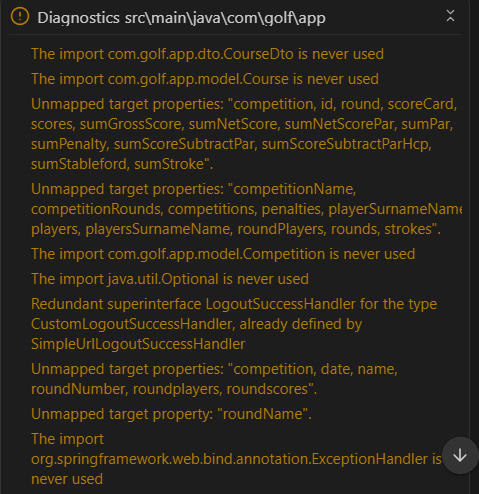
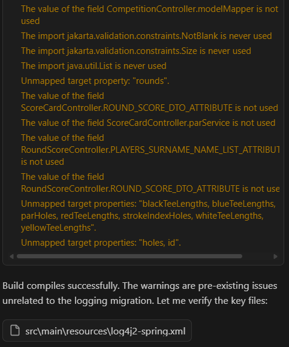

# Amp (Sourcegraph) Agent Tests - January 2026

## Table of Contents

- [Summary](#summary)
- [Testing](#testing)
    - [Environment](#environment)
    - [Code Generation Findings](#code-generation-findings)
    - [Testing Customization](#testing-customization)
    - [Test Report](#test-report)
    - [Agent's Final Grade](#agents-final-grade)
- [Links](#links)

# Summary

Amp is a coding agent that can be run as VS Code extension or as a command-line tool. Amp is unconstrained on token
usage and will always use the best model for the executed task. The agent distinctive feature is a multiplayer support —
a developer can share threads and collaborate with team.

The new release suggests two modes to work on tasks:

- **Smart**: uses most powerful models without constraints for maximum capability and autonomy.
- **Rush**: faster, cheaper, and less capable, suitable for small, well-defined tasks.

The agent showed the best performance among the examined agents. It successfully completed the tasks assigned to it. The
agent responded reasonably to the feedback, which allowed to successfully achieve a goal in a minimum number of steps.
However the agent may tend to do over-engineering or suggest unrequested changes or suggest plain straightforward
solutions. The generated code should be supervised by an experienced developer to prevent defects and technical debt
introduction.

The agent has been examined with tasks belonging to various categories such as solution-or-component-generation,
solution-migration, code-refactoring, code-bugfixing. In response, the agent generated solutions affecting from 2 files
and 12 code lines till 11 files and 445 code lines. It took from 1 to 5 iterations to complete the given development
either successfully or to prove that further agent-assisted development was not reasonable.

# Testing

## Environment

|               | Version                                         |
|---------------|-------------------------------------------------|
| Amp           | 0.0.1768464644 (Research Preview)               |
| Payment Plan  | Pay as Go                                       |
| Default Model | Claude Opus 4.5 (preselected by the agent mode) |
| Agent Mode    | Smart                                           |

## Code Generation Findings

- Diagnoses project code issues after the solution generation.

- May generate custom code instead of using the library/framework capabilities.

## Testing Customization

Amp supports `AGENTS.md` file in workspace directory. It provides the AI model with project-specific information about
codebase structure, development practices, and coding standards.

The Amp was ordered to generate `AGENTS.md` automatically before running tests.

## Test Report

| # | Sourcecode Repository                                | Task Summary (Name/Category/Complexity)                                                                                                                                                                 | Task Description (Initial Prompt)                                                                                                                              | First-Shot Effort | First-Shot Completeness                                                                                                                                                                                                                                                                                                                                                            | First-Shot Accuracy                                                                                                                                                                                                                                    | Subsequent Prompts (Feedback, Comments)                                                                                                                                                                                                                                                                                                                                                                                                                                                            | Final Completeness |                                                   Final Accuracy | Final Test Grade | Statistics                                                                                                 | Comments                                                          |
|--:|------------------------------------------------------|---------------------------------------------------------------------------------------------------------------------------------------------------------------------------------------------------------|----------------------------------------------------------------------------------------------------------------------------------------------------------------|-------------------|------------------------------------------------------------------------------------------------------------------------------------------------------------------------------------------------------------------------------------------------------------------------------------------------------------------------------------------------------------------------------------|--------------------------------------------------------------------------------------------------------------------------------------------------------------------------------------------------------------------------------------------------------|----------------------------------------------------------------------------------------------------------------------------------------------------------------------------------------------------------------------------------------------------------------------------------------------------------------------------------------------------------------------------------------------------------------------------------------------------------------------------------------------------|-------------------:|-----------------------------------------------------------------:|-----------------:|------------------------------------------------------------------------------------------------------------|-------------------------------------------------------------------|
| 1 | https://github.com/PolinaTolkachova/golf-application | **Id:** 0001 **Name:** Make reverse engineering of DB schema and make it manageable with Flyway **Category:** code-refactoring **Complexity:** Medium                                          | See https://github.com/epam/AIRUN-Assistants-Benchmark-TestInstructions/blob/main/agentic-workflow-tests/0001/README.md                                        | N/A               | 50% - The database schema validation error: wrong column type encountered in column \[gender] in table \[player]. - The application failed to launch successfully. - Testing could not be performed due to the failed application launch.                                                                                                                                 | 86% - The intended functionality is not accomplished. - Exposes sensitive data in sources.                                                                                                                                                       | 1) SchemaManagementException: Schema-validation: wrong column type encountered in column \[gender] in table \[player]; found \[varchar (Types#VARCHAR)], but expecting \[tinyint (Types#TINYINT)] 2) Prevent user credentials expose in `docker-compose.yml`, `flyway.conf`.                                                                                                                                                                                                                    |               100% |                                                             100% |              75% | Files: 3 modified(M) 4 added(A) 0 deleted(D)  Lines: 443 insertions(+) 2 deletions(-) | Minor: additionally added Flyway migration at application launch. |
| 2 | https://github.com/PolinaTolkachova/golf-application | **Id:** 0003 **Name:** Refactor Golf application access-control layer, replace Basic Authentication with Oauth2 Authorization **Category:** code-refactoring **Complexity:** High              | See https://github.com/epam/AIRUN-Assistants-Benchmark-TestInstructions/blob/main/agentic-workflow-tests/0003/README.md                                        | N/A               | 100%                                                                                                                                                                                                                                                                                                                                                                               | 100%                                                                                                                                                                                                                                                   | Not required                                                                                                                                                                                                                                                                                                                                                                                                                                                                                       |                    |                                                                  |             100% | Files: 3 modified(M) 0 added(A) 0 deleted(D)  Lines: 33 insertions(+) 42 deletions(-) |                                                                   |
| 3 | https://github.com/PolinaTolkachova/golf-application | **Id:** 0004 **Name:** Return round scores in CSV format in Golf application **Category:** solution-or-component-generation **Complexity:** Low                                                | See https://github.com/epam/AIRUN-Assistants-Benchmark-TestInstructions/blob/main/agentic-workflow-tests/0004/README.md                                        | N/A               | 48% - The data field containing the comma is not enclosed in double quotes. - The double quote contained in the data field is not escaped by doubling it. - Spring HTTP Message Conversion is not utilized. - The code uses raw `StringBuilder` concatenation instead of a proven CSV processing library.                                                              | 63% - The intended functionality is not fully accomplished. - Custom CSV generation code does not handle edge cases, exceptions. - CSV generation is embedded in the controller. - The CSV generation logic lacks necessary documentation. | 1) Spring's message conversion mechanism is not utilized. 2) Using OutputStreamWriter is a poor and error-prone choice for CVS generation. 3) Regression: the default RoundScoreController GET endpoint starts to produce text/html only.                                                                                                                                                                                                                                                    |               100% | 83% - The CSV generation logic lacks necessary documentation. |              59% | Files: 2 modified(M) 1 added(A) 0 deleted(D)  Lines: 87 insertions(+) 0 deletions(-)  |                                                                   |
| 4 | https://github.com/PolinaTolkachova/golf-application | **Id:** 0008 **Name:** Refactor Golf application, replace logback logging with Log4j 2.x logging framework and SLF4J as logging facade **Category:** solution-migration **Complexity:** Medium | See https://github.com/epam/AIRUN-Assistants-Benchmark-TestInstructions/blob/main/agentic-workflow-tests/0008/README.md                                        | N/A               | 73% - spring-boot-starter-logging is not fully excluded from Spring Boot starter dependencies. - `logging.level.*` properties are not removed from application.properties. - Log4j2 configuration is not completed. - String concatenation is still used instead of parameterized placeholders. - The application log file is created. - Application run failed. | 92% - The intended functionality is not accomplished.                                                                                                                                                                                               | 1) spring-boot-starter-logging is not fully excluded from Spring Boot starter dependencies. 2) `logging.level.*` properties are not removed from application.properties. The created loggers are synchronous by default. It affects the logging performance. 3) String concatenation is still used in logging statements instead of parameterized placeholders. It affects the performance. 4) WARN StatusConsoleListener Infinite loop in property interpolation of LOG_DIR->sys:LOG_DIR |               100% |                                                             100% |              69% | Files: 7 modified(M) 2 added(A) 2 deleted(D)  Lines: 91 insertions(+) 82 deletions(-) |                                                                   |
| 5 | https://github.com/PolinaTolkachova/golf-application | **Id:** 0011 **Name:** Migrate in-memory user and role definitions to database in Golf application **Category:** code-refactoring **Complexity:** Low                                          | See https://github.com/epam/AIRUN-Assistants-Benchmark-TestInstructions/blob/main/agentic-workflow-tests/0011/README.md                                        | N/A               | 100%                                                                                                                                                                                                                                                                                                                                                                               | 94% - Exposes passwords in comments.                                                                                                                                                                                                                | 1) Prevent user passwords expose in comments                                                                                                                                                                                                                                                                                                                                                                                                                                                       |               100% |                                                             100% |              99% | Files: 1 modified(M) 1 added(A) 0 deleted(D)  Lines: 36 insertions(+) 23 deletions(-) |                                                                   |
| 6 | https://github.com/PolinaTolkachova/golf-application | **Id:** 0014 **Name:** User Account Menu in Golf application **Category:** solution-or-component-generation **Complexity:** Low                                                                | See agentic-workflow-tests/0014/README.md: https://github.com/epam/AIRUN-Assistants-Benchmark-TestInstructions/blob/main/agentic-workflow-tests/0014/README.md | N/A               | 83% - Bootstrap bundle is not utilized to create the account menu. - The coded added *span* element attributed with `sec:authorize="isAuthenticated()"` instead of *div*. - The account menu is not expandable.                                                                                                                                                           | 100%                                                                                                                                                                                                                                                   | 1) Make the account menu expandable.                                                                                                                                                                                                                                                                                                                                                                                                                                                               |               100% |                                                             100% |              96% | Files: 2 modified(M) 0 added(A) 0 deleted(D)  Lines: 22 insertions(+) 1 deletions(-)  |                                                                   |
| 7 | https://github.com/PolinaTolkachova/golf-application | **Id:** 0016 **Name:** Fix an issue with competition removing in Golf application **Category:** code-bugfixing **Complexity:** Medium                                                          | See https://github.com/epam/AIRUN-Assistants-Benchmark-TestInstructions/blob/main/agentic-workflow-tests/0016/README.md                                        | N/A               | 83% - The implementation uses POST method instead of DELETE HTTP method for competition deletion.                                                                                                                                                                                                                                                                               | 100%                                                                                                                                                                                                                                                   | 1) The deletion endpoint uses the `POST` HTTP method instead of the more semantically appropriate `DELETE` method. 2) Please rewrite competition deletion using `@DeleteMapping("/{id}")` instead of `@DeleteMapping("/{id}/remove")`.                                                                                                                                                                                                                                                          |               100% |                                                             100% |              87% | Files: 3 modified(M) 0 added(A) 0 deleted(D)  Lines: 11 insertions(+) 1 deletions(-)  |                                                                   |

## Agent's Final Grade

The agent's final grade is **83%**.

# Links

- [Amp Home](https://ampcode.com/)

    © 2026 EPAM Systems, Inc. All Rights Reserved.     EPAM, EPAM AI/RUN TM and the EPAM logo are registered trademarks of EPAM Systems, Inc.     This report is licensed under CC BY-SA 4.0 

