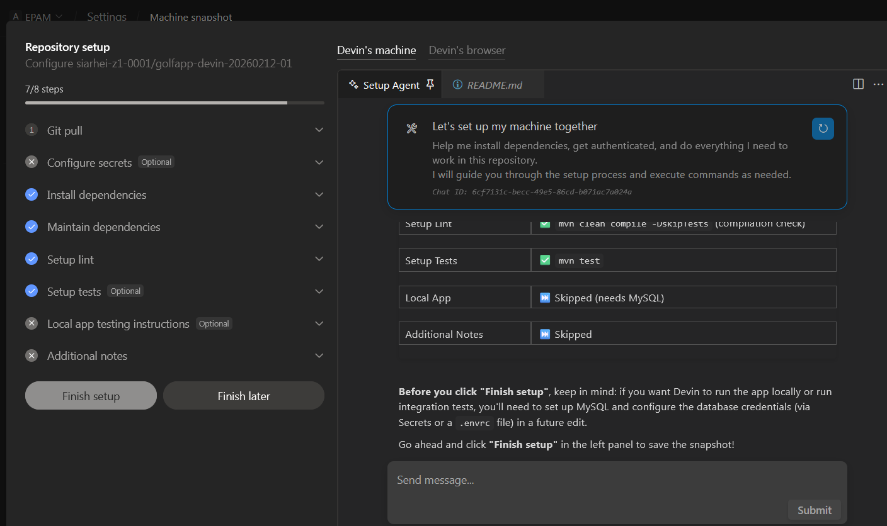
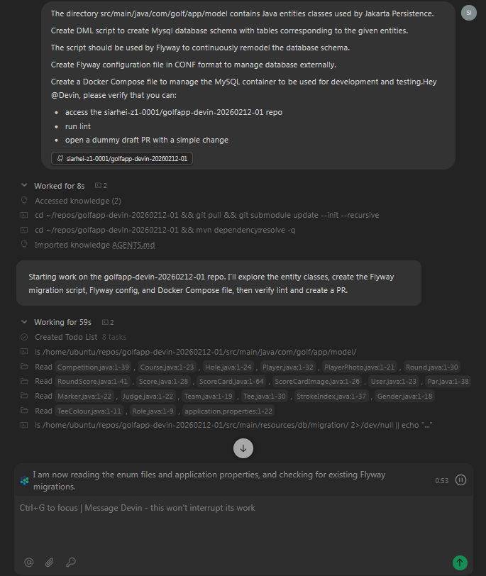
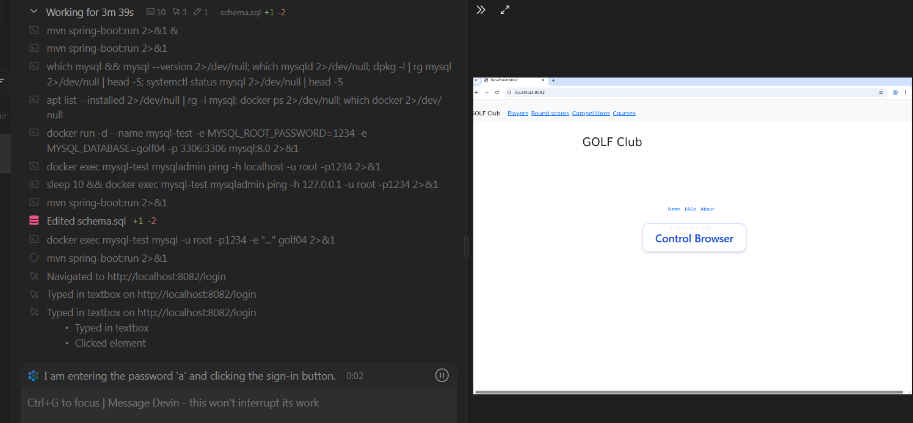

# Devin AI Agent Test Execution Results - February 2026

- [Summary](#summary)
- [Distinctive Features](#distinctive-features)
- [Testing](#testing)
    - [Environment](#environment)
        - [Version](#version)
    - [Code Generation Findings](#code-generation-findings)
    - [Screenshots](#screenshots)
        - [Repository Setup](#repository-setup)
        - [Session](#session)
        - [Browser](#browser)
    - [Testing Customization](#testing-customization)
    - [Testing Approach](#testing-approach)
        - [Repository Initialization](#repository-initialization)
        - [Repository Setup](#repository-setup)
            - [Git pull](#gil-pull)
            - [Install Dependencies](#install-dependencies)
            - [Maintain Dependencies](#maintain-dependencies)
            - [Setup Lint](#setup-lint)
            - [Setup Tests](#setup-tests)
            - [Local App Testing instructions](#local-app-testing-instructions)
    - [Test Report](#test-report)
- [Agent's Final Grade](#agents-final-grade)
    - [By Run](#by-run)
    - [By Test](#by-test)

# Summary

This is a next round of Devin agent tests. The new version has obtained guided agent-assisted setup of the repository and development environment.

It is revealed that the agent is rather expensive comparing to other coding agents. Worth mentioning that the payment policy is not transparent and too arbitrary. Session fees are not linked to successful completion of tasks, the user is also forced to pay for unsuccessful attempts at solving.

The agent has been examined with tasks belonging to various categories such as solution-or-component-generation, solution-migration, code-refactoring, code-bugfixing.

The new agent version shows better performance than before and has returned to coding agent testing rating leaders.

# Distinctive Features

- Devin is provided as Software as a Service. It works in cloud and generates solutions as pull requests to a client project GitHub repository.
- Devin integrates into the repository as a GitHub App and can respond to pull request comments.

# Testing

## Environment

### Version

| Item | Value |
|---|---|
| Devin AI | N/A |
| Payment Plan | Core (pay as you go) |
| Default Model | Undisclosed |

# Code Generation Findings

- Supports guided agent-assisted setup of the repository and development environment.
- May generate unnecessary custom code replacing the library/framework capabilities.
- May suggest a simplified straightforward solution. It is laborious and time-consuming to force the agent to rework the solution following a better approach. A developer has to provide a lot of granular instructions how to improve and/or fix the solution code.
- Performs testing of the generated solution.
- Able to control the browser to test the application UI features.
- Able to set up the test environment, for instance launch Docker container for MySql.

# Screenshots

## Repository Setup



## Session



## Browser



# Testing Customization

General golf-application rules for agents are added as file `AGENTS.md`.

# Testing Approach

Due to SaaS nature of Devin we have to develop a specific setup for the testing.

Devin works with GitHub repository as a GitHub App, so a new repository is created to perform set of test on Golf application codebase.

## Repository Initialization

```bash
Create github repo in github
Download zip from https://github.com/PolinaTolkachova/golf-application/
git clone git@github.com:user/golfapp-devin-20260212-01.git
cd golfapp-devin-20260212-01
ln -s . golf-application-main
unzip golf-application-main.zip
rm golf-application-main
git status
git add src pom.xml README.md LICENSE .gitignore AGENTS.md
git commit -m "initial commit"
git push origin main
```

## Repository Setup

Custom configurations:

### Gil pull

```bash
cd ~/repos/golfapp-devin-20260212-01 && git pull && git submodule update --init --recursive
```

### Install Dependencies

```bash
sudo apt install maven -y
```

### Maintain Dependencies

```bash
mvn dependency:resolve -q
```

### Setup Lint

```bash
mvn clean compile -DskipTests
```

### Setup Tests

```bash
mvn test
```

### Local App Testing instructions

```bash
mvn spring-boot:run
```

# Test Report

| # | Run | Sourcecode repository | Task summary (ID / Name / Category / Complexity) | Task description (initial prompt) | First-shot effort | First-shot completeness | First-shot accuracy | Subsequent prompts (feedback/comments) | Final completeness | Final accuracy | Statistics | Comments |
|---:|:---:|---|---|---|---|---|---|---|---:|---:|---|---|
| 1 | 01 | https://github.com/PolinaTolkachova/golf-application | **Id:** 0001<br>**Name:** Make reverse engineering of DB schema and make it manageable with Flyway<br>**Category:** code-refactoring<br>**Complexity:** Medium | See `agentic-workflow-tests/0001/README.md` | N/A | 100% | 89%<br>- Using the root user as the application database user leads to security risks.<br>- Exposes sensitive data in sources. | 1)<br>Prevent user credentials expose in `docker-compose.yml`, `flyway.conf`.<br>2)<br>Using the root user as the application database user leads to security risks. | 100% | 100% | **Files:** 3 modified (M), 4 added (A), 0 deleted (D)<br>**Lines:** 359 insertions(+), 4 deletions(-) |  |
| 2 | 02 | https://github.com/PolinaTolkachova/golf-application | **Id:** 0001<br>**Name:** Make reverse engineering of DB schema and make it manageable with Flyway<br>**Category:** code-refactoring<br>**Complexity:** Medium | See `agentic-workflow-tests/0001/README.md` | N/A | 35%<br>- The database schema validation error: wrong column type encountered in column [gender] in table [player].<br>- Hibernate configuration is not changed from updating database schema to validating database schema.<br>- The application launch fails due to a database schema validation error.<br>- Testing could not be performed due to the failed application launch. | 86%<br>- The intended functionality is not accomplished.<br>- Exposes sensitive data in sources. | 1)<br>SchemaManagementException: Schema-validation: wrong column type encountered in column [gender] in table [player]; found [smallint (Types#SMALLINT)], but expecting [tinyint (Types#TINYINT)]<br>2)<br>Hibernate configuration is not changed from updating database schema to validating database schema.<br>3)<br>Prevent user credentials expose in docker-compose.yml, flyway.conf.<br>4)<br>Using the root user as the application database user leads to security risks. | 100% | 100% | **Files:** 1 modified (M), 3 added (A), 0 deleted (D)<br>**Lines:** 331 insertions(+), 3 deletions(-) | Intended functionality initially not accomplished; exposed sensitive data in sources. |
| 3 | 03 | https://github.com/PolinaTolkachova/golf-application | **Id:** 0001<br>**Name:** Make reverse engineering of DB schema and make it manageable with Flyway<br>**Category:** code-refactoring<br>**Complexity:** Medium | See `agentic-workflow-tests/0001/README.md` | N/A | 35%<br>- The database schema validation error: wrong column type encountered in column [gender] in table [player].<br>- The application.properties file still uses 'spring.jpa.hibernate.ddl-auto=update' instead of switching it to 'validate'.<br>- The application launch failed due to a schema-validation error.<br>- Testing could not be performed due to the failed application launch. | 86%<br>- The intended functionality is not accomplished.<br>- Exposes sensitive data in sources | 1)<br>Schema-validation: wrong column type encountered in column [gender] in table [player]; found [smallint (Types#SMALLINT)], but expecting [tinyint (Types#TINYINT)]<br>2)<br>Hibernate configuration is not changed from updating database schema to validating database schema.<br>3)<br>Using the root user as the application database user leads to security risks.<br>4)<br>Prevent user credentials expose in `docker-compose.yml`, `flyway.conf`. | 100% | 100% | **Files:** 2 modified (M), 4 added (A), 0 deleted (D)<br>**Lines:** 350 insertions(+), 4 deletions(-) | Intended functionality initially not accomplished; exposed sensitive data in sources. |
| 4 | 01 | https://github.com/PolinaTolkachova/golf-application | **Id:** 0003<br>**Name:** Refactor Golf application access-control layer, replace Basic Authentication with Oauth2 Authorization<br>**Category:** code-refactoring<br>**Complexity:** High | See `agentic-workflow-tests/0003/README.md` | N/A | 100% | 100% | Not required | 100% | 100% | **Files:** 3 modified (M), 0 added (A), 0 deleted (D)<br>**Lines:** 14 insertions(+), 43 deletions(-) |  |
| 5 | 02 | https://github.com/PolinaTolkachova/golf-application | **Id:** 0003<br>**Name:** Refactor Golf application access-control layer, replace Basic Authentication with Oauth2 Authorization<br>**Category:** code-refactoring<br>**Complexity:** High | See `agentic-workflow-tests/0003/README.md` | N/A | 100% | 100% | Not required | 100% | 100% | **Files:** 3 modified (M), 0 added (A), 2 deleted (D)<br>**Lines:** 20 insertions(+), 89 deletions(-) |  |
| 6 | 03 | https://github.com/PolinaTolkachova/golf-application | **Id:** 0003<br>**Name:** Refactor Golf application access-control layer, replace Basic Authentication with Oauth2 Authorization<br>**Category:** code-refactoring<br>**Complexity:** High | See `agentic-workflow-tests/0003/README.md` | N/A | 100% | 100% | Not required | 100% | 100% | **Files:** 3 modified (M), 0 added (A), 1 deleted (D)<br>**Lines:** 17 insertions(+), 67 deletions(-) |  |
| 7 | 01 | https://github.com/PolinaTolkachova/golf-application | **Id:** 0004<br>**Name:** Return round scores in CSV format in Golf application<br>**Category:** solution-or-component-generation<br>**Complexity:** Low | See `agentic-workflow-tests/0004/README.md` | N/A | 52%<br>- The default RoundScoreController GET endpoint was not preserved, but restricted to "text/html".<br>- Spring HTTP Message Conversion is not utilized.<br>- The code uses raw `StringBuilder` concatenation instead of a proven CSV processing library. | 63%<br>- The intended functionality is not fully accomplished.<br>- Custom CSV generation code does not handle edge cases, exceptions.<br>- CSV generation is embedded in the controller.<br>- The CSV generation logic lacks necessary documentation. | 1)<br>Spring's message conversion mechanism is not utilized.<br>2)<br>Using PrintWriter is a poor and error-prone choice for CVS generation.<br>3)<br>Regression: the default RoundScoreController GET endpoint starts to produce text/html only.<br>4)<br>Manually handling the HTTP Accept header is confusing and doesn't align with Spring's approach to handling different content types in the controller.<br>5)<br>Restore the default `@GetMapping` annotation on `RoundScoreController.displayScoreCardMainPage` method, remove unwanted `configureContentNegotiation` method. | 100% | 83% | **Files:** 3 modified (M), 1 added (A), 0 deleted (D)<br>**Lines:** 95 insertions(+), 1 deletions(-) | CSV generation logic lacks necessary documentation. |
| 8 | 02 | https://github.com/PolinaTolkachova/golf-application | **Id:** 0004<br>**Name:** Return round scores in CSV format in Golf application<br>**Category:** solution-or-component-generation<br>**Complexity:** Low | See `agentic-workflow-tests/0004/README.md` | N/A | 52%<br>- The default RoundScoreController GET endpoint was not preserved, but restricted to "text/html".<br>- Spring HTTP Message Conversion is not utilized.<br>- The code uses raw PrintWriter and StringJoiner instead of a proven CSV processing library. | 63%<br>- The intended functionality is not fully accomplished.<br>- Custom CSV generation code does not handle edge cases, exceptions.<br>- CSV generation is embedded in the controller.<br>- The CSV generation logic lacks necessary documentation. | 1)<br>Spring's message conversion mechanism is not utilized.<br>2)<br>Using PrintWriter and StringJoiner is a poor and error-prone choice for CVS generation.<br>3)<br>Regression: the default RoundScoreController GET endpoint is limited to produce text/html only. | 100% | 83% | **Files:** 3 modified (M), 2 added (A), 0 deleted (D)<br>**Lines:** 218 insertions(+), 1 deletions(-) | CSV generation logic lacks necessary documentation. |
| 9 | 03 | https://github.com/PolinaTolkachova/golf-application | **Id:** 0004<br>**Name:** Return round scores in CSV format in Golf application<br>**Category:** solution-or-component-generation<br>**Complexity:** Low | See `agentic-workflow-tests/0004/README.md` | N/A | 41%<br>- The default RoundScoreController GET endpoint was not preserved, but restricted to "text/html".<br>- The code does not enclose fields in double quotes even if they contain commas.<br>- Double quote contained in the data field is not escaped by doubling it.<br>- Spring HTTP Message Conversion is not utilized.<br>- The code uses raw PrintWriter and StringJoiner instead of a proven CSV processing library. | 63%<br>- The intended functionality is not fully accomplished.<br>- Custom CSV generation code does not handle edge cases, exceptions.<br>- CSV generation is embedded in the controller.<br>- The CSV generation logic lacks necessary documentation. | 1)<br>Spring's message conversion mechanism is not utilized.<br>2)<br>Using PrintWriter and StringJoiner is a poor and error-prone choice for CVS generation.<br>3)<br>Regression: the default RoundScoreController GET endpoint is narrowed to "text/html" media type only. | 100% | 83% | **Files:** 3 modified (M), 1 added (A), 0 deleted (D)<br>**Lines:** 105 insertions(+), 1 deletions(-) | CSV generation logic lacks necessary documentation. |
| 10 | 01 | https://github.com/PolinaTolkachova/golf-application | **Id:** 0008<br>**Name:** Refactor Golf application, replace logback logging with Log4j 2.x and SLF4J facade<br>**Category:** solution-migration<br>**Complexity:** Medium | See `agentic-workflow-tests/0008/README.md` | N/A | 92%<br>- The configuration uses RollingFile rather than RollingRandomAccessFile.<br>- Since the root logger remains configured as the default logger, added loggers may be inadvertently synchronous. | 97%<br>- Logging with loop degrades performance. | 1)<br>The Log4j2 configuration uses RollingFile rather than RollingRandomAccessFile.<br>2)<br>Since the root logger remains configured as the default logger, synchronous loggers may be inadvertently added.<br>3)<br>Logging with loop degrades performance.<br>4)<br>Mapping within stream as logging statement argument degrades performance.<br>5)<br>You have added log.isDebugEnabled() guard statement, but removed actual gathered content from logging, namely the names of the players. | 100% | 100% | **Files:** 7 modified (M), 1 added (A), 2 deleted (D)<br>**Lines:** 95 insertions(+), 83 deletions(-) |  |
| 11 | 02 | https://github.com/PolinaTolkachova/golf-application | **Id:** 0008<br>**Name:** Refactor Golf application, replace logback logging with Log4j 2.x and SLF4J facade<br>**Category:** solution-migration<br>**Complexity:** Medium | See `agentic-workflow-tests/0008/README.md` | N/A | 76%<br>- LMAX Disruptor is not added as dependency and it is not utilized.<br>- application.properties still contains logging level configurations.<br>- Logging is not asynchronous in Log4j2 configuration.<br>- The configuration uses a RollingFile appender instead of RollingRandomAccessFile.<br>- Log4j2 loggers are not asynchronous. | 97%<br>- Logging with loop degrades performance. | 1)<br>LMAX Disruptor is not utilized although Log4j2 performance tuning was asked.<br>2)<br>`logging.level.*` properties are not removed from application.properties. The created loggers are synchronous by default. It affects the logging performance.<br>3)<br>Would RollingRandomAccessFile be better for performance?<br>4)<br>Logging with loop degrades performance.<br>5)<br>Guard logging statement with mapping within stream as argument to prevent performance degradation. | 100% | 100% | **Files:** 7 modified (M), 2 added (A), 2 deleted (D)<br>**Lines:** 119 insertions(+), 83 deletions(-) |  |
| 12 | 03 | https://github.com/PolinaTolkachova/golf-application | **Id:** 0008<br>**Name:** Refactor Golf application, replace logback logging with Log4j 2.x and SLF4J facade<br>**Category:** solution-migration<br>**Complexity:** Medium | See `agentic-workflow-tests/0008/README.md` | N/A | 76%<br>- LMAX Disruptor is not added as dependency and it is not utilized.<br>- Infinite loop in property interpolation indicates Log4j2 configuration issue.<br>- Logging is not asynchronous in Log4j2 configuration.<br>- The configuration uses a RollingFile appender instead of RollingRandomAccessFile.<br>- Log4j2 loggers are not asynchronous. | 97%<br>- Logging with loop degrades performance. | 1)<br>LMAX Disruptor is not utilized although Log4j2 performance tuning has been asked.<br>2)<br>Would RollingRandomAccessFile be better for performance?<br>3)<br>Logging with loop degrades performance.<br>4)<br>Guard logging statement with mapping within stream as argument to prevent performance degradation.<br>5)<br>WARN StatusConsoleListener Infinite loop in property interpolation of LOG_DIR->sys:LOG_DIR | 100% | 100% | **Files:** 7 modified (M), 1 added (A), 2 deleted (D)<br>**Lines:** 108 insertions(+), 84 deletions(-) |  |
| 13 | 01 | https://github.com/PolinaTolkachova/golf-application | **Id:** 0011<br>**Name:** Migrate in-memory user and role definitions to database in Golf application<br>**Category:** code-refactoring<br>**Complexity:** Low | See `agentic-workflow-tests/0011/README.md` | N/A | 100% | 100% | Not required | 100% | 100% | **Files:** 2 modified (M), 2 added (A), 0 deleted (D)<br>**Lines:** 38 insertions(+), 23 deletions(-) | Minor: solution relies on `spring.sql.init.mode` (not directly requested). |
| 14 | 02 | https://github.com/PolinaTolkachova/golf-application | **Id:** 0011<br>**Name:** Migrate in-memory user and role definitions to database in Golf application<br>**Category:** code-refactoring<br>**Complexity:** Low | See `agentic-workflow-tests/0011/README.md` | N/A | 100% | 100% | Not required | 100% | 100% | **Files:** 2 modified (M), 2 added (A), 0 deleted (D)<br>**Lines:** 33 insertions(+), 23 deletions(-) | Minor: solution relies on `spring.sql.init.mode` (not directly requested). |
| 15 | 03 | https://github.com/PolinaTolkachova/golf-application | **Id:** 0011<br>**Name:** Migrate in-memory user and role definitions to database in Golf application<br>**Category:** code-refactoring<br>**Complexity:** Low | See `agentic-workflow-tests/0011/README.md` | N/A | 94%<br>- The unique index for the combination of username and authority in the AUTHORITIES table is not created. | 100% | 1)<br>The unique index for the combination of username and authority in the AUTHORITIES table is not created. | 100% | 100% | **Files:** 2 modified (M), 2 added (A), 0 deleted (D)<br>**Lines:** 31 insertions(+), 23 deletions(-) | Minor: solution relies on `spring.sql.init.mode` (not directly requested). |
| 16 | 01 | https://github.com/PolinaTolkachova/golf-application | **Id:** 0014<br>**Name:** User Account Menu in Golf application<br>**Category:** solution-or-component-generation<br>**Complexity:** Low | See `agentic-workflow-tests/0014/README.md` | N/A | 89%<br>- Bootstrap bundle is not utilized to create the account menu.<br>- The account menu is not expandable sub-menu of main menu but just main menu items. | 92%<br>- The intended functionality is not fully accomplished. | 1)<br>Use Bootstrap adopted in the project instead of custom JavaScript and CSS to implement the menu functionality.<br>2)<br>The account menu is not expandable sub-menu but just a few main menu elements.<br>3)<br>The account menu should be the expandable sub-menu instead of just a few main menu elements.<br>4)<br>An user is redirected to unused sign in page instead of actual login page after logout.<br>5)<br>Actual login page is replaced with unused sign in page backed by src/main/resources/templates/login.html. | 100% | 100% | **Files:** 3 modified (M), 0 added (A), 0 deleted (D)<br>**Lines:** 28 insertions(+), 1 deletions(-) |  |
| 17 | 02 | https://github.com/PolinaTolkachova/golf-application | **Id:** 0014<br>**Name:** User Account Menu in Golf application<br>**Category:** solution-or-component-generation<br>**Complexity:** Low | See `agentic-workflow-tests/0014/README.md` | N/A | 89%<br>- Bootstrap bundle is not utilized to create the account menu.<br>- The account menu is not expandable sub-menu of main menu but just main menu items. | 92%<br>- The intended functionality is not fully accomplished. | 1)<br>Use Bootstrap adopted in the project instead of custom JavaScript and CSS to implement the menu functionality.<br>2)<br>The account menu is not expandable sub-menu but just a few main menu elements.<br>3)<br>The account menu should be the expandable sub-menu instead of just a few main menu elements.<br>4)<br>The account menu does not expand downwards on all pages.<br>5)<br>An user is redirected to unused sign in page instead of actual login page after logout.<br>6)<br>Actual login page is replaced with unused sign in page backed by src/main/resources/templates/login.html.<br>7)<br>Regression: the original Spring Security login page has been replaced with unused sign in page backed by src/main/resources/templates/login.html. | 100% | 100% | **Files:** 3 modified (M), 0 added (A), 0 deleted (D)<br>**Lines:** 20 insertions(+), 2 deletions(-) |  |
| 18 | 03 | https://github.com/PolinaTolkachova/golf-application | **Id:** 0014<br>**Name:** User Account Menu in Golf application<br>**Category:** solution-or-component-generation<br>**Complexity:** Low | See `agentic-workflow-tests/0014/README.md` | N/A | 89%<br>- Bootstrap bundle is not utilized to create the account menu.<br>- The account menu is not expandable sub-menu of main menu but just main menu items. | 92%<br>- The intended functionality is not fully accomplished. | 1)<br>Use Bootstrap adopted in the project instead of custom JavaScript and CSS to implement the menu functionality.<br>2)<br>An user is redirected to unused sign in page instead of actual login page after logout where he can not login again.<br>3)<br>You have changed the main menu style without request. Restore the original style, but keep the account sub-menu functionality. | 100% | 100% | **Files:** 3 modified (M), 0 added (A), 0 deleted (D)<br>**Lines:** 35 insertions(+), 7 deletions(-) |  |
| 19 | 01 | https://github.com/PolinaTolkachova/golf-application | **Id:** 0016<br>**Name:** Fix an issue with competition removing in Golf application<br>**Category:** code-bugfixing<br>**Complexity:** Medium | See `agentic-workflow-tests/0016/README.md` | N/A | 83%<br>- Using POST instead of DELETE HTTP method violates RESTful principles. | 100% | 1)<br>The deletion endpoint uses the `POST` HTTP method instead of the more semantically appropriate `DELETE` method.<br>2)<br>Please rewrite competition deletion using `@DeleteMapping("/{id}")` instead of `@DeleteMapping("/{id}/remove")`. | 100% | 100% | **Files:** 3 modified (M), 0 added (A), 0 deleted (D)<br>**Lines:** 12 insertions(+), 2 deletions(-) |  |
| 20 | 02 | https://github.com/PolinaTolkachova/golf-application | **Id:** 0016<br>**Name:** Fix an issue with competition removing in Golf application<br>**Category:** code-bugfixing<br>**Complexity:** Medium | See `agentic-workflow-tests/0016/README.md` | N/A | 83%<br>- Using POST instead of DELETE HTTP method violates RESTful principles. | 100% | 1)<br>The deletion endpoint uses the `POST` HTTP method instead of the more semantically appropriate `DELETE` method.<br>2)<br>Please rewrite competition deletion using `@DeleteMapping("/{id}")` instead of `@DeleteMapping("/{id}/remove")`. | 100% | 100% | **Files:** 3 modified (M), 0 added (A), 0 deleted (D)<br>**Lines:** 14 insertions(+), 2 deletions(-) |  |
| 21 | 03 | https://github.com/PolinaTolkachova/golf-application | **Id:** 0016<br>**Name:** Fix an issue with competition removing in Golf application<br>**Category:** code-bugfixing<br>**Complexity:** Medium | See `agentic-workflow-tests/0016/README.md` | N/A | 83%<br>- Using POST instead of DELETE HTTP method violates RESTful principles. | 100% | 1)<br>The deletion endpoint uses the `POST` HTTP method instead of the more semantically appropriate `DELETE` method.<br>2)<br>Please rewrite competition deletion using `@DeleteMapping("/{id}")` instead of `@DeleteMapping("/{id}/remove")`. | 100% | 100% | **Files:** 3 modified (M), 0 added (A), 0 deleted (D)<br>**Lines:** 12 insertions(+), 2 deletions(-) |  |

# Agent's Final Grade

The agent's final grade is **78%**.

## By Run

| Tag | Grade |
|---|---:|
| VM01 | 0.80 |
| VM02 | 0.76 |
| VM03 | 0.78 |
| **Average** | **0.78** |
| **STDEV.S** | **0.02** |

## By Test

| Number | VM01 | VM02 | VM03 | Average | STDEV.S |
|---:|---:|---:|---:|---:|---:|
| 0001 | 0.88 | 0.58 | 0.58 | 0.68 | 0.18 |
| 0003 | 1.00 | 1.00 | 1.00 | 1.00 | 0.00 |
| 0004 | 0.49 | 0.60 | 0.57 | 0.55 | 0.05 |
| 0008 | 0.70 | 0.65 | 0.66 | 0.67 | 0.02 |
| 0011 | 1.00 | 1.00 | 0.98 | 0.99 | 0.01 |
| 0014 | 0.68 | 0.60 | 0.79 | 0.69 | 0.09 |
| 0016 | 0.87 | 0.87 | 0.87 | 0.87 | 0.00 |


<p style="text-align: center;">    © 2026 EPAM Systems, Inc. All Rights Reserved.<br/>    EPAM, EPAM AI/RUN <sup>TM</sup> and the EPAM logo are registered trademarks of EPAM Systems, Inc.<br>    This report is licensed under CC BY-SA 4.0<br/></p>
