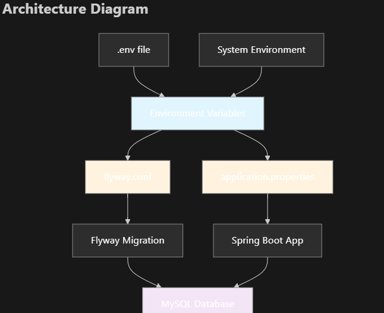

# Roo Code Agent Tests - September 2025

# Summary
Roo Code is a coding agent provided as VS Code extension. Its distinctive features are the provision of specialized modes designed to solve various problems, including Сode Mode, Architect Mode, Ask Mode, Debug Mode. Orchestrator Mode allows to manage complex tasks and delegating work to dedicated modes. The user is also given the opportunity to create his own modes. The agent comes with set of tools allowing to read and write files, execute commands, debug a code, automate interaction with a web browser. External tools are supported via MCP. The agent supports a wide range of AI models available via connection to AI providers.

The agent design supposes its ability to work on development task almost autonomously with minimal human involvement. On other side, it includes features allowing the developer to keep control over development: checkpoints, flexible permission settings, visual diffs.

Roo Code is well-developed, but there are areas to improve. For instance, the adaptation to system environment can be better, sometimes the agent fails to adjust completely to recognized system services and tries workarounds. The file diff feature can be more convenient too.

The agent has been examined with tasks belonging to various categories such as solution-or-component-generation, solution-migration, code-refactoring, code-bugfixing. In response, the agent generated solutions affecting from 6 files and 64 code lines till 27 files and 7000 code lines. It took from 1 to 13 iterations to complete the given development either successfully or to prove that further agent-assisted development was not reasonable.

The agent's final grade is 57%, but it could be better if the testing goes another way. First half of tests were performed exclusively in orchestrator mode. Later the approach was changed: the initial task was given in the orchestrator mode, and the finalization was carried out in the code mode. In the orchestrator mode the agent tries to finish the task completely, tests the final solution autonomously. It takes a time and often accompanied by debugging modifications. Many iterations are spent to revert the modifications back or isolate in test profile. On contrary, the code mode is better for minor improvement and fixes.

The agent learning curve is rather high, it affects the grade.

# Testing

## Environment
|                | Version / Value |
| --- | --- |
| Roo Code | 3.27.0 - 3.28.2 |
| API Provider | GCP Vertex AI |
| Default Model | Claude Sonnet 4 |
| Interaction Mode(s) | Orchestrator, Code |
| Reasoning | Enabled |
| Auto-Approve | Read, Write, Mode, Subtasks, Execute, TODO |

## Code Generation Findings
- Automatically breaks down task into subtasks in Orchestrator mode
- Leaves notes about the reasons for removing unnecessary generated earlier code as comments  
  
- Can create an architecture diagram for suggested solution  
  
- Can ask clarifying questions
- Tests the generated solution
- Can debug generated solution
- Can use browser for debugging UI issues
- May generate custom code instead of using the library/framework capabilities.
- Adopts to local workstation environment and mitigates the environment setup. For instance, the agent can try to launch docker container or switch to in-memory database if the configured database is not accessible.

## Test Report
| # | Sourcecode Repository | Task Summary Name/Category/Complexity | Task Description (Initial Prompt) | First-Shot Effort | First-Shot Completeness | First-Shot Accuracy | Subsequent Prompts (Feedback, Comments) | Final Completeness | Final Accuracy | Final Test Grade | Statistics | Comments |
| --- | --- | --- | --- | --- | --- | --- | --- | --- | --- | --- | --- | --- |
| 1 | https://github.com/PolinaTolkachova/golf-application | Id: 0001 Name: Make reverse engineering of DB schema and make it manageable with Flyway Category: code-refactoring Complexity: Medium | See https://github.com/epam/AIRUN-Assistants-Benchmark-TestInstructions/blob/main/agentic-workflow-tests/0001/README.md | N/A | 19% - Flyway migration failed due to unknown configuration properties - Hibernate configuration is not changed to validating database schema - The application could not be run due to failed Flyway migration - Tests could not be performed due to failed Flyway migration | 68% - The intended functionality is not accomplished - The Flyway configuration includes unsupported properties - Mysql root user is accessible from `%` - Passwords and secrets are shown in plaintext | 1) Flyway migration failed: ERROR: Unknown configuration properties: flyway.edition,flyway.mysql.transactional.lock. Please check your conf files or commandline parameters  2) docker-compose.yml is insecure: - `root` is accessible from `%` - passwords are given in plaintext, although .env.example is provided, environment variables are not used  3) Hibernate configuration is not changed to validating database schema  4) Schema-validation: wrong column type encountered in column [gender] in table [player]; found [enum (Types#CHAR)], but expecting [tinyint (Types#TINYINT)]  5) Rollback the Player class change. Consider JPA entities as source of truth and fix the schema-validation issue.  6) Do not create new migration versions, just update V1__Create_golf_database_schema.sql | 100% | 100% | 41% | Files: 1 M, 5 A, 0 D Lines: 755 insertions(+), 4 deletions(-) |  |
| 2 | https://github.com/PolinaTolkachova/golf-application | Id: 0003 Name: Refactor Golf application access-control layer, replace Basic Authentication with Oauth2 Authorization Category: code-refactoring Complexity: High | See https://github.com/epam/AIRUN-Assistants-Benchmark-TestInstructions/blob/main/agentic-workflow-tests/0003/README.md | N/A | 83% - The application code does deny access by default for newly added endpoints - Access to public resources is denied - On startup with H2, Hibernate reports a syntax error creating the `user` table | 83% - Extra documentation is generated out of scope - A hard‐coded JWT secret is present in code - Dev and prod code and configuration are not separated | 1) GenerationTarget encountered exception accepting command : Error executing DDL "create table user (id bigint generated by default as identity, email varchar(255), password varchar(255), username varchar(255), primary key (id))" via JDBC [Syntax error in SQL statement "create table [*]user (id bigint generated by default as identity, email varchar(255), password varchar(255), username varchar(255), primary key (id))"; expected "identifier";] org.hibernate.tool.schema.spi.CommandAcceptanceException: Error executing DDL "create table user (id bigint generated by default as identity, email varchar(255), password varchar(255), username varchar(255), primary key (id))" via JDBC [Syntax error in SQL statement "create table [*]user (id bigint generated by default as identity, email varchar(255), password varchar(255), username varchar(255), primary key (id))"; expected "identifier";]  2) Do not alter table name for User entity  3) Dev and prod code and configuration are not separated. Consider H2 database and hard‐coded JWT development configuration be available in dev profile(s) only, by default external resource server should be used.  4) Compilation errors: [ERROR] golf-application/src/main/java/com/golf/app/security/AppSecurityConfig.java:[62,52] method corsConfigurationSource in class com.golf.app.security.AppSecurityConfig cannot be applied to given types;   required: java.lang.String,java.lang.String,java.lang.String,boolean   found:    no arguments   reason: actual and formal argument lists differ in length [ERROR] golf-application/src/main/java/com/golf/app/security/AppSecurityConfig.java:[94,30] cannot find symbol   symbol:   method jwtDecoder()   location: class com.golf.app.security.AppSecurityConfig  5) The created profiles are too different. This may result in errors in production due to insufficient configuration testing. Let us create a basic configuration and override only the environment-specific configuration properties.  6) Access to public resources is denied  7) curl -v --header "Authorization: Bearer $ACCESSTOKEN" http://localhost:8082/accessDenied  HTTP/1.1 404 {     "timestamp": "2025-09-11T15:57:28.627+00:00",     "status": 404,     "error": "Not Found",     "trace": "org.springframework.web.servlet.resource.NoResourceFoundException: No static resource accessDenied....",     "message": "No static resource accessDenied.",     "path": "/accessDenied" } | 93% - The application code does deny access by default for newly added endpoints | 92% - Extra documentation is generated out of scope | 55% | Files: 14 M, 13 A, 0 D Lines: 6944 insertions(+), 66 deletions(-) | The solution is over-engineered |
| 3 | https://github.com/PolinaTolkachova/golf-application | Id: 0004 Name: Return round scores in CSV format in Golf application Category: solution-or-component-generation Complexity: Low | See https://github.com/epam/AIRUN-Assistants-Benchmark-TestInstructions/blob/main/agentic-workflow-tests/0004/README.md | N/A | 48% - CSV header name differs from corresponding scorecardsTable fields in the round-score-main.html - Spring HTTP Message Conversion is not utilized - The code does not utilize a proven CSV processing library to write CSV | 63% - Unrequested database change to H2 is done withing main configuration - The code does not handle edge cases for CSV generation - The CSV-generation logic added into the controller - CSV-generation logic is embedded in the controller instead of being delegated to a service or utility layer - The CSV generation logic lacks necessary documentation | 1) Isolate the database change in a separate profile to be used for the task testing.  2) Restore the original application.properties before the database change to H2 in-memory database  3) Spring's message conversion mechanism is not utilized  4) The request failed with HTTP/1.1 500 error: curl -s -v -u 1:1 --header 'accept: text/csv' http://localhost:8082/round-score  The error is logged: ERROR org.thymeleaf.TemplateEngine -  [THYMELEAF][http-nio-8082-exec-2] Exception processing template "round-score": Error resolving template [round-score], template might not exist or might not be accessible by any of the configured Template Resolvers  5) Using OutputStreamWriter is a poor and error-prone choice for CVS generation.  6) Apache Commons CSV is added, but its capabilities are not used: - headers are written as strings - objects are manually converted to strings - NULL values ​​are manually handled  7) Deprecated API is used: - The method withNullString(String) from the type CSVFormat is deprecate - The method withQuoteMode(QuoteMode) from the type CSVFormat is deprecated  CSV headers are still written as records.  8) 18 hole scores are processed one by one, not in loop.  9) These header names do not match exactly. The CSV uses headers `"Hole 1", "Hole 2", … "Hole 18"`, whereas the HTML table headers are simply numbered `1`, `2`, … `18`. | 100% | 83% The CSV generation logic lacks necessary documentation | 37% | Files: 4 M, 5 A, 0 D Lines: 660 insertions(+), 6 deletions(-) |  |
| 4 | https://github.com/PolinaTolkachova/golf-application | Id: 0008 Name: Refactor Golf application, replace logback logging with Log4j 2.x logging framework and SLF4J as logging facade Category: solution-migration Complexity: Medium | See https://github.com/epam/AIRUN-Assistants-Benchmark-TestInstructions/blob/main/agentic-workflow-tests/0008/README.md | N/A | 86% - LMAX Disruptor dependency is not added - RollingRandomAccessFile appender is not used in log4j2.xml - `logging.level.*` properties are not removed from application.properties | 100% | 1) Log4j2 performance optimization is requested, but LMAX Disruptor is not utilized.  2) Would RollingRandomAccessFile be better for performance?  3) Log4jContextSelector configured twice  4) `logging.level.*` properties are not removed from application.properties | 100% | 100% | 74% | Files: 7 M, 3 A, 2 D Lines: 422 insertions(+), 80 deletions(-) |  |
| 5 | https://github.com/PolinaTolkachova/golf-application | Id: 0011 Name: Migrate in-memory user and role definitions to database in Golf application Category: code-refactoring Complexity: Low | See https://github.com/epam/AIRUN-Assistants-Benchmark-TestInstructions/blob/main/agentic-workflow-tests/0011/README.md | N/A | 100% | 63% - The intended functionality is not accomplished (works partly with H2 database) - Unrequested database change to H2 is done withing main configuration - Replaced main application configuration with test configuration. - Unwanted Flyway migration at runtime - Disabling frame options for H2 console introduces potential vulnerabilities | 1) Revert back application.properties. Override test H2 settings in application-test.properties  2) Remove Flyway from runtime. Suppose the database is managed externally.  3) Error: You have an error in your SQL syntax; check the manual that corresponds to your MySQL server version for the right syntax to use near 'IF NOT EXISTS ix_auth_username ON authorities (username, authority)' at line 1  4) Use default login form. Move to src/main/resources/templates/login.html is out of scope.  5) Use default login form `.formLogin(withDefaults())`. Do not customize logout form. Rollback src/main/resources/templates/login.html changes.S  6) Isolate H2 dependency in Maven profile | 100% | 94% - Disabling frame options for H2 console introduces potential vulnerabilities | 59% | Files: 6 M, 6 A, 0 D Lines: 555 insertions(+), 39 deletions(-) |  |
| 6 | https://github.com/PolinaTolkachova/golf-application | Id: 0014 Name: User Account Menu in Golf application Category: solution-or-component-generation Complexity: Low | See https://github.com/epam/AIRUN-Assistants-Benchmark-TestInstructions/blob/main/agentic-workflow-tests/0014/README.md | N/A | 76% - bootstrap.bundle.min.js is not imported on all pages with account menu - `th:text="${#authentication.principal.username}"` is used instead of `sec:authentication="name"` - The account menu expands downwards on main page only - SQL syntax errors when creating/dropping the `user` table in H2 | 83% - The intended functionality is not fully accomplished - The changes include test and H2 configuration, modifications to application properties beyond just adding an account menu | 1) Revert back application.properties. Use application-test.properties to override test H2 settings and other debug settings. Isolate H2 dependency in Maven profile.  2) Manual rollback of src/main/resources/application.properties  3) The account menu does not expand downwards on all pages except main.  4) There is a common header.html block, but you have added import of CSS and JavaScript modules to many pages instead of using common header. It doesn't seem maintainable.  5) The account menu still does not expand downwards on "ADD PLAYER" page, "PLAYER DETAILS" page, "EDIT PLAYER" page, "You Round Score" page, "Round Score Input" page,  "COMPETITION DETAILS" page, "EDIT COMPETITION" page, "ADD COMPETITION" page, "COMPETITION ROUND DETAILS" pages, "ADD COURSE" page.  6) The provided code uses `th:text="${#authentication.principal.username}"` to display the username rather the Thymeleaf sec:authentication attribute. | 100% | 100% | 58% | Files: 21 M, 2 A, 0 D Lines: 372 insertions(+), 98 deletions(-) |  |
| 7 | https://github.com/PolinaTolkachova/golf-application | Id: 0016 Name: Fix an issue with competition removing in Golf application Category: code-bugfixing Complexity: Medium | See https://github.com/epam/AIRUN-Assistants-Benchmark-TestInstructions/blob/main/agentic-workflow-tests/0016/README.md | N/A | 83% - The solution uses POST HTTP method for competition deletion instead of DELETE | 94% - H2 database console is exposed over a network | 1) The deletion endpoint uses the `POST` HTTP method instead of the more semantically appropriate `DELETE` method  2) Please rewrite competition deletion using `@DeleteMapping("/{id}")` instead of `@PostMapping("/{id}/remove")`  3) Isolate H2 dependency in Maven profile | 100% | 100% | 78% | Files: 4 M, 1 A, 0 D Lines: 63 insertions(+), 1 deletions(-) |  |

## Agent's Final Grade
The agent's final grade is 57%.