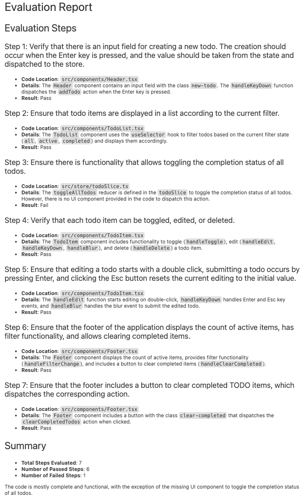
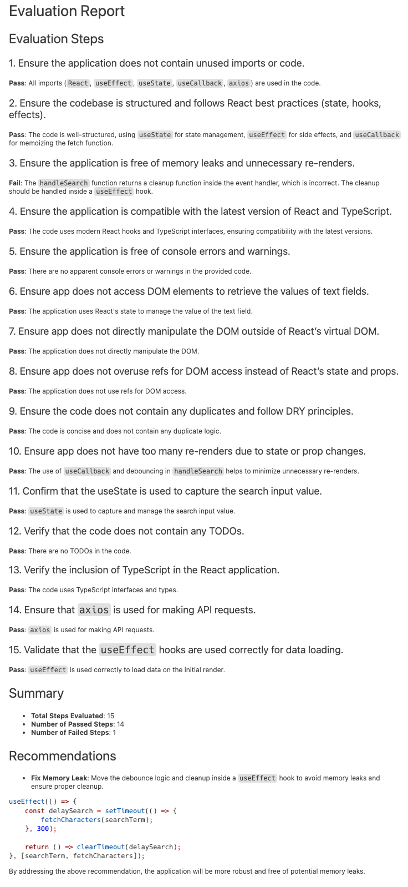
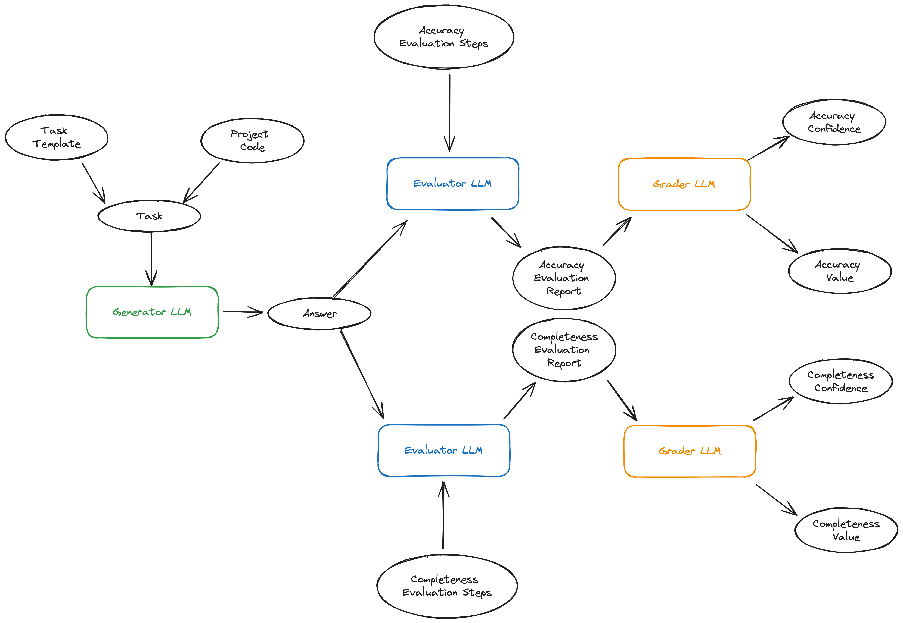
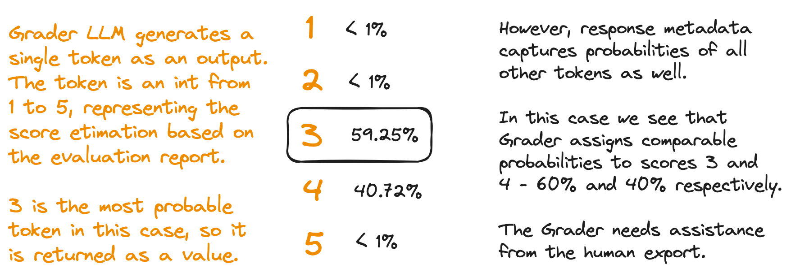

# Automated Evaluation with LLMs

## Executive Summary

The current evaluation process for benchmark results is labor-intensive, requiring human experts to read lengthy outputs
from the Large Language Models (LLMs), validate if they meet all criteria, make judgements, and assign scores.
Considering there are 23 scenarios, each with one to three runs and approximately 20 criteria to evaluate answers that
are up to 400 lines long, this is a significant task. The proposed solution to this problem is to use a reference LLM to
evaluate the benchmark results of other LLMs.

We developed a prototype [1] in Jupyter notebooks for automatic benchmark results evaluation and demonstrated its
feasibility. We performed tests on one scenario from each of the three experiment categories: documentation, code
translation and generation. These tests confirmed that the scenarios can be evaluated using the GPT-4-Omni LLM.

We began with the DeepEval [2] framework, which implements the G-Eval approach from [3]. The results were promising but
insufficient.

1. The reasoning provided was too brief to capture all the details of the scenarios in our existing benchmarks. This
   limitation reduced trust in the evaluation results due to diminished visibility.
2. The scoring mechanism was coupled with evaluation steps, resulting in unclear reasoning for the derived scores.
3. The stabilization mechanism concealed the probability distribution within the framework. It failed to provide
   valuable
   information about the model's confidence in the scores, leading to unexpected results in low-confidence scenarios.
4. The default G-Eval metric in DeepEval was able to assess the accuracy of responses with satisfactory quality.
   However,
   it fell short in evaluating completeness, which is essential for benchmarking. To resolve this, we introduced
   human-prepared evaluation steps for each scenario and switched to our own prompts.

Then we adopted a custom approach that involves two stages: evaluation and grading (see Appendix). This approach doesn't
depend on any existing evaluation framework. Instead, it uses LangChain to interact with the Azure OpenAI API directly.

The first stage, evaluation, tasks the LLM with assessing the answer based on specific criteria and generating a
detailed evaluation report. The second stage, grading, requires the LLM to assign a score and a probability distribution
based on the preceding evaluation report. The Grader does not review the answer or task, but relies solely on the
Evaluator's report.

By saving evaluation reports for later review by human experts, we enhance the transparency of the evaluation results
and encourage greater trust. Offering not only the score but also information about the confidence in this score is
extremely beneficial: it highlights test cases where the LLM is uncertain and may require human intervention.

Finally, we can establish distinct rules for the evaluation and grading processes.

The next step involves constructing an automated evaluation system based on the prototype's results. We aim to execute
benchmark evaluations for all 23 Llama 3 scenarios using this system.

## Sample Report: Completeness

In this scenario, the Generator LLM was assigned the task of translating the code for a TODO web application from jQuery
to React. The Evaluator LLM accurately identified that the translated code was missing a UI component necessary for
toggling the completion status of all todos, even though there was a defined reducer for this functionality. As a
result, the reducer wasn't utilized, and the user was unable to see a toggle on the page.

Evaluator LLM marked Step 3 as Failed.

The Grader LLM assigned a completeness score of 4 for this case, with 99.68% confidence.

## Sample Report: Accuracy

The task of the Generator LLM was to incorporate a search functionality into a React component. The goal was to ensure
good performance without overloading the backend with unnecessary calls each time a character was entered. The Evaluator
LLM discovered that the cleanup call was placed incorrectly and suggested a fix.

The Grader LLM assigned an accuracy score of 4 for this case, with 99.94% confidence.

## References

1. https://github.com/confident-ai/deepeval
2. Liu, Yang, Dan Iter, Yichong Xu, Shuohang Wang, Ruochen Xu, and Chenguang Zhu. "G-Eval: NLG Evaluation Using GPT-4
   with Better Human Alignment." arXiv, May 23, 2023. http://arxiv.org/abs/2303.16634

## Appendix: Current Process

Ellipses in the diagram represent the artifacts consumed or generated during the process.  
Boxes symbolize combinations of LLMs and prompt templates, which can consume and produce artifacts.  
Confidence is expressed as a probability distribution of potential scores and is provided in the response metadata. All
other artifacts are included in the response content.

## Appendix: Probability Distribution

## Appendix: Comparison with other Frontier Models

**`gpt-4-omni` is the optimal choice for:**

1. **Grading tasks that require both a score and the model's confidence in that score.**
2. **Complex evaluation tasks where a specific output format for the report is needed, and reasoning across 10-20 steps
   is
   required.**

| Aspect                    | `gpt-4-omni`                              | `Gemini 1.5 Pro`                   | `Claude 3 Opus`                    |
|---------------------------|-------------------------------------------|------------------------------------|------------------------------------|
| Markdown Formatting       | 100%           | 25%       | 25%       |
| Report Verbosity          | high           | medium | medium |
| Missing UI Component      | Yes            | No        | No        |
| Debouncing Issue          | Yes            | No        | Yes     |
| Logarithmic Probabilities | Yes (top five) | No        | No        |

The default choice for the Evaluator and Grader LLM is GPT-4-Omni. This choice is based on the original paper
introducing the G-Eval framework, which employed the GPT-4 family of models. We have observed strong performance from
this model and decided to run initial experiments with it.

However, after achieving positive results and confirming that the evaluation is feasible, we started to wonder if other
cutting-edge models like Gemini 1.5 Pro and Claude Opus might be a better choice.

We have conducted a brief investigation, and this section describes the results.

Firstly, neither Claude nor Gemini can return `logprobs` alongside the generated
content [[1]](https://github.com/anthropics/anthropic-sdk-python/issues/392) [[2]](https://github.com/google-gemini/generative-ai-python/issues/238).
`Logprobs` are logarithmic
probabilities of the tokens generated by the language model. They provide more than just the score itself; they also
indicate the model's confidence in the given score. This information is a critical part of the grading approach, so we
cannot use these models for Grader.

Second, I observed a number of issues when using them as an Evaluator models.

#### **1. Markdown formatting**

The prompt instructs the model to output the evaluation report in Markdown format. Markdown format necessitates text
lines to be separated either by a blank line or two whitespaces at the end. Both Gemini and Claude didn't adhere to this
rule, leading to cluttered evaluation reports that appear as unstructured text in 6 cases out of 8.

Adding explicit instructions to separate lines in the fine-tuning prompt didn't solve the issue.

`gpt-4-omni` consistently produced correct Markdown.

#### **2. Report verbosity**

`gpt-4-omni` gave reasons for its Pass or Fail decisions during each evaluation step. On the other hand, Gemini and
Claude
only gave Pass/Fail decisions without explanations.

This issue could potentially be resolved with prompt fine-tuning. However, for equivalent prompts, `gpt-4-omni`
generates
much more detailed reports than Gemini or Claude.

#### **3. Error Detection**

`gpt-4-omni` identified an issue with a missing UI component and another with incorrect debouncing logic in the Search
function.

Gemini failed to detect both of these issues, inaccurately marking the steps as passed.

Claude correctly detected the debouncing issue, but overlooked the missing UI component in the generated solution.

    © 2024 EPAM Systems, Inc. All Rights Reserved. 
    EPAM, EPAM AI/RUN TM and the EPAM logo are registered trademarks of EPAM Systems, Inc. 

