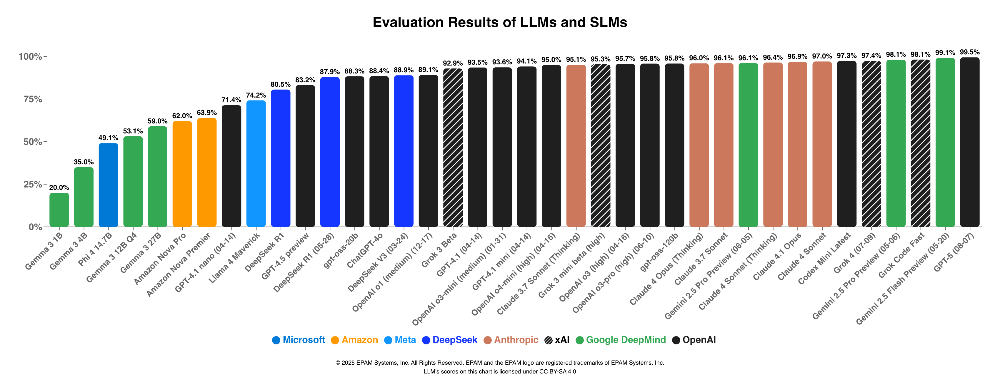
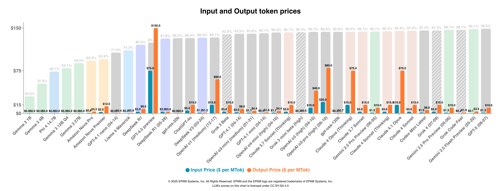
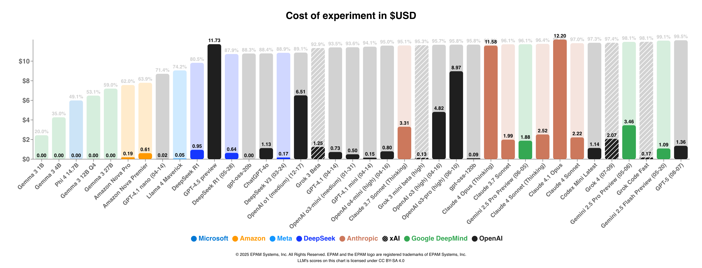
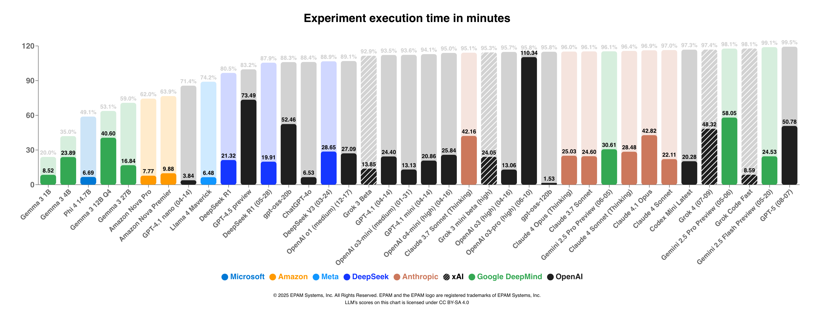

# LLMs Leaderboard (2025-02-05 Update)

This page compares the effectiveness of Anthropic, Amazon, Google DeepMind, xAI, OpenAI, Meta and DeepSeek companies LLMs in executing software engineering tasks, including code translation, code generation, documentation generation and
large context instruction following (LCIF).

Our latest research and evaluations have revealed significant shifts in large language model performance. Leading our rankings is OpenAI's o3-mini model with an impressive 92.4% total score, closely followed by its predecessor o1-mini at
92.3%. Both models demonstrate exceptional capabilities in software engineering tasks while maintaining efficient processing times and reasonable costs.

The third position is held by OpenAI o1 (1217) with 89.4%, showcasing strong performance across all evaluation categories. Following closely is Anthropic's Claude 3.5 Sonnet v2 at 88.7%, demonstrating impressive results particularly in code
generation and documentation tasks. The fifth place is secured by ChatGPT-4o at 88.2%, which maintains competitive performance while offering notably fast execution times.

The current top of Large Language Models based on research, in order of Total Score, are:

1. OpenAI o3-mini (2025-01-31) - 92.4%
2. OpenAI o1-mini (2024-09-12) - 92.3%
3. OpenAI o1 (2024-12-17) - 89.4%
4. Claude 3.5 Sonnet v2 (2024-10-22) - 88.7%
5. ChatGPT-4o (November) - 88.2%

You can read [llm-comparison-report.md](llm-comparison-report.md) for a detailed comparison of the models. The report includes all experiment scores, the performance of each model in different categories, and the final scores.

## Final scores in EPAM's LLMs Benchmark

All categories, except Large Context Instructions Following (LCIF), are evaluated automatically using the Large Language Model1
You can read detailed reports on concrete model performance and the areas where each model excels
in [llm-detailed-result](llm-detailed-result).

The table below provides an overview of the experiment, encompassing three categories. Here, you can review the average accuracy and completeness across all categories, total execution time,
total number of input and output tokens (for o1-series models, output tokens include reasoning tokens), the cost of the experiment, and finally, the total score.
The total score comprises the average score across all categories including LCIF experiment score.

| Model                                                                                  | Total Time (min) | Total input | Total output | Cost ($) | Total Score |
|----------------------------------------------------------------------------------------|------------------|-------------|--------------|----------|-------------|
| [OpenAI o3-mini (2025-01-31)](llm-detailed-result/open-ai-o3-mini-2025-02-03.md)       | 9.49             | 75663       | 90534        | 0.48     | **92.4%**   |
| [OpenAI o1-mini (2024-09-12)](llm-detailed-result/open-ai-o1-mini-2024-11-06.md)       | 11.23            | 77314       | 102043       | 1.46     | 92.3%       |
| [OpenAI o1 (1217)](llm-detailed-result/open-ai-o1-1217-2024-12-19.md)                  | 15.13            | 75663       | 83171        | 6.13     | 89.4%       |
| [Claude 3.5 Sonnet v2](llm-detailed-result/claude-35-sonnet-2024-11-06.md)             | 11.11            | 94643       | 39652        | 0.88     | 88.7%       |
| [ChatGPT-4o](llm-detailed-result/chat-gpt-4o-2024-11-06.md)                            | 7.34             | 75686       | 37560        | 0.94     | 88.2%       |
| [GPT-4o (2024-11-20)](llm-detailed-result/gpt-4o-1120-2024-11-21.md)                   | 4.7              | 75686       | 35709        | 0.55     | 86.9%       |
| [OpenAI o1-preview (2024-09-12)](llm-detailed-result/open-ai-o1-preview-2024-11-06.md) | 46.73            | 77314       | 150303       | 10.18    | 86.5%       |
| [Claude 3.5 Haiku](llm-detailed-result/claude-35-haiku-2024-11-06.md)                  | 8.93             | 94643       | 35217        | 0.27     | 85.5%       |
| [Gemini Experimental (0612)](llm-detailed-result/gemini-exp-1206-2024-12-19.md)        | 34.86            | 87809       | 67061        | 0.00     | 84.7%       |
| [Grok 2 (1212)](llm-detailed-result/grok-2-1212-2024-12-19.md)                         | 12.00            | 75457       | 45017        | 0.60     | 83.6%       |
| [GPT-4o (2024-08-06)](llm-detailed-result/gpt-4o-0806-2024-11-06.md)                   | 11.65            | 75686       | 30858        | 0.50     | 81.4%       |
| [Qwen 2.5 Coder 32B](llm-detailed-result/qwen25coder32b-2024-11-25.md)                 | 6.93             | 74193       | 38907        | 0.10     | 81.0%       |
| [Gemini 1.5 Pro (002)](llm-detailed-result/gemini-15-pro-2024-11-08.md)                | 16.65            | 87809       | 36669        | 0.29     | 80.4%       |
| [DeepSeek R1](llm-detailed-result/deepseek-r1-2025-01-28.md)                           | 58.79            | 78065       | 63012        | 1.13     | 79.0%       |
| [Grok Beta](llm-detailed-result/grok-beta-2024-11-15.md)                               | 10.45            | 75457       | 32444        | 0.86     | 77.1%       |
| [Amazon Nova Pro](llm-detailed-result/amazon-nova-pro-2024-12-06.md)                   | 8.28             | 83627       | 28668        | 0.29     | 71.1%       |
| Llama3.1 405B2                                                              | 9.56             | 74045       | 27498        | 0.30     | 70.5%       |
| [GPT-4o-mini (0718)](llm-detailed-result/gpt-4o-mini-0718-2024-11-06.md)               | 7.98             | 75686       | 25987        | 0.03     | 69.9%       |
| GPT-3.5 Turbo2                                                              | 4.48             | 73956       | 17270        | 0.06     | 60.0%       |
| Llama3 70B2                                                                 | 30.96            | 58615       | 23784        | 0.05     | 59.5%       |
| Claude 3 Opus2                                                              | 24.59            | 94480       | 45574        | 4.84     | -           |
| GPT-4o (2024-05-13)2                                                        | 12.68            | 75581       | 42729        | 1.02     | -           |
| Gemini 1.5 Pro (0801-exp)2                                                  | 15.66            | 87887       | 44631        | 0.78     | -           |
| Gemini 1.5 Pro (0409)2                                                      | 17.40            | 87596       | 36497        | 1.38     | -           |

_Table 1. Overview of the experiment results._

> Additional info:  
> 1 - Evaluation and grading of benchmark results were performed automatically with the help of evaluation tools based on the GPT-4o model.
> Please refer the page [Automated Evaluation with LLMs](automated-evaluation-with-llms.md) to learn about the evaluation tool.  
> 2 - Evaluation was done more than 3 month ago, results are outdated

We have visualized some of the information for your review.

## Models specification

| LLM Name                                                              | Description                                                                                                                                                                                                                                                                                                                                                                                                                                                                                                                                                                                                                                                     | Context Window            | Cost (Input / Output per MTok) | Max Output | Training Data   |
|-----------------------------------------------------------------------|-----------------------------------------------------------------------------------------------------------------------------------------------------------------------------------------------------------------------------------------------------------------------------------------------------------------------------------------------------------------------------------------------------------------------------------------------------------------------------------------------------------------------------------------------------------------------------------------------------------------------------------------------------------------|---------------------------|--------------------------------|------------|-----------------|
| OpenAI o3-mini                                                        | OpenAI o3-mini is first OpenAI small reasoning model that supports highly requested developer features including function calling, Structured Outputs, and developer messages, making it production-ready out of the gate. API Provider: OpenAI, Azure                                                                                                                                                                                                                                                                                                                                                                                                       | 200K                      | $1.10 / $4.40                  | 100K       | Up to Oct 2023  |
| OpenAI o1-mini                                                        | The o1 series of large language models are trained with reinforcement learning to perform complex reasoning. o1 models think before they answer, producing a long internal chain of thought before responding to the user. o1-mini: faster and cheaper reasoning model particularly good at coding, math, and science.  API Provider: OpenAI, Azure                                                                                                                                                                                                                                                                                                          | 128K                      | $3.00 / $12.00                 | 64K        | Up to Oct 2023  |
| Claude 3.5 Sonnet v2                                                  | Anthropic's most powerful AI model. Claude 3.5 Sonnet raises the industry bar for intelligence, outperforming competitor models and Claude 3 Opus on a wide range of evaluations, with the speed and cost of our mid-tier model, Claude 3 Sonnet. Claude 3.5 Sonnet shows us the frontier of what's possible with generative AI. Parameters: Unknown API Provider: AWS Bedrock, Google Vertex AI                                                                                                                                                                                                                                                          | 200K                      | $3.00 / $15.00                 | 8K         | April, 2024     |
| ChatGPT-4o (0903)                                                     | Dynamic model continuously updated to the current version of GPT-4o in ChatGPT. Intended for research and evaluation*. *We are releasing this model for developers and researchers to explore OpenAI's latest research. For production use, OpenAI recommends using dated GPT models, which are optimized for API usage. Parameters: Unknown API Provider: OpenAI, Azure                                                                                                                                                                                                                                                                                  | 128K                      | $5.00 / $15.00                 | 16K        | Up to Oct 2023  |
| OpenAI o1 (1217)                                                      | OpenAI released stable version of o1 model in the end of 2024. Now it has larger context and larger output token size. The latest o1 model supports tools calling, both text and image inputs, and produces text outputs (including Structured Outputs).                                                                                                                                                                                                                                                                                                                                                                                                        | 200K                      | $15.00 / $60.00                | 100K (!)   | Up to Oct 2023  |
| GPT-4o (2024-11-20)                                                   | [Update to GPT-4o (November 20, 2024)](https://help.openai.com/en/articles/9624314-model-release-notes): We’ve updated GPT-4o for ChatGPT users on all paid tiers. This update to GPT-4o includes improved writing capabilities that are now more natural, audience-aware, and tailored to improve relevance and readability. This model is also better at working with uploaded files, providing deeper insights and more thorough responses. Parameters: Unknown API Provider: OpenAI, Azure                                                                                                                                                            | 128K                      | $2.50 / $10.00                 | 16K        | Up to Oct 2023  |
| Claude 3.5 Haiku                                                      | Claude 3.5 Haiku matches the performance of Claude 3 Opus, our prior largest model, on many evaluations at a similar speed to the previous generation of Haiku. Parameters: Unknown API Provider: AWS Bedrock, Google Vertex AI                                                                                                                                                                                                                                                                                                                                                                                                                           | 200K                      | $1.00 / $5.00                  | 8K         | July, 2024      |
| Gemini Experimental (0612)                                            | Quality improvements, celebrate 1 year of Gemini Parameters: Unknown API Provider: Google AI Studio                                                                                                                                                                                                                                                                                                                                                                                                                                                                                                                                                       | Unknown                   | $0.00 / $0.00                  | 8K         | -               |
| OpenAI o1-preview                                                     | The o1 series of large language models are trained with reinforcement learning to perform complex reasoning. o1 models think before they answer, producing a long internal chain of thought before responding to the user. o1-preview: reasoning model designed to solve hard problems across domains. API Provider: OpenAI, Azure                                                                                                                                                                                                                                                                                                                           | 128K                      | $15.00 / $60.00                | 32K        | Up to Oct 2023  |
| Grok 2 (1212)                                                         | [Grok 2](https://docs.x.ai/docs#models) xAI latest text model supporting structured outputs, with improved efficiency, speed and capabilities. Next model by xAi after Grok Beta. Parameters: Unknown API Provider: xAI                                                                                                                                                                                                                                                                                                                                                                                                                                   | 131K                      | $2.00 / $10.00                 | 4K         | -               |
| [Qwen2.5-Coder 32B Instruct](https://github.com/QwenLM/Qwen2.5-Coder) | Qwen2.5-Coder is the latest series of Code-Specific Qwen large language models (formerly known as CodeQwen). As of now, Qwen2.5-Coder has covered six mainstream model sizes, 0.5, 1.5, 3, 7, 14, 32 billion parameters, to meet the needs of different developers. Parameters: 32B API Provider: [Fireworks.ai](https://fireworks.ai/models/fireworks/qwen2p5-coder-32b-instruct), other [available API](https://artificialanalysis.ai/models/qwen2-5-coder-32b-instruct/providers)                                                                                                                                                                    | 33K (depends on provider) | $0.90 / $0.90                  | 4K         | -               |
| GPT-4o (2024-08-06)                                                   | Updated snapshot of GPT-4o model with an increased output token size and a reduced price Parameters: Unknown API Provider: OpenAI, Azure                                                                                                                                                                                                                                                                                                                                                                                                                                                                                                                  | 128K                      | $2.50 / $10.00                 | 16K        | Up to Oct 2023  |
| Gemini 1.5 Pro (002)                                                  | A multimodal model that supports adding image, audio, video, and PDF files in text or chat prompts for a text or code response. This model supports long-context understanding up to the maximum input token limit. Parameters: Unknown API Provider: Google AI Studio                                                                                                                                                                                                                                                                                                                                                                                    | 2M                        | $1.25 / $5.00                  | 8K         | September, 2024 |
| DeepSeek R1                                                           | DeepSeek released R1, a reasoning model trained with initial supervised data followed by reinforcement learning. It matches OpenAI-o1's performance on math, code, and reasoning tasks. The models are open-sourced, with their 32B distilled version setting new records by outperforming OpenAI-o1-mini.  API Provider: DeepSeek platform (currently unavailable), Fireworks (used in benchmark), other providers                                                                                                                                                                                                                                          | 64K                       | $8.00 / $8.00                  | 8K         | Up to Oct 2023  |
| [Grok Beta](https://x.ai/blog/api)                                    | [Grok Beta](https://docs.x.ai/docs#models) for now is only one model available via xAI API. Comparable performance to Grok 2 but with improved efficiency, speed and capabilities. xAI blog: "We are kicking off our public beta with a preview of a new Grok model that is currently in the final stages of development. The model – released under the provisional name grok-beta – has a context length of 128,000 tokens and also supports function calling and system prompts. We will release more information about the model shortly." Parameters: Unknown API Provider: xAI                                                                | 128K                      | $5.00 / $15.00                 | 4K         | -               |
| [Amazon Nova Pro](https://aws.amazon.com/ai/generative-ai/nova/)      | Amazon Nova Pro is a highly capable multimodal model with the best combination of accuracy, speed, and cost for a wide range of tasks.  Amazon Nova Pro’s capabilities, coupled with its industry-leading speed and cost efficiency, makes it a compelling model for almost any task, including video summarization, Q&A, mathematical reasoning, software development, and AI agents that can execute multi-step workflows. Amazon Nova Pro excels at instruction following and agentic workflows as measured by Comprehensive RAG Benchmark (CRAG), the Berkeley Function Calling Leaderboard, and Mind2Web. Parameters: Unknown API Provider: Amazon | 300K                      | $0.80 / $3.20                  | 5K         | October, 2023   |
| GPT-4o mini                                                           | GPT-4o mini ("o" for "omni") is our most advanced model in the small models category, and our cheapest model yet. It is multimodal (accepting text or image inputs and outputting text), has higher intelligence than gpt-3.5-turbo but is just as fast. It is meant to be used for smaller tasks, including vision tasks. We recommend choosing gpt-4o-mini where you would have previously used gpt-3.5-turbo as this model is more capable and cheaper. Parameters: Over 70B API Provider: OpenAI, Azure                                                                                                                                               | 128K                      | $0.15 / $0.60                  | 16K        | Up to Oct 2023  |
| Llama3.1 405B                                                         | The Meta Llama 3.1 collection of multilingual large language models (LLMs) is a collection of pretrained and instruction tuned generative models in 8B, 70B and 405B sizes (text in/text out). The Llama 3.1 instruction tuned text only models (8B, 70B, 405B) are optimized for multilingual dialogue use cases and outperform many of the available open source and closed chat models on common industry benchmarks.  Parameters: 405B  API Provider: Fireworks.ai                                                                                                                                                                                    | 128K                      | $3.00 / $3.00                  | 16K        | Up to Dec 2023  |
| GPT-3.5 Turbo                                                         | GPT-3.5 Turbo models can understand and generate natural language or code and have been optimized for chat using the Chat Completions API but work well for non-chat tasks as well. As of July 2024, gpt-4o-mini should be used in place of gpt-3.5-turbo, as it is cheaper, more capable, multimodal, and just as fast. gpt-3.5-turbo is still available for use in the API. Parameters: Unknown  API Providers: OpenAI, Azure                                                                                                                                                                                                                           | 16K                       | $0.50 / $1.50                  | 4K         | Up to Dec 2023  |
| Llama3 70B                                                            | Meta developed and released the Meta Llama 3 family of large language models (LLMs), a collection of pre-trained and instruction tuned generative text models in 8 and 70B sizes. The Llama 3 instruction tuned models are optimized for dialogue use cases and outperform many of the available open source chat models on common industry benchmarks. Further, in developing these models, we took great care to optimize helpfulness and safety.   Parameters: 70B  API Provider: EPAM AI DIAL*                                                                                                                                             | 8K                        | $0.59 / $0.79                  | 4K         | Up to Dec 2023  |
| Claude 3 Opus                                                         | Claude 3 Opus is Anthropic's most powerful AI model, with state-of-the-art performance on highly complex tasks. It can navigate open-ended prompts and sight-unseen scenarios with remarkable fluency and human-like understanding. Claude 3 Opus shows us the frontier of what's possible with generative AI. Parameters: 2T (not official number) - https://lifearchitect.substack.com/p/the-memo-special-edition-claude-3 API Provider: AWS Bedrock, Google Vertex AI                                                                                                                                                                                  | 200K                      | $15.00 / $75.00                | 4K         | August, 2023    |
| Gemini 1.5 Pro (Experimental 0801)                                    | Experimental preview version of Google's best performing multimodal model with features for a wide variety of reasoning tasks Parameters: Unknown API Provider: Google AI Studio                                                                                                                                                                                                                                                                                                                                                                                                                                                                          | 2M                        | $3.50 / $10.50                 | 8K         | November, 2023  |
| GPT-4o (2024-05-13)                                                   | GPT-4o ("o" for "omni") is our most advanced model. It is multimodal (accepting text or image inputs and outputting text), and it has the same high intelligence as GPT-4 Turbo but is much more efficient—it generates text 2x faster and is 50% cheaper. Additionally, GPT-4o has the best vision and performance across non-English languages of any of our models. GPT-4o is available in the OpenAI API to paying customers Parameters: Over 200B - Medium article API Provider: OpenAI, Azure                                                                                                                                                       | 128K                      | $5.00 / $15.00                 | 4K         | Up to Oct 2023  |
| Gemini 1.5 Pro (0409)                                                 | Gemini 1.5 Pro is a mid-size multimodal model that is optimized for a wide-range of reasoning tasks. 1.5 Pro can process large amounts of data at once, including 2 hours of video, 19 hours of audio, codebases with 60,000 lines of code, or 2,000 pages of text. Parameters: Unknown API Provider: Vertex AI                                                                                                                                                                                                                                                                                                                                           | 1M                        | $7.00 / $21.00                 | 8K         | November, 2023  |
| GPT-4 Turbo (2024-04-09)                                              | The latest generation of the multimodal model from OpenAI. It has updated knowledge Up to Dec 2023 and provides 3X cheaper pricing for input tokens and 2X cheaper for output tokens compared to the original GPT-4 model. Parameters: Unknown API Provider: OpenAI, Azure                                                                                                                                                                                                                                                                                                                                                                                | 128K                      | $10.00 / $30.00                | 4K         | Up to Dec 2023  |

_Table 2. Description of LLMs, their versions, amount of information to process, and the length of the response._

> *EPAM AI DIAL is a proprietary tool developed by EPAM Systems, serves as a platform for hosting and utilizing models while also functioning as a proxy through Azure.

## Notes

- To learn more about our methodology for evaluating LLMs, please read [LLMs Benchmark Approach](llm-approach.md).
- To submit your model for evaluation, please refer to the [Large Language Model Benchmark Submission](submissions/llm-benchmark-submission.md) page.

    © 2025 EPAM Systems, Inc. All Rights Reserved. 
    EPAM, EPAM AI/RUN TM and the EPAM logo are registered trademarks of EPAM Systems, Inc. 
    This report is licensed under CC BY-SA 4.0

