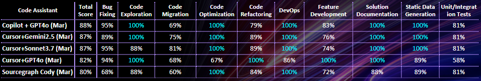

# Code Assistants Leaderboard as of April 2025

- [Leaderboard as of December 2024](code-assistants.md)
- [Leaderboard per Developer Task as of April 2025](#leaderboard-per-developer-task-as-of-april-2025)

## Leaderboard as of April 2025

| Category                                                                                                                                   | Test Date    | Test Details                                                                                                                                                                                         | Executive Summary on Code Assistant Research                                                                                                                                                                                                                                                                                                                                                                 | Final Score (Low + Medium Complexity) | Low Complexity only (144 tests) | Medium Complexity Only (25 tests) |
|--------------------------------------------------------------------------------------------------------------------------------------------|--------------|------------------------------------------------------------------------------------------------------------------------------------------------------------------------------------------------------|--------------------------------------------------------------------------------------------------------------------------------------------------------------------------------------------------------------------------------------------------------------------------------------------------------------------------------------------------------------------------------------------------------------|-----------------------------------|-----------------|--------------------|
| [GitHub Copilot](https://github.com/features/copilot) + [GPT-4o](https://platform.openai.com/docs/models/gpt-4o)                           | March 2025   | [Sandbox Tests - March 2025](reports/copilot/2025/copilot-gpt4o-sandbox-tests-march-2025.md)   [Golf App Tests - March 2025](reports/copilot/2025/copilot-gpt4o-golf-app-tests-march-2025.md)     | Appeared to be the best in code-completions and very good at chat tests (but not the best). As of Spring 25 has agentic feature in very heavy development/experimental state. Also lacking some enterprise features like standalone deployment. Improved plugins for JetBrains tools and full Visual Studio - they almost caught on VS Code                                                                  | 88%                               | 89%             | 80%                |
| [Cursor](https://www.cursor.com/) + [Claude 3.7 Sonnet](https://www.anthropic.com/news/claude-3.7-sonnet)                                  | March 2025   | [Sandbox Tests - March 2025](reports/cursor/2025/cursor-sonnet3.7-sandbox-tests-march-2025.md)   [Golf App Tests - March 2025](reports/cursor/2025/cursor-sonnet3.7-golf-app-tests-march-2025.md) | A landmark of how standalone GenAI-enabled IDE may look like in the future. VS Code-based only - which may pose significant limitations for enterprise developers (Java, .NET, front-end) - in such cases may represent an interface to AI features including the agent. Has the most capable agentic feature, although this feature isn't ideal - can solve small to medium tasks with moderate complexity. | 87%                               | 88%             | 80%                |
| [Cursor](https://www.cursor.com/) + [Gemini-2.5-pro-exp-03-25](https://cloud.google.com/gemini/docs/overview)                              | March-April 2025 | [Sandbox Tests - March 2025](reports/cursor/2025/cursor-gemini2.5-sandbox-tests-march-2025.md)   [Golf App Tests - April 2025](reports/cursor/2025/cursor-gemini2.5-golf-app-tests-april-2025.md) | A landmark of how standalone GenAI-enabled IDE may look like in the future. VS Code-based only - which may pose significant limitations for enterprise developers (Java, .NET, front-end) - in such cases may represent an interface to AI features including the agent. Has the most capable agentic feature, although this feature isn't ideal - can solve small to medium tasks with moderate complexity. | 87%                               | 87%             | 88%                |
| [Cursor](https://www.cursor.com/) + [GPT-4o](https://platform.openai.com/docs/models/gpt-4o)                                               | March-April 2025 | [Sandbox Tests - March 2025](reports/cursor/2025/cursor-gpt4o-sandbox-tests-march-2025.md)   [Golf App Tests - April 2025](reports/cursor/2025/cursor-gpt4o-golf-app-tests-april-2025.md)         | A landmark of how standalone GenAI-enabled IDE may look like in the future. VS Code-based only - which may pose significant limitations for enterprise developers (Java, .NET, front-end) - in such cases may represent an interface to AI features including the agent. Has the most capable agentic feature, although this feature isn't ideal - can solve small to medium tasks with moderate complexity.                                                                                                                                                                                                                                                                                                                                                                                                              | 82%                               | 83%             | 76%                |
| [Cody (Sourcegraph)](https://sourcegraph.com/cody) + [Claude 3.7 Sonnet](https://www.anthropic.com/news/claude-3.7-sonnet)                 | March 2025   | [Sandbox Tests - March 2025](reports/sourcegraph-cody/2025/cody-sonnet3.7-sandbox-tests-march-2025.md)   [Golf App Tests - March 2025](reports/sourcegraph-cody/2025/cody-sonnet3.7-golf-app-tests-march-2025.md)         | Quality is good - a bit worse then leaders but almost on par with Cursor + GPT-4o. Provides very wide spectrum of enterprise features like standalone deployment, very wide support of IDE plugins, prompt library, code insights, code search etc. Agentic interface is in heavy development but already is of moderate usefulness/quality                                                                                                                                                                                                                                                                                                                                                                                                             | 80%                               | 81%             | 80%                |

 © EPAM. Distribution and use permitted 

** The LLM specified for the code assistant was used to run tests for the chat window

## Leaderboard per Developer Task as of April 2025

 © EPAM. Distribution and use permitted 

    © 2025 EPAM Systems, Inc. All Rights Reserved.     EPAM, EPAM AI/RUN TM and the EPAM logo are registered trademarks of EPAM Systems, Inc.     This report is licensed under CC BY-SA 4.0 

