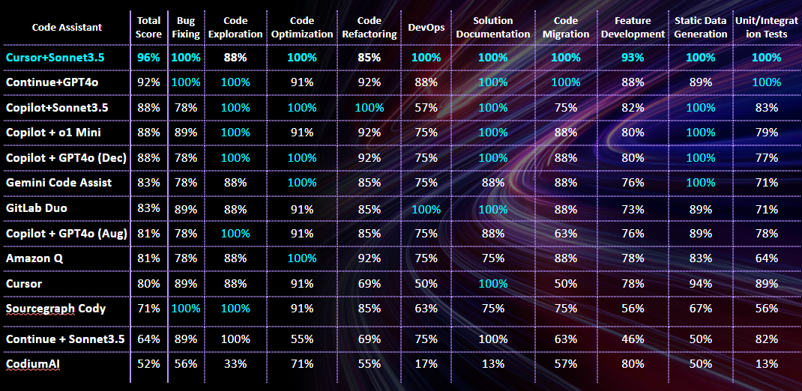

# Code Assistants Leaderboard as of April 2025

- [Leaderboard as of April 2025](#leaderboard-as-of-dec-2024)
- [Leaderboard per Developer Task as of April 2025](#leaderboard-per-developer-task-as-of-december-2024)
- [Detailed Reports](#detailed-reports)
- [Notes](#notes)

## Summary
As of fall 2024 code assistants of Google, Microsoft and Amazon show very similar quality, although they vary in features - Amazon is the only that released its developer agent in public access whereas Microsoft (GitHub) is only piloting a preview of its agentic product Copilot Workspace.

There are two niche players that score much better - Continue and Cursor. The former is an open-source product, and it suffers from stability and configuration issues, although when works properly it scores much higher than major vendors tools. The latter Cursor is a private build of Visual Studio code therefore it suits only developers that work in this IDE (leaving Java, .NET, C++ and some other developers aside) - although being an AI-centric IDE it scores the highest.

Other tools according to our research don't represent a significant interest.

## Leaderboard as of April 2025

| Category                                                                                                                                   | Test Date    | Test Details                                                                                                                                                                                         | Executive Summary on Code Assistant Research                                                                                                                                                                                                                                                                                                                                                                                                                                                                                                                                                                                   | Final Score (Low + Medium Complexity) | Low Complexity only | Medium Complexity Only |
|--------------------------------------------------------------------------------------------------------------------------------------------|--------------|------------------------------------------------------------------------------------------------------------------------------------------------------------------------------------------------------|--------------------------------------------------------------------------------------------------------------------------------------------------------------------------------------------------------------------------------------------------------------------------------------------------------------------------------------------------------------------------------------------------------------------------------------------------------------------------------------------------------------------------------------------------------------------------------------------------------------------------------|-----------------------------------|-----------------|--------------------|
| [GitHub Copilot](https://github.com/features/copilot) + [GPT-4o](https://platform.openai.com/docs/models/gpt-4o)                           | March 2025   | [Sandbox Tests - March 2025](reports/copilot/2025/copilot-gpt4o-sandbox-tests-march-2025.md)   [Golf App Tests - March 2025](reports/copilot/2025/copilot-gpt4o-golf-app-tests-march-2025.md)     |                                                                                                                                                                                          | 88%                               | 89%             | 80%                |
| [Cursor](https://www.cursor.com/) + [Claude 3.7 Sonnet](https://www.anthropic.com/news/claude-3.7-sonnet)                                  | March 2025   | [Sandbox Tests - March 2025](reports/cursor/2025/cursor-sonnet3.7-sandbox-tests-march-2025.md)   [Golf App Tests - March 2025](reports/cursor/2025/cursor-sonnet3.7-golf-app-tests-march-2025.md) |                                                                                                                                                                                                                                 | 87%                               | 88%             | 80%                |
| [Cursor](https://www.cursor.com/) + [Gemini-2.5-pro-exp-03-25](https://cloud.google.com/gemini/docs/overview)                              | March-April 2025 | [Sandbox Tests - March 2025](reports/cursor/2025/cursor-gemini2.5-sandbox-tests-march-2025.md)   [Golf App Tests - April 2025](reports/cursor/2025/cursor-gemini2.5-golf-app-tests-april-2025.md) |                                                                                                                                                                                                                                               | 87%                               | 87%             | 88%                |
| [Cursor](https://www.cursor.com/) + [GPT-4o](https://platform.openai.com/docs/models/gpt-4o)                                               | March-April 2025 | [Sandbox Tests - March 2025](reports/cursor/2025/cursor-gpt4o-sandbox-tests-march-2025.md)   [Golf App Tests - April 2025](reports/cursor/2025/cursor-gpt4o-golf-app-tests-april-2025.md)         |                                                                                                                                                                                                                    | 82%                               | 83%             | 76%                |
| [Cody (Sourcegraph)](https://sourcegraph.com/cody) + [Claude 3.7 Sonnet](https://www.anthropic.com/news/claude-3.7-sonnet)                 | March 2025   | [Sandbox Tests - March 2025](reports/sourcegraph-cody/2025/cody-sonnet3.7-sandbox-tests-march-2025.md)   [Golf App Tests - March 2025](reports/sourcegraph-cody/2025/cody-sonnet3.7-golf-app-tests-march-2025.md)         |                                                                                                                                                                                          | 80%                               | 81%             | 80%                |

 © EPAM. Distribution and use permitted 

** The LLM specified for the code assistant was used to run tests for the chat window

## Leaderboard per Developer Task as of December 2024

 © EPAM. Distribution and use permitted 

    © 2025 EPAM Systems, Inc. All Rights Reserved.     EPAM, EPAM AI/RUN TM and the EPAM logo are registered trademarks of EPAM Systems, Inc.     This report is licensed under CC BY-SA 4.0 

