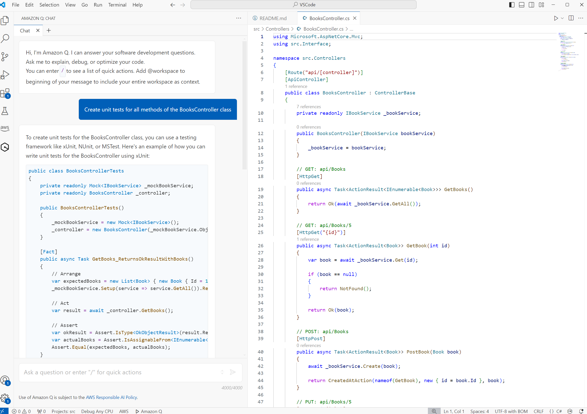
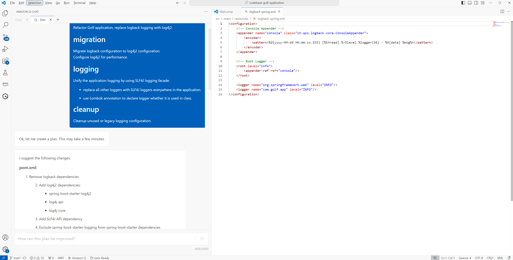

# Code Assistants Benchmark Approach

- [AI/RUN TM Engineering Benchmark Tests](#airun-engineering-benchmark-tests)
- [Categories of tests](#categories-of-tests)
- [A Note on IDE](#a-note-on-ide)
- [Agents vs Code Assistants](#agents-vs-code-assistants)
- [Ranging Tests Complexity](#ranging-tests-complexity)
- [Repositories Summary](#repositories-summary)
- [Evaluation Approach](#evaluation-approach)
- [A Note on Automation](#a-note-on-automation)
- [Other Aspects. Closing Notes. Limitations and Ramifications](#other-aspects-closing-notes-limitations-and-ramifications)

[Here](../../pages/sandbox-test/why-ai-run-benchmark.md) we have already explained the challenges and limitations of the other available on the Market benchmarks. Below we provide details on how AI/RUN TM Engineering Benchmark addresses them. Also it is explained how we define categories of tests, their complexity and evaluation criteria.   

## AI/RUN TM Engineering Benchmark Tests

An example of a benchmark test from our benchmark is given below alongside instructions for running the test. The test itself comprises a file with a name that suggests that inside there'll be an implementation of a utility method for dealing with HTTP Authentication, namely the test tries to create a method that returns an HTTP Basic Authentication string from a given username and a password. The instructions tell a developer to insert a code snippet and await code suggestion from the assistant tool. A suggestion rendered by Amazon Q is also depicted.

Chat-based version of the same benchmark test is depicted below, so this is a test that has both code completion and chat versions:

We tried to stick to the following premises during such tests creation:
1. They have to be contextual - solving a real problem that developers face during enterprise programming.
2. Naming has to resemble real examples of code style.
3. Problems must be easy to check although slight variations of correct suggestions may occur.
4. The way how the test implies using IDE must closely resemble the way how a real developer uses IDE during real programming.

So as it was shown above, the test design implies having a small 'solution' consisting of 1-5 files and instructions for a developer that will be running this test. The instructions usually direct placing a cursor in a specific place in the text editor and typing some specific text or asking a question in the chat window. Agentic tests that are being developed as of mid-2024 imply more sophisticated flows as agentic code assistants are capable of solving much more sophisticated challenges.

The full instructions for running this test are depicted below:

In addition to what was said above, the method of verifying whether the test was successful or not is actually compiling the code and running the unit tests provided with the test instructions.

Another example of a test is where we think Gen AI assistants currently excel - unit tests creation. The test presents a .NET Web API REST controller with the task to cover its methods with unit tests:

Test instructions have two versions - for the chat interface and for code completion. The method of checking implies running a code coverage tool with the threshold of 70% when the test itself is deemed as passed:

So, this test shows that not only running unit tests is used to check the correctness of the output, but sometimes more sophisticated approaches like verifying how much code was covered by the tests that were generated by the Gen AI assistant tool. For such complex scenarios, the code completion instructions can also be multi-step, but this occurs rarely.

## Categories of tests

By doing an extensive survey in an organization that covered hundreds of developers, we identified 16 categories of software development activities where AI technologies can help. Of course, there could have been different categorizations, and we saw some analogs in the industry, but the structure we have stuck to proved to be efficient for us in terms of fitting our observations and R&D activities in general. Such categories and associated development activities for each category are depicted in the picture below:

As of mid-2024, we marked in blue those categories where we think the acceleration of developers' productivity is significant (approximately above 10%), in green those categories where acceleration is medium (up to approx. 10%), and in orange those where we see potential but where acceleration currently is below 5%.

Reviewing the process of creating a benchmark that will measure the relative efficiency of Generative AI development assistants, we identified that some categories of development can be approached easily, whereas approaching other categories represented a substantial challenge.

Those categories for which we were able to create test scenarios in the benchmark relatively easily:
1. Non-Proprietary Solution/Component generation
2. Tests Creation
3. Algorithm Development
4. Data Generation
5. Code Bug Fixing

Categories that represented a moderate challenge for us:
1. Code Refactoring, Code Optimization – as those vary in complexity and size, especially optimizations.
2. Solution Documentation – as there might be different levels of solution documentation – architectural, functional, etc.
3. Solution Migration – as migrations may represent code migration, architecture migration, programming language update, etc. – they all vary in degree of sophistication.
4. Code Analysis – as this may represent holistic static code analysis, adherence to best practices, security scans, and other various kinds of analyses.
5. Solution template generation – a task with a high variety of possible solutions which is files/folders and config structure according to a task.

Categories that represented a significant challenge for us:
1. DevOps – because of the variability of possible scenarios and complexity of how to check the results.
2. Code Explanation – the whole matter represents a very broad topic and the explanation scope may vary from short code snippets to whole solutions.

At the same time, there were categories that currently don’t lend themselves to benchmark/checking how AI assistance can speed up related activities, although it is evident that they substantially help developers:
1. Learning technologies – Gen AI dramatically helps to study new APIs, programming language primitives, and similar. Although it is very hard to measure the exact impact, especially in the scope of a benchmark.
2. Code Review – although the current Gen AI tools provide such functionality, from the benchmarking methodology standpoint, it was very challenging to develop repeatable cases that can be verified continuously.
3. Code instrumentation – a niche activity that highly depends on a concrete use-case – i.e. inserting timers into the code or log messages – very hard to verify.

Ultimately, after doing a thorough analysis of which categories and relevant cases can be checked programmatically with reasonable complexity of the test cases and moderate effort, we decided to concentrate on the following 11 categories:
1. Non-Proprietary Solution/Component Generation
2. Tests Creation
3. Algorithm Development
4. Data Generation
5. Code Explanation
6. Code Bug Fixing
7. Code Refactoring
8. Solution Documentation
9. Code Optimizations
10. DevOps
11. Solution Migration

Although we have experimented with other categories like Solution Template Generation, we have found that it is very challenging to produce good representative tests for those other categories with a reasonable amount of effort.

## A Note on IDE

According to our analysis of the industry state as of mid-2024, Visual Studio Code appears to be a de-facto standard for releasing new features and updates for Gen AI Dev Assistants. This IDE boasts the widest support of all major vendors of such tools - hence we decided to create tests in the benchmark predominantly for VS Code and also report scores and behavior of tools mostly for VS Code. Although we noticed that functional capabilities and behavior of Gen AI Dev assistants may vary across IDEs even for the same tool - i.e. GitHub Copilot has more features in VS Code than in full Visual Studio. A similar situation happens with JetBrains tools.

We attentively monitor the situation, and if we find that it changed dramatically, we will likely change the approach - i.e. we may start verifying Java tests in JetBrains IntelliJ Idea and .NET tests in Visual Studio (although not all major vendors provide support for the full Visual Studio - i.e. there's no Google Gemini Code Assist for it).

## Agents vs Code Assistants

In mid-2024, so-called ‘agentic assistants’ represent a frontier option of how Gen AI may aid in creating software by acting as a developer companion that is able to solve high-level problems. Unlike code completion, which produces ad-hoc suggestions during code typing, such assistants bear two major characteristics that make them outstanding:
- Ability to create a step-by-step plan for solving a task and then execute this plan by generating code.
- Ability to integrate with so-called ‘tools’ for the matter of either getting information from them or updating information by using them. In this way, agentic tools are able to get details from corporate JIRA or Confluence or update the needed files in the filesystem.
- Ability to do 'orchestration' of prompts and other agents that play some specific roles (i.e. by using system prompts).
- Ability to reflect on its own results by iteratively improving the outcome.

Although there might be other interpretations of what an 'agentic assistant' means, as it frequently happens in a rapidly changing domain, the description above proved for us to describe the current state of things pretty accurately.

An example of agentic flow supported by Amazon Q Developer Assistant is depicted below - although this tool is not able to do integrations, it is able to create a plan for a high-level task and then execute this plan step by step creating code:

## Ranging Tests Complexity

We quickly realized that there can be different scopes and complexities of tests. Moreover, the evolution path of Gen AI code assistants brought new use-cases and patterns of appliance like agentic flows where the tool can create an execution plan for a relatively high-level task and then execute this task by generating code for it.

All the information below is related to non-agentic tests as AI agentic flows benchmarking is in development now and on its own it represents a far more substantial undertaking.

Initially, we started with tests each representing an isolated task like HumanEval but with key differences:
1. The task must closely resemble what real developers do during enterprise programming and/or creation of information systems.
2. The task must be isolated, comprising 1-5 files but at the same time bigger than HumanEval counterparties in terms of having some context to elaborate upon (and to index by a code assistant) – the vast majority of tests are not isolated algorithmic stories unlike HumanEval.
3. The method of testing must resemble what real programmers do during real coding – the tasks do not imply writing huge comments before code snippets to be modified, unlike HumanEval.

In this way, we have created a bunch of tests for Java and C# that reside in the repository [AIRUN Assistants Benchmark CodeBase](https://github.com/epam/AIRUN-Assistants-Benchmark-CodeBase) and tests instructions for them at [AIRUN Assistants Benchmark TestInstructions](https://github.com/epam/AIRUN-Assistants-Benchmark-TestInstructions). Sometimes such tests represent a file with an insertion point, and the instruction directs to start typing something and await a completion – which is a code-completion test. More often, especially with more sophisticated categories of development like refactoring, bug-fixing, code explanation, and similar, the task could not be solved via just a code completion. We waited for approximately half a year until chat interfaces became mainstream with the general availability of GitHub Copilot Chat, and at that point, we rolled out more ‘conversational’ tests that relied upon IDE chat where a user was able to ask open-ended questions. So, putting agentic tests aside, basically two kinds of tests have emerged - code-completion, that we have marked in the Excel as 'completion' and what we called 'chat' (column 'Interface' in the Excel).

Complexity of all tests was evaluated using the following criteria:

*Low complexity*:
- Single line or less code completion/replacement/migration.
- Uniform data generation i.e. JSON.
- Trivial couple of lines DevOps or other config generation.
- Generating primitive data types mock data for unit tests/integration tests.
- In general, very low to none number of dependencies, external integration calls, and similar.

*Medium complexity*:
- One unit test generation.
- 2-7 lines of code generation for component/algo/refactoring/bug fixing/optimization/migration.
- Some basic nesting/data references in data generation incl. generating mock objects i.e. a mock object with 1-5 fields.
- 10-20 lines of DevOps/config file i.e. Docker configuration with 3-5 layers.
- Simple application generation/transformation (i.e. generate simple React app, migrate simple React app into Angular).
- Simple function/method/class/component documentation/explanation.
- In general, just a couple of external dependencies such as libraries and just a few integration calls.

*High complexity*:
- Unit test harness generation or integration test or integration test harness generation.
- 7+ lines of code generation for component/algo/refactoring/bug fixing/optimization/migration (i.e. a complex refactoring using Strategy/Unit of Work pattern).
- Data generation of complex data structures with references and nesting including generation of mock objects with nesting.
- Data anonymization/cleansing.
- 20+ lines of DevOps/config.
- Complex application/component generation/transformation (i.e. generate/migrate a complex React app).
- Complex function/method/class/component documentation/explanation (explain an architecture of the project/library).
- More than a couple of dependencies on external libraries and frameworks and/or more than a couple of integration calls.

With the development of Gen AI Code Assistants, we came to a conclusion that it is better to conduct tests in projects with more files allowing the assistants to do more indexing of the codebase. In this way, we took a small Java web application for doing a golf club management code of which resides at [Codebase Golf Application](https://github.com/PolinaTolkachova/golf-application) and the instructions to which reside at [golf-application-tests](https://github.com/epam/AIRUN-Assistants-Benchmark-TestInstructions/tree/main/golf-application-tests). As all the tests here imply more context processing and they are more sophisticated in nature, we attributed them to medium-high complexity.

An example of a test with medium complexity is given below. It represents some refactoring that implies understanding of the context of two methods and proposing a solution that includes some external libraries (still some may conclude that this test is of low complexity because it’s just a couple of lines fixes – which is ok also). The concept of this test is applying refactoring to Java code to use automated ModelMapper instead of manual mapping of domain object into DTO. An initial state of the code is depicted on the picture:

## Repositories Summary

As it was already described above, the benchmark resides in 3 repositories - two repositories with codebases for 'simple' tests and the codebase of the golf application. In the beginning of 2024, we figured out that if test instructions (what to type or ask in the chat) and right answers examples are put in the same folder structure as the codebase, some Gen AI tools can index the correct examples also and subsequently they will respond just with the excerpts from the correct answers. So we took the decision to segregate instructions from the codebases. Unit tests that have to pass when the correct solution is applied also reside in the instructions repository.

So the instructions reside in the Tests Instructions repository [AIRUN Assistants Benchmark TestInstructions](https://github.com/epam/AIRUN-Assistants-Benchmark-TestInstructions), which subsequently has folders each holding instructions for different kinds of tests:

We now release sandbox-tests, which is what was mentioned as the first iteration of tests - isolated code examples consisting of 1-5 files, and golf-application-tests, which are the tests for the small solution golf application. Other groups of tests including fine-tuning and agentic-workflow represent work that is currently well underway and may be released in the nearest future.

Each test in tests instructions has a README.md file with textual instruction on how to run the test as well as a correct response example (for almost all tests except the most obvious ones) and unit tests file. The file structure for the instructions repository is `{kind of test}/{tests category}/{test name}/{programming language}`. An example of a directory of a specific test instruction is displayed below:

Below is an example of the tests instructions for the test displayed above:

The instructions have several key sections:
1. Kind of modality - whether this is Code Completion or Chat within IDE. 'Bare LLM' represents just testing of LLM chat interface (like Chat GPT) which is no longer performed.
2. Assert conditions - checks to be made to mark the test as valid.
3. Additional notes - any helpful remarks for test executors.

Like it was already said, the repository with initial tests called 'sandbox-tests' resides at location [AIRUN Assistants Benchmark CodeBase](https://github.com/epam/AIRUN-Assistants-Benchmark-CodeBase). The repository has the structure that resonates with the categories outlined in the sections above:

The code for a specific test resides at the following location `[ category ] /  [ test name ] /  [ programming language ] / [ IDE ]` where the two last parts are optional:

## Evaluation Approach

We have been experimenting with different models of running and evaluating tests including automation. In mid-2024, we settled with the approach where tests are being executed and then evaluated by a developer manually. Each developer is given clear instructions that tell upon which conditions a test is deemed as passed. Very frequently it is running unit tests associated with tests instructions successfully, but sometimes there can be other conditions. I.e. below is an example of a test that tries to get rid of an unhandled exception in C# and the check rules tell that the overall code including suggested by the code assistant must compile and the unit tests that come with the experiment's instructions must pass:

When running experiments, a developer has to fill in the Excel table that will capture the details and subsequently calculate the mean and other numbers for reporting. In code completion, the most usual case is when a developer chooses the first suggested option. However, in cases where it is evident that this option does not solve the test challenge, a developer that runs the test chooses the next most possible option suggested by the Gen AI code assistant.

Subsequently, this Excel table is used for report generation as to which test categories scored which exact result for a specific tool. We also found somewhat useful the 'Effort' column which identifies a relative evaluation of how much effort was required for getting a result for a specific test.

Though that such evaluation methodology bears some degree of subjectivity, to address that we strived to provide the clearest instructions and unit tests that have to pass to mark the test successful. However, in some rare instances, a developer is able to mark the test as successful even if not all the tests have passed, and in such cases, they have to provide a comment in the comments column with the explanation.

## A Note on Automation

In 2023, we did an extensive attempt to automate tests running by using desktop GUI automation in VS Code and Visual Studio. Unfortunately, we abandoned this effort due to inherent complexities of Gen AI code assistants:
1. They do not provide either SDK or API as this represents an internal IP. All that can be automated is pointing a cursor, pressing buttons, and typing text within IDE, which generally is a big challenge for today's automation world.
2. As they represent IDE plugins, very frequently there was unexpected behavior that occurred in IDE that prevented further testing and implied adjusting testing scripts - this may have been a pop-up suggesting a tool update or some visual tabs or panels rearrangement.
3. From the point above - different IDEs required different automation scripts as they represent completely different desktop applications.
4. Automation usually allowed choosing only the first suggestion in code completion scenarios. Elaborating on other options was a very hard challenge to solve.
5. We found out that only 8 mentioned categories of tests can be automated with reasonable efforts: Solution/Component Generation, Tests Creation, Algorithm Development, Data Generation, Code Bug Fixing, DevOps, Solution Migration, and Solution Template Generation.

We also did some prototyping of applying BDD-like syntax for tests running; however, at that time we did not find that the amount of investment justifies the benefits gained as we already identified the limitations outlined above.

Although some other benchmarks like SWE-Bench lend themselves very well to automation because what is generated in the tests is a repository diff file, we deliberately have chosen the approach that resembles much more the way of how developers perform maximum of day-to-day activities during software development. Whereas SWE-Bench-like suites can mostly test autonomous headless agentic assistants rather than coding companion tools.

## Other Aspects. Closing Notes. Limitations and Ramifications

We totally understand that measuring the efficiency and accuracy of Gen AI coding assistants is a multidimensional complicated task that involves not just the tests that we created. What needs to be measured also is:
1. Feature set, licensing, and costs for each assistant software - which is a separate research done by our group.
2. The way how tools adapt to user behavior in the long run - which is very hard to benchmark as this requires a long time sitting of a developer interacting with the tool and evaluating how it adapts to either successful or unsuccessful suggestions. We think that monitoring real projects, surveying, and so-called tools 'telemetry' helps address this challenge.

Overall, we haven't seen any similar benchmark in the industry that covers so many different aspects of software development activities, and also the numbers that we have been getting throughout almost the last two years generally corresponded to the feedback we were getting from the developers in the field.

We will continue to evolve this benchmark in two major directions:
1. Adding more sophisticated tests such as agentic tools tests and tests for fine-tuning.
2. Enriching existing tests and categories with more sophisticated scenarios as we already see that some of the assistants are getting almost 100% score in some specific categories.
