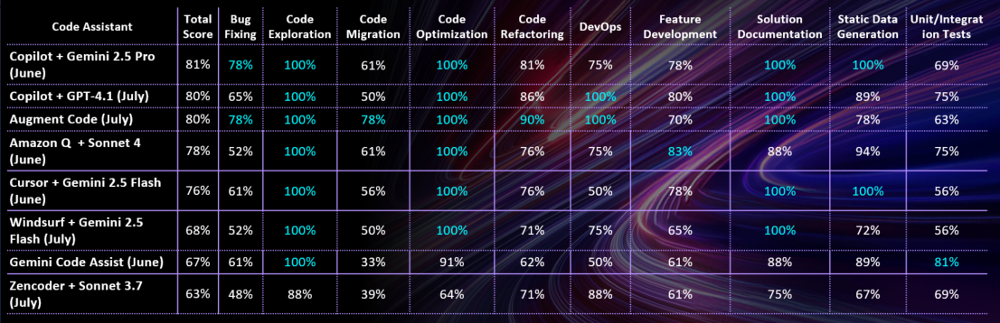

# Code Assistants Leaderboard as of July 2025

- [Leaderboard as of April 2025](code-assistants-april-2025.md)

## Leaderboard as of July 2025

| Category                                                                                                                                                           | Test Date | Test Details                                                                                                                                                                                                                                                                                                                                                                                                                     | Final Score (Chat Based + Code Completion Tests, 177 tests) | Chat Based Tests (109 tests)     | Code Completion Tests (68 tests) |
|--------------------------------------------------------------------------------------------------------------------------------------------------------------------|-----------|------------------------------------------------------------------------------------------------------------------------------------------------------------------------------------------------------------------------------------------------------------------------------------------------------------------------------------------------------------------------------------------------------------------------------------------|-------------------------------------------------------------|----------------------------------|----------------------------------|
| [GitHub Copilot](https://github.com/features/copilot) + [Gemini 2.5 Pro](https://cloud.google.com/vertex-ai/generative-ai/docs/models/gemini/2-5-pro)              | June 2025 | [Sandbox Tests - June 2025](reports/copilot/2025/copilot-gemini2.5Pro-sandbox-tests-june-2025.md)   [Golf App Tests - July 2025](reports/copilot/2025/copilot-gemini2.5Pro-golf-app-tests-june-2025.md)         |   **80.65%**                                                  | 86.21%                           | **73.53%**                       |
| [GitHub Copilot](https://github.com/features/copilot) + [GPT-4.1](https://openai.com/index/gpt-4-1/)                                                               | July 2025 | [Sandbox Tests - July 2025](reports/copilot/2025/copilot-gpt4.1-sandbox-tests-july-2025.md)   [Golf App Tests - July 2025](reports/copilot/2025/copilot-gpt4.1-golf-app-july-2025.md)                           |   80.23%                                                      | 89.91%                           | 64.71%                           |
| [Augment Code](https://docs.augmentcode.com/introduction)                                                                                                          | July 2025 | [Sandbox Tests - July 2025](reports/augment-code/2025/augment-code-sandbox-tests-july-2025.md)   [Golf App Tests - July 2025](reports/augment-code/2025/augment-code-golf-app-tests-july-2025.md)               |   80.00%                                                      | 88.07%                           | 67.65%                           |
| [Amazon Q](https://aws.amazon.com/q/) + [Claude 4 Sonnet](https://www.anthropic.com/claude/sonnet)                   | June 2025 | [Sandbox Tests - June 2025](reports/amazon-q/2025/amazon-q-sandbox-tests-june-2025.md)   [Golf App Tests - June 2025](reports/amazon-q/2025/amazon-q-sonnet4-golf-app-tests-june-2025.md)     | 77.97%                                                      | **92.66%**                       | 54.41%                           |
| [Cursor](https://www.cursor.com/) + [Gemini 2.5 Flash](https://cloud.google.com/vertex-ai/generative-ai/docs/models/gemini/2-5-flash)                              | June 2025 | [Sandbox Tests - June 2025](reports/cursor/2025/cursor-gemini2.5Flash-sandbox-tests-june-2025.md)   [Golf App Tests - June 2025](reports/cursor/2025/cursor-gemini2.5Flash-golf-app-tests-june-2025.md)         |   75.71%                                                      | 88.07%                           | 55.88%                           |
| [Windsurf](https://docs.windsurf.com/windsurf/getting-started) + [Gemini 2.5 Flash](https://cloud.google.com/vertex-ai/generative-ai/docs/models/gemini/2-5-flash) | July 2025 | [Sandbox Tests - July 2025](reports/windsurf/2025/windsurf-gemini2.5Flash-sandbox-tests-july-2025.md)   [Golf App Tests - July 2025](reports/windsurf/2025/windsurf-gemini2.5Flash-golf-app-tests-july-2025.md) |    68.36%                                                      | 80.73%                           | 48.53%                           |
| [Gemini Code Assist](https://codeassist.google/)                                                                                                                   | June 2025 | [Sandbox Tests - June 2025](reports/gemini/2025/gemini-sandbox-tests-june-2025.md)   [Golf App Tests - June 2025](reports/gemini/2025/gemini-golf-app-tests-june-2025.md)                                       |   67.23%                                                      | 83.49%                           | 41.18%                           |
| [Zencoder](https://docs.zencoder.ai/get-started/introduction) + [Claude 3.7 Sonnet](https://www.anthropic.com/claude/sonnet)                                       | July 2025 | [Sandbox Tests - July 2025](reports/zencoder/2025/zencoder-sonnet3.7-sandbox-tests-july-2025.md)   [Golf App Tests - July 2025](reports/zencoder/2025/zencoder-sonnet3.7-golf-app-tests-july-2025.md)           |   62.71%                                                      | 87.16%                           | 23.53%                           |
| [Cline](https://docs.cline.bot/getting-started/for-new-coders) + [Gemini 2.5 Flash](https://cloud.google.com/vertex-ai/generative-ai/docs/models/gemini/2-5-flash) | July 2025 | [Sandbox Tests - July 2025](reports/cline/2025/cline-gemini2.5Flash-sandbox-tests-july-2025.md)   [Golf App Tests - July 2025](reports/cline/2025/cline-gemini2.5Flash-golf-app-tests-july-2025.md)          |   -                                                           | 83.00%                           | -                                |
| [Continue](https://docs.continue.dev/) + [Gemini 2.5 Flash](https://cloud.google.com/vertex-ai/generative-ai/docs/models/gemini/2-5-flash)                         | July 2025 | [Sandbox Tests - July 2025](reports/continue/2025/continue-gemini2.5Flash-sandbox-tests-july-2025.md)   [Golf App Tests - July 2025](reports/continue/2025/continue-gemini2.5Flash-golf-app-tests-july-2025.md) |   -                                                           | 84.00%  | -                                |
| [Amp](https://sourcegraph.com/amp)                                                                                                                                 | July 2025 | [Golf App Tests - July 2025](reports/amp/2025/amp-golf-app-tests-july-2025.md)                                                                                                                                     |   -                                                           | 91% (golf-app tests, 22 tests)   | -                                |
| [Cody](https://sourcegraph.com/docs/cody) + [Gemini 2.5 Flash](https://cloud.google.com/vertex-ai/generative-ai/docs/models/gemini/2-5-flash)                      | July 2025 | [Sandbox Tests - July 2025](reports/sourcegraph-cody/2025/cody-gemini2.5Flash-sandbox-tests-july-2025.md)                                                                                                          |   69.03% (code completion + sandbox tests, 155 tests)         | 86.21% (sandbox tests, 87 tests)     | 47.06%                           |

 © EPAM. Distribution and use permitted 

- All the tests have been performed in VS Code except Cursor and Windsurf that represent their own IDE. In other IDEs score and behavior of code assistants may vary.
- The LLM specified for the code assistant was used to run tests for the chat window.
- Cline does not provide code autocompletion functionality.

## Leaderboard per Developer Task as of July 2025

 © EPAM. Distribution and use permitted 

    © 2025 EPAM Systems, Inc. All Rights Reserved.     EPAM, EPAM AI/RUN TM and the EPAM logo are registered trademarks of EPAM Systems, Inc.     This report is licensed under CC BY-SA 4.0 

