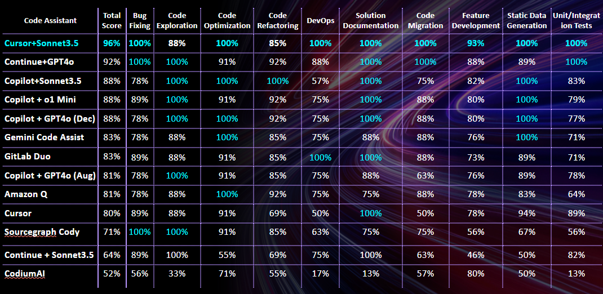
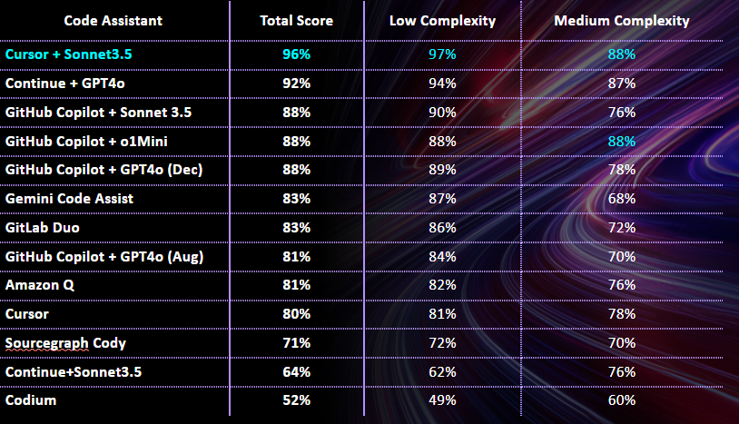

# Code Assistants Leaderboard as of December 2024

- [Leaderboard as of Dec 2024](#leaderboard-as-of-dec-2024)
- [Leaderboard per Developer Task as of December 2024](#leaderboard-per-developer-task-as-of-december-2024)
- [Detailed Reports](#detailed-reports)
- [Notes](#notes)

## Summary
As of fall 2024 code assistants of Google, Microsoft and Amazon show very similar quality, although they vary in features - Amazon is the only that released its developer agent in public access whereas Microsoft (GitHub) is only piloting a preview of its agentic product Copilot Workspace.

There are two niche players that score much better - Continue and Cursor. The former is an open-source product, and it suffers from stability and configuration issues, although when works properly it scores much higher than major vendors tools. The latter Cursor is a private build of Visual Studio code therefore it suits only developers that work in this IDE (leaving Java, .NET, C++ and some other developers aside) - although being an AI-centric IDE it scores the highest.

Other tools according to our research don't represent a significant interest.

## Leaderboard as of Dec 2024

| Category                                                                                                                                       | Test Date     | Test Details                                                                                                                                                                                  | Executive Summary on Code Assistant Research                                                                                                                                                                                                                                                                                                                                                                                                                                                                                                                                                                                       | Final Score (Low + Medium Complexity) | Low Complexity only | Medium Complexity Only |
|------------------------------------------------------------------------------------------------------------------------------------------------|---------------|-----------------------------------------------------------------------------------------------------------------------------------------------------------------------------------------------|------------------------------------------------------------------------------------------------------------------------------------------------------------------------------------------------------------------------------------------------------------------------------------------------------------------------------------------------------------------------------------------------------------------------------------------------------------------------------------------------------------------------------------------------------------------------------------------------------------------------------------|---------------------------------------|---------------------|------------------------|
| **[Cursor](https://www.cursor.com/) + [Sonnet 3.5](https://www.anthropic.com/news/claude-3-5-sonnet)**                                         | **Sep 2024**  | [Sandbox Tests - Sep 2024](reports/cursor/cursor-sonnet-sandbox-tests-september-2024.md)   [Golf App Tests - Sep 2024](reports/cursor/cursor-sonnet-golf-app-tests-september-2024.md)      | **Separate IDE (private build of VS Code) that has rich and efficient Gen AI capabilities tightly integrated into the IDE user journeys and scoring very high numbers in EPAM Benchmark. Although raises serious concerns being a niche IDE on its own - rarely a developer will code in VS Code, even more rarely - in some niche IDE.**                                                                                                                                                                                                                                                                                          | **96%**                               | **97%**             | **88%**                |
| [Continue](https://docs.continue.dev/intro) + [GPT4o](https://platform.openai.com/docs/models/gpt-4o)                                          | July 2024     | [Continue AI - July 2024](reports/continue/continue-july-2024.md)                                                                                                                             | Open-source plugin for VS Code and JetBrains IDEs that scores the highest numbers in EPAM benchmark in combination with GPT-4o. Very fast and efficient. Is worth considering as alternative to non-agentic Copilot.                                                                                                                                                                                                                                                                                                                                                                                                               | 92%                                   | 93%                 | 90%                    |
| [GitHub Copilot](https://github.com/features/copilot) + [Sonnet 3.5](https://www.anthropic.com/news/claude-3-5-sonnet)                         | November 2024 | [Sandbox Tests - Nov 2024](reports/copilot/copilot-sonnet-sandbox-tests-november-2024.md)   [Golf App Tests - Nov 2024](reports/copilot/copilot-sonnet-golf-app-tests-november-2024.md)    | As of November 2024 looks like an experimental feature of Copilot as not all tests can pass. Good score overall but slower than o1.                                                                                                                                                                                                                                                                                                                                                                                                                                                                                                | 88%                                   | 90%                 | 76%                    |
| [GitHub Copilot](https://github.com/features/copilot) + [o1-mini](https://openai.com/index/openai-o1-mini-advancing-cost-efficient-reasoning/) | November 2024 | [Sandbox Tests - Nov 2024](reports/copilot/copilot-o1mini-sandbox-tests-november-2024.md)   [Golf App Tests - Nov 2024](reports/copilot/copilot-o1mini-golf-app-tests-november-2024.md)    | Fast and accurate across all usecases. Score a bit lower than the leading combination Cursor + Sonnet 3.5.                                                                                                                                                                                                                                                                                                                                                                                         | 88%                                   | 88%                 | **88%**                |
| [GitHub Copilot](https://github.com/features/copilot) + [GPT4o](https://platform.openai.com/docs/models/gpt-4o)                                | December 2024 | [Sandbox Tests - December 2024](reports/copilot/copilot-gpt4o-sandbox-tests-december-2024.md)   [Golf App Tests - Dec 2024](reports/copilot/copilot-gpt4o-golf-app-tests-december-2024.md) | Copilot + GPT4o is similar to Copilot +o1mini. While Copilot +o1mini generates more code examples and documentation in the chat window, Copilot + GPT4o provides a more concise output. Both are approximately equal in terms of response generation speed.                                                                                                                                                                                                                                                                                | 88%                                   | 89%                 | 78%                    |
| [Gemini Code Assist](https://cloud.google.com/gemini/docs/overview)                                                                            | Sep 2024      | [Sandbox Tests - Sep 2024](reports/gemini/gemini-sandbox-tests-september-2024.md)   [Golf App Tests - Sep 2024](reports/gemini/gemini-golf-app-tests-september-2024.md)                    | Good score overall but lower than Copilot + o1. Very close to Amazon Q.                                                                                                                                                                                                                                                                                                                                                                                                                                                                                                                                                            | 83%                                   | 87%                 | 68%                    |
| [GitLab Duo](https://cloud.google.com/gemini/docs/overview)                                                                                    | December 2024 | [Gitlab Duo - December 2024](reports/gitlab-duo/gitlab-duo-december-2024.md)      | GitLab Duo serves as an alternative to GitHub Copilot, offering a suite of AI-powered tools designed to integrate seamlessly within the GitLab ecosystem. It includes features such as a dedicated coding assistant plugin, integration with GitLab Server (available through a separate enterprise subscription), a CLI assistant, and a coding agent similar to GitHub Copilot's Workspace.   While GitLab Duo is a strong contender, it currently trails GitHub Copilot by an estimated 5-15% in certain areas , positioning it closer to solutions like Google Gemini according to our benchmark. However reliability may be a concern as we noticed instabilities while running our tests.            | 83%                                   | 86%                 | 72%                    |
| [GitHub Copilot](https://github.com/features/copilot) + [GPT4o](https://platform.openai.com/docs/models/gpt-4o)                                | Aug 2024      | [Sandbox Tests - Aug 2024](reports/copilot/copilot-sandbox-tests-august-2024.md)   [Golf App Tests - Aug 2024](reports/copilot/copilot-golf-app-tests-august-2024.md)                      | Used to be a leader in the score across 3 major vendors but now has been likely overtaken by AWS Amazon Q by a tiny margin. According to the tests the **chat is much more capable than code completion**. Has got some useful chat commands however does not provide a developer agent like Amazon Q.                                                                                                                                                                                                                                                                                                                             | 81%                                   | 84%                 | 70%                    |
| [Amazon Q](https://aws.amazon.com/q/)                                                                                                          | Sep 2024      | [Sandbox Tests - Sep 2024](reports/amazon-q/amazon-q-sandbox-tests-september-2024.md)   [Golf App Tests - Sep 2024](reports/amazon-q/amazon-q-golf-app-tests-september-2024.md)            | Initially a laggard but recently Amazon likely did huge investments to improve this technology - the quality of answers increased approx. on 10-20% and it provides a unique developer agent - the only major vendor that released this tech - able to solve high-level tasks by generating a plan and creating code for it - it rendered much better results than its competitor Codium AI, although seemingly its dev agent can't solve all tasks. On the negative side it's code completion is much less accurate unlike its chat and responses were slow. Overall the tests score is on the level or even better than Copilot. | 81%                                   | 82%                 | 76%                    |
| [Cursor*](https://www.cursor.com/)                                                                                                             | July 2024     | [Cursor - July 2024](reports/cursor/cursor-july-2024.md)                                                                                                                                      | Separate IDE (private build of VS Code) that has rich and efficient Gen AI capabilities tightly integrated into the IDE user journeys and scoring very high numbers in EPAM Benchmark. Although raises serious concerns being a niche IDE on its own - rarely a developer will code in VS Code, even more rarely - in some niche IDE.                                                                                                                                                                                                                                                                                              | 80%                                   | 81%                 | 78%                    |
| [Sourcegraph Cody](https://sourcegraph.com/cody)                                                                                               | July 2024     | [Sourcegraph Cody - July 2024](reports/sourcegraph-cody/sourcegraph-cody-july-2024.md)                                                                                                        | Niche product - a plugin for VS Code and a standalone website plus an enterprise offering. Scored good marks in EPAM Benchmark although worse than Copilot especially in code completion. Especially good at indexing a project locally and automatically providing necessary embeddings. A separate website has got a Code Search feature that answers questions on open-source repositories. Is worth investigating deeper for cases when a client needs to index a whole private repository locally - likely an expensive Enterprise version is needed for such case.                                                           | 71%                                   | 71%                 | 76%                    |
| [Continue](https://docs.continue.dev/intro) + [Sonnet 3.5](https://www.anthropic.com/news/claude-3-5-sonnet)                                   | Sep 2024      | [Sandbox Tests - Sep 2024](reports/continue/continue-sonnet-sandbox-tests-september-2024.md)   [Golf App Tests - Aug 2024](reports/continue/continue-sonnet-golf-app-tests-august-2024.md) | Open-source plugin for VS Code and JetBrains IDEs that scores the highest numbers in EPAM benchmark in combination with Sonnet 3.5. Very fast and efficient. Is worth considering as alternative to non-agentic Copilot.                                                                                                                                                                                                                                                                                                                                                                                                           | 64%                                   | 62%                 | 76%                    |
| [CodiumAI](https://codeium.com/)                                                                                                               | June 2024     | [CodiumAI - June 2024](reports/codium-ai/codium-ai-capabilities-research-may-june-2024.md)                                                                                                    | Niche product (VS Code and JetBrains IDEs Plugin) that has many capabilities including agentic features but did not impress overall in any of areas. Benchmark score is low. Can generate not bad unit test suites - but this is on the level of major players in the field. Code reviews functionality is worse by quality then unit tests generation.                                                                                                                                                                                                                                                                            | 52%                                   | 49%                 | 63%                    |

 © EPAM. Distribution and use permitted 

*- All the tests have been performed in VS Code IDE except Cursor that represents its own IDE that is a private build of VS Code. In other IDEs score and behavior of code assistants may vary.

## Leaderboard per Developer Task as of December 2024

 © EPAM. Distribution and use permitted 

## Detailed Reports

- [Copilot (GPT4o) Sandbox tests - December 2024](reports/copilot/copilot-gpt4o-sandbox-tests-december-2024.md)
- [Copilot (GPT4o) Golf App tests - December 2024](reports/copilot/copilot-gpt4o-golf-app-tests-december-2024.md)
- [GitLab Duo - December 2024](reports/gitlab-duo/gitlab-duo-december-2024.md)
- [Copilot (o1-mini) Sandbox tests - November 2024](reports/copilot/copilot-o1mini-sandbox-tests-november-2024.md)
- [Copilot (o1-mini) Golf App tests - November 2024](reports/copilot/copilot-o1mini-golf-app-tests-november-2024.md)
- [Copilot (Sonnet) Sandbox tests - November 2024](reports/copilot/copilot-sonnet-sandbox-tests-november-2024.md)
- [Copilot (Sonnet) Golf App tests - November 2024](reports/copilot/copilot-sonnet-golf-app-tests-november-2024.md)
- [Amazon Q Sandbox tests - September 2024](reports/amazon-q/amazon-q-sandbox-tests-september-2024.md)
- [Amazon Q Golf App tests - September 2024](reports/amazon-q/amazon-q-golf-app-tests-september-2024.md)
- [CodiumAI Capabilities Research May-June 2024](reports/codium-ai/codium-ai-capabilities-research-may-june-2024.md)
- [Continue - July 2024](reports/continue/continue-july-2024.md)
- [Continue (Sonnet) Sandbox tests - September 2024](reports/continue/continue-sonnet-sandbox-tests-september-2024.md)
- [Continue (Sonnet) Golf App tests - August 2024](reports/continue/continue-sonnet-golf-app-tests-august-2024.md)
- [Copilot Sandbox tests - August 2024](reports/copilot/copilot-sandbox-tests-august-2024.md)
- [Copilot Golf App tests - August 2024](reports/copilot/copilot-golf-app-tests-august-2024.md)
- [Cursor - July 2024](reports/cursor/cursor-july-2024.md)
- [Cursor (Sonnet) Sandbox tests - September 2024](reports/cursor/cursor-sonnet-sandbox-tests-september-2024.md)
- [Cursor (Sonnet) Golf App tests - September 2024](reports/cursor/cursor-sonnet-golf-app-tests-september-2024.md)
- [Gemini Sandbox tests - September 2024](reports/gemini/gemini-sandbox-tests-september-2024.md)
- [Gemini Golf App tests - September 2024](reports/gemini/gemini-golf-app-tests-september-2024.md)
- [Sourcegraph Cody - July 2024](reports/sourcegraph-cody/sourcegraph-cody-july-2024.md)
- [Gemini, Copilot and Amazon Q Sandbox tests - June 2024](reports/gemini-copilot-amazon-q-sandbox-tests-june-2024.md)
- [Gemini, Copilot and Amazon Q Golf App tests - April 2024](reports/gemini-copilot-amazon-q-golf-app-tests-april-2024.md)

## Notes

- See [the code assistants benchmark approach](code-assistants-benchmark-approach.md)
- See [the code assistants feature comparison August 2024](code-assistants-feature-comparison/code-assistants-feature-comparison-august-2024.md)

    © 2024 EPAM Systems, Inc. All Rights Reserved.     EPAM, EPAM AI/RUN TM and the EPAM logo are registered trademarks of EPAM Systems, Inc.     This report is licensed under CC BY-SA 4.0 

