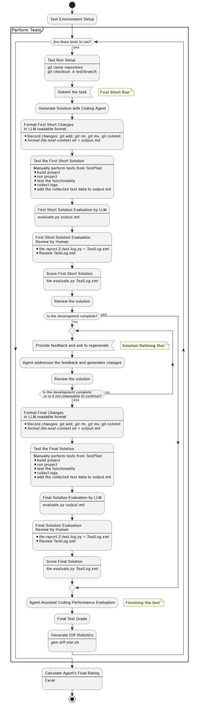
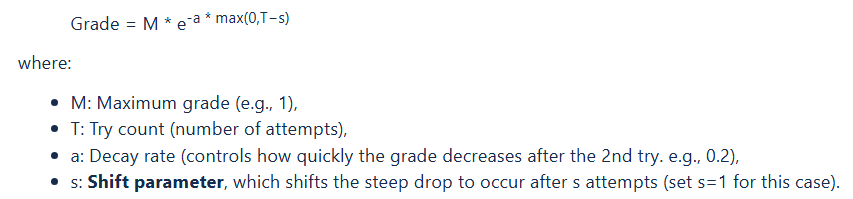
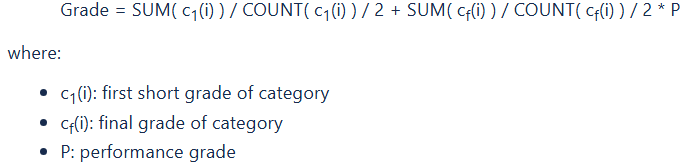

# Coding Agent Testing Methodology

# Table of Contents

- [Coding Testing Methodology](#coding-testing-methodology)
    - [Approach](#approach)
        - [Test Tasks Selection](#test-tasks-selection)
        - [Solution Evaluation](#solution-evaluation)
            - [Completeness](#completeness)
            - [Accuracy](#accuracy)
        - [Automatic LLM evaluation](#automatic-llm-evaluation)
        - [Overall Automation](#overall-automation)
    - [Methodology](#methodology)
        - [Test Specification](#test-specification)
        - [Test Run Steps](#test-run-steps)
            - [Test Run Setup](#test-run-setup)
            - [Test Running](#test-running)
                - [First Short Run](#first-short-run)
                    - [T1.1 Generate Solution with Coding Agent](#t11-generate-solution-with-coding-agent)
                    - [T1.2 Format First Short Changes in LLM-readable format](#t12-format-first-short-changes-in-llm-readable-format)
                    - [T1.3 Test the First Short Solution](#t13-test-the-first-short-solution)
                    - [T1.4 First Short Solution Evaluation by LLM](#t14-first-short-solution-evaluation-by-llm)
                    - [T1.5 First Short Solution Evaluation Review by Human](#t15-first-short-solution-evaluation-review-by-human)
                    - [T1.6 Score First Short Solution](#t16-score-first-short-solution)
                - [Solution Refining Run](#solution-refining-run)
                    - [(Optional, Iterative) Refine the solution](#optional-iterative-refine-the-solution)
                    - [T2.1 Review the solution](#t21-review-the-solution)
                    - [T2.2 Provide feedback and ask to regenerate](#t22-provide-feedback-and-ask-to-regenerate)
                    - [T2.3 Format Final Changes in LLM-readable format](#t23-format-final-changes-in-llm-readable-format)
                    - [T2.4 Test the Final Solution](#t24-test-the-final-solution)
                    - [T2.5 Final Solution Evaluation by LLM](#t25-final-solution-evaluation-by-llm)
                    - [T2.6 Final Solution Evaluation Review by Human](#t26-final-solution-evaluation-review-by-human)
                    - [T2.7 Score Final Solution](#t27-score-final-solution)
                - [T3 Agent-Assisted Coding Performance Evaluation](#t3-agent-assisted-coding-performance-evaluation)
                - [T4 Final Test Grade](#t4-final-test-grade)
                - [T5 Generate Diff Statistics](#t5-generate-diff-statistics)
        - [Agent's Final Rating](#agents-final-rating)
    - [Test Report Sample](#test-report-sample)
    - [Summary](#summary)
    - [Testing](#testing)
        - [Scope](#scope)
        - [Environment](#environment)
        - [Code Generation Findings](#code-generation-findings)
        - [Test Report](#test-report)

## Approach

An agent tester is free to perform testing on their own. We do not define the scope of the research and the set of tests to be run. They may differ dependently on examined agent features and capabilities. This approach provides a broad perspective, allowing testers to identify the benefits of the agent as well as issues that might have been missed by running a fixed set of constrained tests. We provide a list of repositories and samples of tasks, the tester choose from five to fifteen tasks from the given list or offers their own ones, tries to solve tasks with the agent, fills the test report following the sample given below, writes a summary including the agent's evaluation and accompanied by the most interesting observations.

### Test Tasks Selection

A tester should choose from five to fifteen tasks to be solved with coding agent assistance. The number of task may depend on many factors: how much days are going to spend for research, what features are going to be tested, what domains should be investigated, etc. Taking into account that task complexity may differ it is expected that a developer can complete from 2-3 till 7-8 tasks per day.

Tasks can be selected from AIRUN-Assistants-Benchmark-TestInstructions repository containing set of [agentic workflow tests](https://github.com/epam/AIRUN-Assistants-Benchmark-TestInstructions/tree/main/agentic-workflow-tests).

List of repositories suggested to run agentic workflow tests:

| Sourcecode Repository | Summary                                                                                                  | Tags                         |
|-----------------------|----------------------------------------------------------------------------------------------------------|------------------------------|
| [https://github.com/PolinaTolkachova/golf-application](https://github.com/PolinaTolkachova/golf-application) | The Golf Application is a versatile management system designed to facilitate the efficient administration of golf clubs and their activities | Java, Spring, backend, frontend |
| [https://github.com/AlexanderTarvid/eShop-250408](https://github.com/AlexanderTarvid/eShop-250408)       | eShop Reference Application - "AdventureWorks"                                                           | .NET, containers, web app, frontend, backend, Blazor |

The tester is free to offer own test tasks more suitable for examined agent features testing.

### Solution Evaluation

We assume that the solution should be assessed from different perspectives. At the moment, we distinguish two categories for assessment. In the future, the number of categories may change.

#### Completeness

In general completeness should show how the generated solution satisfy functional/technical or non-functional requirements to the task solution (from implementing a UI feature to improving performance or latency in a distributed system). A developer should define a list of high-level requirements and check if all of them are addressed in the generated solution. For complex task the requirements can be differentiated by assigning a weight depending on whether they are mandatory, recommended or optional but desirable, so сompleting of essential requirements contributes the most to final grade.

#### Accuracy

To evaluate the solution accuracy a developer must answer how correctly the generated code performs the intended functionality. Here is a list of key criteria statements to check:

- Ensure that the code is syntactically correct, compiles without errors.
- Ensure the code achieves its intended purpose accurately, without logical errors.
- Ensure the code handles different scenarios correctly, including corner or edge cases.
- Ensure there are not unrequested code changes.
- Ensure there are not unused code fragments.
- Make sure that the code is written following design patterns.
- Ensure that the code is well-documented, with clear and concise documentation for each part of the code.
- Ensure that the code is clean, readable, adheres to best practices and naming conventions.
- Ensure that the code is easily maintainable, with proper structure and separation of concerns.
- Make sure the code makes robust exception handling to handle unexpected issues gracefully and prevent the application from crashing.
- Ensure that application is secure by using proper authentication, authorization, and data validation techniques, and the code protects the application from common security vulnerabilities.
- Ensure that application configuration is flexible and externalized to efficiently manage different environments.
- Ensure that the code follows the established coding standards/patterns in the project/solution

### Automatic LLM evaluation

[The LLM evaluation framework](https://github.com/epam/AIRUN-Evaluation-Framework/tree/main) is used to help a tester to evaluate solutions generated by coding agents. The framework makes an initial solution evaluation and provides the evaluation report. The tester examines the solution, studies the evaluation report and makes the final conclusions.

### Overall Automation

Agentic test automation is under development. As for now we provide a number of scripts that can be used by a tester to speed up the testing process.

## Methodology

#### Test Specification

Test specification contains all information needed to setup test environment, run code generation test, evaluate generated solution, grade the test results. As well it can be converted to a human-readable test description.
The sample of the test specification with major sections is given below:

<details>
<summary>Test specification sample...</summary>

```xml
<?xml version="1.0" encoding="UTF-8" standalone="yes" ?>
<TestSpec>
    <Id>0000</Id>
    <Title>Sample bug fixing task</Title>
    <Category>code-bugfixing</Category>
    <Complexity>medium</Complexity>
    <CodeRepository>https://github.com/PolinaTolkachova/golf-application</CodeRepository>
    <!-- Technology stack -->
    <Stack>
        <Languages>
            <Language primary="true">Java</Language>
            <Language>HTML</Language>
            <Language>JavaScript</Language>
        </Languages>
    </Stack>
    <Task>
<![CDATA[
Fix the issue described below.
 
## Description
Competition removing fails with error and the following error page is displayed:
 
<page>
Whitelabel Error Page
 
This application has no explicit mapping for /error, so you are seeing this as a fallback.
Mon Feb 24 15:01:23 EET 2025
There was an unexpected error (type=Not Found, status=404).
No static resource competition/1/remove.
org.springframework.web.servlet.resource.NoResourceFoundException: No static resource competition/1/remove.
    at org.springframework.web.servlet.resource.ResourceHttpRequestHandler.handleRequest(ResourceHttpRequestHandler.java:585)
    at org.springframework.web.servlet.mvc.HttpRequestHandlerAdapter.handle(HttpRequestHandlerAdapter.java:52)
    at org.springframework.web.servlet.DispatcherServlet.doDispatch(DispatcherServlet.java:1089)
</page>
 
## Steps to reproduce
 
1. Open Competitions page.
2. Open an existing competition page. For instance, http://localhost:8082/competition/1 .
3. Remove the competition by clicking the button "Delete competition".
4. Confirm the competition deletion.
 
## Actual results
- The error page given above is displayed.
 
## Expected results
- The competition is deleted.
- An user is returned to the Competitions page.
]]>
    </Task>
    <Context>
        <Files>
            <File>src/main/java/com/golf/app/controller/CompetitionController.java</File>
            <File>src/main/java/com/golf/app/service/CompetitionService.java</File>
            <File>src/main/java/com/golf/app/service/CompetitionServiceImpl.java</File>
            <File>src/main/resources/templates/competition/competition-details.html</File>
            <File>src/main/resources/templates/competition/competition-main.html</File>
            <File>src/main/resources/application.properties</File>
        </Files>
    </Context>
    <Arrangement>
        <Arrange>Copy logback-spring.xml to golf-application/src/main/resources/logback-spring.xml</Arrange>
        <Arrange>Add the file to git index with the command: `git add src/main/resources/logback-spring.xml`</Arrange>
        <Arrange>Record the changes to the repository with the command: `git commit -m "arrange codebase for test"`</Arrange>
    </Arrangement>
    <Act>
        <ActStep>Submit the task and wait implementation plan is generated</ActStep>
        <ActStep>Go to the implementation plan</ActStep>
        <ActStep>Follow the implementation plan steps and modify source code following the instructions</ActStep>
    </Act>
    <TestPlan>
        <TestStep>Update database configuration in application.properties to make it compatible with your local environment</TestStep>
        <TestStep>Build the application with the command: `mvn clean install`</TestStep>
        <TestStep>Launch the application with the command: `mvn spring-boot:run`</TestStep>
        <TestStep>Open application UI at http://localhost:8082/competition</TestStep>
        <TestStep>Click on competition id link to visit competition details page</TestStep>
        <TestStep>Click 'Delete competition' button and confirm deletion</TestStep>
        <TestStep>Add results of the manual tests to output.md. See (testing-template.md)[testing-template.md]</TestStep>
    </TestPlan>
    <Criteria>
        <Criterion type="completeness" weight="high">
            <Assert weight="high">Ensure the application change fixes the issue with competition deletion</Assert>
            <Assert weight="medium">Make sure that the solution uses DELETE HTTP method for competition deletion</Assert>
            <Assert weight="medium">Ensure the application shows competition main page after competition deletion</Assert>
            <Assert weight="high">Ensure that competition deletion test reported as passed in test report</Assert>
        </Criterion>
        <Criterion type="completeness" weight="medium">
            <Assert>Make sure that the application is built without errors</Assert>
            <Assert>Make sure that the application is launched without errors</Assert>
        </Criterion>
        <Criterion type="accuracy" weight="high" comment="functionality">
            <Assert>Ensure that the CHANGED code accomplishes the intended functionality.</Assert>
            <Assert>Ensure that the CHANGED code handles potential edge cases, exceptions, or invalid inputs gracefully where it is required.</Assert>
        </Criterion>
        <Criterion type="accuracy" weight="high" comment="adherence to task requirements">
            <Assert>Make sure that the CHANGES are primarily made to achieve the intended functionality.</Assert>
            <Assert>Make sure that the CHANGES do not contain unrequested code modifications, unused imports or code.</Assert>
        </Criterion>
        <Criterion type="accuracy" weight="high" comment="code quality">
            <Assert>Ensure that the CHANGED code is syntactically correct, compiles without errors.</Assert>
            <Assert>Ensure that the CHANGED code follows project style guides and maintain consistency with the existing codebase.</Assert>
            <Assert>Ensure that the CHANGED code is clean, readable, adheres to best practices and naming conventions.</Assert>
            <Assert>Ensure that the CHANGED code is easily maintainable, with proper structure and separation of concerns.</Assert>
            <Assert>Make sure that Spring Boot's features such as dependency injection, auto-configuration, and data access abstraction are properly utilized in the the CHANGED code.</Assert>
        </Criterion>
        <Criterion type="accuracy" weight="high" comment="documentation">
            <Assert>Ensure that the CHANGED code is well-documented, with clear and concise documentation for each part of the code.</Assert>
        </Criterion>
        <Criterion type="accuracy" weight="high" comment="security">
            <Assert>Ensure that CHANGED code keeps application secure by using proper authentication, authorization, and data validation techniques.</Assert>
            <Assert>Ensure that CHANGED code avoids exposing sensitive data.</Assert>
            <Assert>Ensure that CHANGED code protects the application from common security vulnerabilities.</Assert>
        </Criterion>
        <Criterion type="accuracy" weight="high" comment="configuration">
            <Assert>Ensure that CHANGED application configuration is flexible and externalized to efficiently manage different environments.</Assert>
        </Criterion>
    </Criteria>
    <!-- Additional information -->
    <MetaInfo>
        <Meta>See samples of correct solution in the [exemplar directory](exemplar).</Meta>
        <Meta>The sample and the assertion conditions are written for a solution using DELETE HTTP method, that is the semantically correct for resource deletion. However, an alternate solution using POST may be a more practical choice for resource deletion in a traditional web application.</Meta>
    </MetaInfo>
</TestSpec>
```

</details>

### Test Run Steps



#### Test Run Setup

**Input:**
- Test specification

**Output:**
- Project directory
- Test branch

**Act:**
1. Clone the project repository
2. Create a branch to run test in. For instance: `git checkout -b test/agentic/0016/amp/run20250605`

#### Test Running

The agent's performance on the test is assessed in two phases.

The result of the first attempt is assessed to find out how correctly the agent assessed the initial task and whether it started solving it correctly.

The second phase is targeted to evaluate cooperative iterative work of developer with a coding agent and asses how easy to get the final solution of acceptable quality.

##### First Short Run

###### T1.1 Generate Solution with Coding Agent

**Input:**
- Test specification
- Project directory
- Test branch

**Output:**
- Git commit hash solution is generated after. For instance: `HEAD~1`
- Last git commit hash of last solution commit. For instance: `HEAD`

**Act:**
1. Open the project in IDE
2. Submit the task
3. Wait the solution is generated
4. Record changes to the repository using `git add`, `git rm` and `git mv` commands.
5. Commit the changes with `git commit` command.

###### T1.2 Format First Short Changes in LLM-readable format

**Input:**
- Test specification
- Project directory
- The generated solutions commits as range of git commit hashes. For instance: `HEAD~1` `HEAD`

**Output:**
- Draft of LLM-readable file describing the solution

**Description:**

&nbsp;&nbsp;&nbsp;&nbsp;Prepare text describing test task, task related files content, agent generated changes in LLM-readable format. 

&nbsp;&nbsp;&nbsp;&nbsp;The test task description and task related file names are read from test specification file.  

&nbsp;&nbsp;&nbsp;&nbsp;Git commands are used to recognize the status of changed files between the given commits and to get the corresponding files changes.

The output text file includes the following sections to allow LLM to evaluate the generated solution properly:
- Task description
- Suggested Changes
    - Suggested file1 changes in diff format
    - Suggested file2 changes in diff format
    - ...
    - Suggested fileN changes in diff format
    - Created file1 with added content (code)
    - ...
    - Created fileN with added content (code)
    - Removed file1 including deleted content (code)
    - ...
    - Removed fileN including deleted content (code)
- Code Context  
  (includes unmodified task related files)
    - File1 with content (code)
    - File2 with content (code)
    - ...
    - FileN with content (code)
- Build and Run
    - Project build logs
    - Project run logs
- Testing
    - Test report
    - Test logs

###### T1.3 Test the First Short Solution

**Input:**
- Test specification
- Draft of LLM-readable file

**Output:**
- Evalution-ready LLM-readable file

**Act:**
- Perform test steps described in TestPlan section of the test specification.
- Open the file and add the test artifacts (these can be build, run, test logs) and test results.

Currently it is a semi-automated step. It is completed by launching a few shell commands, copy-paste build/run logs to result file, performing manual tests and writing down the test results to result file.

###### T1.4 First Short Solution Evaluation by LLM

**Input:**
- Evalution-ready LLM-readable file

**Output:**
- LLM evaluation of solution by categories

**Description:**

&nbsp;&nbsp;&nbsp;&nbsp;The evaluation is done by launching `evaluate.py` from [AIRUN-Evaluation-Framework](https://github.com/epam/AIRUN-Evaluation-Framework). The script produces two files `completeness.md`, `accuracy.md` in Markdown format for two hard-coded categories. The typical output is given below.

<details>
<summary>Sample of LLM-generated evaluation report...</summary>

```md
# Evaluation Report

- **Pass** (100%): Ensure that DB initialization migration script is created in src/main/resources/db/migration/ directory
- **Pass** (100%): Ensure that flyway.conf is created
- **Pass** (100%): Ensure that docker-compose.yml file is created
- **Pass** (100%): Ensure that docker-compose.yml contains definitions of mysql service
- **Pass** (100%): Ensure that docker-compose.yml contains definitions of mysql data volume
- **Pass** (100%): Ensure that Mysql container started without error with the command `docker-compose up`
- **Pass** (100%): Ensure that Flyway migration has been completed without errors
- **Fail** (100%): Ensure that Hibernate configuration is changed from updating database schema to validating database schema

    The `application.properties` file still contains the setting `spring.jpa.hibernate.ddl-auto=update`. To enable schema validation, it should be changed to `spring.jpa.hibernate.ddl-auto=validate`. This change ensures that Hibernate only validates the schema against the existing database without making any automatic updates.

- **Pass** (100%): Make sure that the application is built without errors
- **Fail** (100%): Make sure that the application is launched without errors

    The application fails to start due to a schema validation error:
    ```
    Schema-validation: wrong column type encountered in column [gender] in table [player]; found [enum (Types#CHAR)], but expecting [tinyint (Types#TINYINT)]
    ```

- **Fail** (100%): Make sure the application responds to GET request http://localhost:8082/competition/data/1/round without server error (500-599)
- **Fail** (100%): Make sure the application responds to GET request http://localhost:8082/player without server error (500-599)
- **Fail** (100%): Make sure the application responds to GET request http://localhost:8082/round without server error (500-599)

    Testing was not performed due to the application failing to launch successfully.

---

**Total steps evaluated:** 12  
**Number of passed steps:** 7  
**Number of failed steps:** 5
```
</details>

The report includes the status of each evaluated criteria (e.g., `Pass`, `Fail`), the model's confidence in the conclusion it has reached (e.g., `100%`), and optional explanation how model gets to the conclusion.

The test execution summary, mentioning number of evaluated criteria, number of passed and failed criteria, is added as well.

The format is human readable, but it has some drawbacks:
- The test execution summary may be inaccurate.
- The report is difficult to parse due to instability of LLM output.

As for now the LLM produced files are converted to a more structured report to allow automated processing.

<details>
<summary>Sample of structured report...</summary>

| N | Category     | Criteria                                                                                     | Explanation                                                                                                                                                                    | Confidence | Status  | Reviewed Status |
|---|--------------|----------------------------------------------------------------------------------------------|--------------------------------------------------------------------------------------------------------------------------------------------------------------------------------|------------|---------|-----------------|
| 1 | Completeness | Ensure that DB initialization migration script is created in src/main/resources/db/migration/ directory |                                                                                                                                                                                | 100%       | PASSED  |                 |
| 2 | Completeness | Ensure that flyway.conf is created                                                          |                                                                                                                                                                                | 100%       | PASSED  |                 |
|...|              |                                                                                              |                                                                                                                                                                                |            |         |                 |
| 8 | Completeness | Ensure that Hibernate configuration is changed from updating database schema to validating database schema | The `application.properties` file still contains the setting `spring.jpa.hibernate.ddl-auto=update`. To enable schema validation, it should be changed to `spring.jpa.hibernate.ddl-auto=validate`. This change ensures that Hibernate only validates the schema against the existing database without making any automatic updates. | 100%       | FAILED  |                 |

</details>

###### T1.5 First Short Solution Evaluation Review by Human

**Input:**
- LLM evaluation report

**Output:**
- Reviewed evaluation report

**Description:**

&nbsp;&nbsp;&nbsp;&nbsp; A human reviews the status of each LLM evaluated criterion.

###### T1.6 Score First Short Solution

**Input:**
- Reviewed evaluation report

**Output:**
- The task solution score

**Description:**

&nbsp;&nbsp;&nbsp;&nbsp;Calculation of test score of generated solution in each category and in total.

To make the grade more objective, each criterion is given a weight and the result is calculated as a weighted average.

Let's assume that for each criterion we have a result r(i), which can take the value 1 or 0.

We assign a weight w(i) to each criterion:
- HIGH = 1.0
- MEDIUM = 0.5
- LOW = 0.2

Then the final score will be calculated as:

R = SUM( r(i) * w(i) ) / SUM( w(i) )


##### Solution Refining Run

###### (Optional, Iterative) Refine the solution

The solution refining is done iteratively in loop. A developer tries to complete the given development either successfully or to prove that further agent-assisted development was not reasonable. It is up to developer how many iterations to take.

###### T2.1 Review the solution

**Input:**
- The previously generated solution

**Output:**
- Developer feedback or comment

**Act:**
1. Review the solution

###### T2.2 Provide feedback and ask to regenerate

**Input:**
- Developer feedback or comment

**Output:**
- Git commit hash solution is generated after. For instance: `HEAD~2`
- Last git commit hash of last solution commit. For instance: `HEAD`

**Act:**
1. Submit the feedback
2. Wait the solution is generated
3. Record changes to the repository using `git add`, `git rm` and `git mv` commands.
4. Commit the changes with `git commit` command.

###### T2.3 Format Final Changes in LLM-readable format

**Input:**
- Test specification
- Project directory
- The generated solutions commits as range of git commit hashes. For instance: `HEAD~2` `HEAD`

**Output:**
- Draft of LLM-readable file describing the solution

**Description:**

&nbsp;&nbsp;&nbsp;&nbsp;The same as the analogous first-shot step.

###### T2.4 Test the Final Solution

**Input:**
- Test specification
- Draft of LLM-readable file

**Output:**
- Evalution-ready LLM-readable file

**Description:**

&nbsp;&nbsp;&nbsp;&nbsp;The same as the analogous first-shot step.

###### T2.5 Final Solution Evaluation by LLM

**Input:**
- Evalution-ready LLM-readable file

**Output:**
- LLM evaluation of solution by categories

**Description:**

&nbsp;&nbsp;&nbsp;&nbsp;The same as the analogous first-shot step.

###### T2.6 Final Solution Evaluation Review by Human

**Input:**
- LLM evaluation report

**Output:**
- Reviewed evaluation report

**Description:**

&nbsp;&nbsp;&nbsp;&nbsp;The same as the analogous first-shot step.

###### T2.7 Score Final Solution

**Input:**
- Reviewed evaluation report

**Output:**
- The task solution score

**Description:**

&nbsp;&nbsp;&nbsp;&nbsp;The same as the analogous first-shot step.

##### T3 Agent-Assisted Coding Performance Evaluation

**Input:**
- List of developer feedback or comments or requests

**Output:**
- Agent-assisted coding performance grade

**Description:**

&nbsp;&nbsp;&nbsp;&nbsp;The complexity of obtaining a solution using an agent is estimated based on the number of iterations. The sample of the input list is given below.

<details>
<summary>Sample of developer feedback or comments or requests list...</summary>

| N | Feedback/Comment                                                                                                                                       |
|---|--------------------------------------------------------------------------------------------------------------------------------------------------------|
| 1 | The CSV response is constructed manually using `StringBuilder` instead of leveraging Spring's HTTP message converters                                 |
| 2 | Preserve the default RoundScoreController GET endpoint producing all media types other than "text/csv"                                                |
| 3 | The CSV headers defined in `RoundScoreCsvDto` do not precisely match the headers expected by the `scorecardsTable` in `round-score-main.html`         |
| 4 | The controller method `displayScoreCardMainPageCsv` does not include exception handling mechanisms. If unexpected errors occur during CSV generation or data retrieval, it may lead to unhandled exceptions, potentially causing the application to crash or behave unpredictably. |
| 5 | I am not sure that converting RoundScore to RoundScoreCsvDto directly in the controller is a good practice                                              |

</details>

The formula of the grade calculation is defined as:



##### T4 Final Test Grade

The final test grade takes into account the grade of the solution obtained after the first attempt, the grade of the final solution, and the complexity of obtaining the final solution.



For instance, let's assume there are grades for two evaluation categories and performance grade:

| Grade                       | Value |
|-----------------------------|-------|
| First-Shot Completeness      | 0.60  |
| First-Shot Accuracy          | 0.74  |
| Final Completeness           | 1.00  |
| Final Accuracy              | 0.95  |
| Agent-Assisted Coding Performance | 0.71  |

So the grade is calculated as:


##### T5 Generate Diff Statistics

**Input:**
- Test specification
- Project directory
- The generated solutions commits as range of git commit hashes. For instance: `HEAD~2` `HEAD`

**Output:**
- The solution diff statistics

**Description:**

&nbsp;&nbsp;&nbsp;&nbsp;Generating diff statistics between commits as number of modified, added, deleted files and number of inserted, deleted lines.

### Agent's Final Rating

**Input:**
- List of per-test grades

**Output:**
- Agent's total grades

**Description:**

&nbsp;&nbsp;&nbsp;&nbsp;The agent's final rating is calculated as the arithmetic mean of the test grades.

| Number | Performance   | First-Shot Accuracy | First-Shot Completeness | Final Accuracy | Final Completeness | Grade |
|--------|---------------|---------------------|------------------------|----------------|--------------------|-------|
| 1      | 0.449328964   | 0.86                | 0.35                   | 0.94           | 0.85               | 0.38  |
| 2      | 1             | 0.86                | 1.00                   | 0.86           | 1.00               | 0.87  |
| 3      | 0.367879441   | 0.77                | 0.48                   | 1.00           | 1.00               | 0.47  |
|        |               |                     |                        |                |                    | **0.57** |

## Test Report Sample

## Summary

AgentX is LLM-backed IDE developed on VSCode basement. It provides a wide variety of popular LLMs to assist with software development.

The agent is generally good with task solving, but it has some drawbacks like a limited number of attempts to review and improve the generated solution.

The agent has been examined with tasks belonging to various categories such as solution-or-component-generation, solution-migration, code-refactoring, code-bugfixing. In response, the agent generated solutions affecting from 3 files and 50 code lines up to 12 files and 310 code lines. It took from 1 to 8 iterations to complete the given development either successfully or to prove that further agent-assisted development was not reasonable.

## Testing

### Scope

Only the core AgentX capability is tested: generating new code across your entire project and implementing features.

Special modes are not examined.

### Environment

| Component        | Version      |
|------------------|--------------|
| AgentX extension | 1.7.1        |
| Coding IDE       | 1.99.0       |
| License          | Developer Pro|
| Default Model    | GPT-4o       |

### Code Generation Findings

- May miss adding imports.
- May generate code crossing methods boundaries.
- Often violates DRY principle.
- Takes a long time to generate code, usually agent responds to a developer request after five minutes.

### Test Report

| # | Sourcecode Repository                                                         | Task Summary                                  | Task Description (Initial Prompt)                                                                                                                                                             | First-Shot Effort                      | First-Shot Completeness                      | First-Shot Accuracy                              | Subsequent Prompts (Feedback, Comments)                          | Final Completeness              | Final Accuracy               | Statistics                                         | Comments                                                                                                                               |
|---|-------------------------------------------------------------------------------|-----------------------------------------------|----------------------------------------------------------------------------------------------------------------------------------------------------------------------------------------------|--------------------------------------|---------------------------------------------|-------------------------------------------------|-----------------------------------------------------------------|------------------------------|-----------------------------|----------------------------------------------------|----------------------------------------------------------------------------------------------------------------------------------------|
| 1 | [https://github.com/PolinaTolkachova/golf-application](https://github.com/PolinaTolkachova/golf-application) | **Name**: Make reverse engineering of DB schema and make it manageable with Flyway <br> **Category**: code-refactoring <br> **Complexity**: Medium | The directory `src/main/java/com/golf/app/model` contains Java entities classes used by Jakarta Persistence.<br>Create DML script to create MySQL database schema with tables corresponding to the given entities.<br>The script should be used by Flyway to continuously remodel the database schema.<br>Create Flyway configuration file in CONF format.<br>Create a Docker Compose file to manage the MySQL container to be used for development and testing. | <span style="color:#7a869a;">Describe how much time is spent to create initial prompt</span> | 90% <br>- missed some tables in `V1__Initial_Schema.sql`. | 70% <br>- unnecessary Flyway dependencies in `pom.xml`<br>- incorrect column definitions<br>- missing relation tables | 1) Don't add Flyway dependencies to `pom.xml`<br>2) Add missing create table statement for `competition_rounds` to `V1__Initial_Schema.sql` | 100%                         | 90% <br>- some table columns definitions were lost | Files:<br>0 modified (M)<br>3 added (A)<br>0 deleted (D)<br>Lines:<br>332 insertions (+)<br>0 deletions (-) | The first generated solution version added unnecessary Flyway dependencies in `pom.xml` and missed `competition_rounds` table in `V1__Initial_Schema.sql`. Fixed after developer feedback. Some table columns definitions were lost. |
| 2 | [https://github.com/PolinaTolkachova/golf-application](https://github.com/PolinaTolkachova/golf-application) | **Id**: 0011 <br> **Name**: Migrate in-memory user and role definitions to database in Golf application <br> **Category**: code-refactoring <br> **Complexity**: Low | See [agentic-workflow-tests/0011/README.md](https://github.com/epam/AIRUN-Assistants-Benchmark-TestInstructions/blob/main/agentic-workflow-tests/0011/README.md)                                 | <span style="color:#003366;">N/A</span>  | 100%                                       | 100%                                           | **manual correction**: switch off automatic `spring.sql.init`, add missing imports | <span style="color:#7a869a;">not required</span> | <span style="color:#7a869a;">not required</span> | Files:<br>2 modified (M)<br>2 added (A)<br>0 deleted (D)<br>Lines:<br>58 insertions (+)<br>19 deletions (-)                       |                                                                                                                                         |