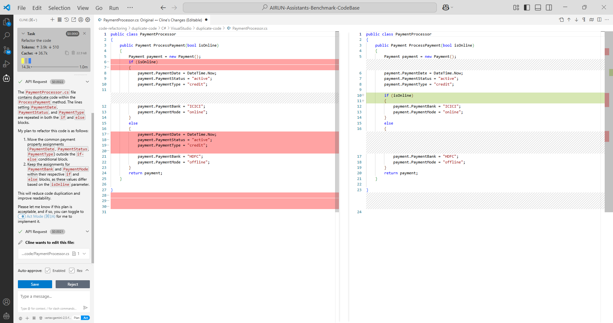

# Cline (Gemini 2.5 Flash) AI Code Assistant Sandbox Tests - July 2025

## Table of Contents

- [Summary](#summary)
- [Test Execution Results](#test-execution-results)
- [Score](#score)
- [Chat-Based Tests (Gemini 2.5 Flash)](#chat-based-tests-gemini-25-flash)
- [Configuration](#configuration)
- [UX Summary](#ux-summary)

## Summary

Cline does not provide code autocompletion functionality.

## Test Execution Results

[SandboxTestsClineGemini2.5FlashJuly2025.xlsx](../../../../../reports/2025/SandboxTestsClineGemini2.5FlashJuly2025.xlsx)

## Score

**Chat-based tests score:** 82.76% (15/87)

## Chat-Based Tests (Gemini 2.5 Flash)

**Java:**

| Pass Rate (%) | Tests (Total) | Failed Tests |
|---------------|---------------|--------------|
| 77.27         | 44            | 10           |

**C#:**

| Pass Rate (%) | Tests (Total) | Failed Tests |
|---------------|---------------|--------------|
| 85.71         | 35            | 5            |

**TypeScript:**

| Pass Rate (%) | Tests (Total) | Failed Tests |
|---------------|---------------|--------------|
| 100           | 8             | 0            |

*The tests were conducted using the Gemini 2.5 Flash model via the GCP Vertex AI API provider.*

## Configuration

- **Cline version:** 3.18.10
- **IDE:** VS Code

## UX Summary

Responses in the chat window were generated slowly, and in Plan mode, the suggested code wasn't generated. It is necessary to additionally switch to Act mode for the file to be edited with the suggested code, which incurs additional costs for extra requests to the LLM.

    © 2025 EPAM Systems, Inc. All Rights Reserved.     EPAM, EPAM AI/RUN TM and the EPAM logo are registered trademarks of EPAM Systems, Inc.     This report is licensed under CC BY-SA 4.0 

