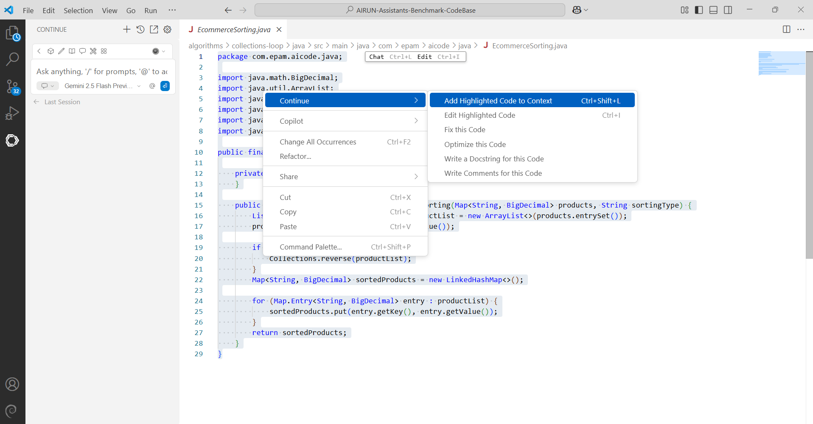

# Continue (Gemini 2.5 Flash Preview) AI Code Assistant Golf App Tests - July 2025

## Table of Contents

- [Summary](#summary)
- [Test Execution Results](#test-execution-results)
- [Score](#score)
- [Chat-Based Tests (Gemini 2.5 Flash Preview)](#chat-based-tests-gemini-25-flash-preview)
- [Configuration](#configuration)
- [UX Summary](#ux-summary)

## Test Execution Results

[SandboxTestsContinueJuly2025.xlsx](../../../../../reports/2025/SandboxTestsContinueGemini2.5FlashJuly2025)

## Score

**Chat-based tests score:** 86.21% (12/87)

## Chat-Based Tests (Gemini 2.5 Flash Preview)

**Java:**

| Pass Rate (%) | Tests (Total) | Failed Tests |
|---------------|---------------|--------------|
| 84.09         | 44            | 7            |

**C#:**

| Pass Rate (%) | Tests (Total) | Failed Tests |
|---------------|---------------|--------------|
| 85.71         | 35            | 5            |

**TypeScript:**

| Pass Rate (%) | Tests (Total) | Failed Tests |
|---------------|---------------|--------------|
| 100           | 8             | 0            |

*The tests were conducted using the Gemini 2.5 Flash Preview model.

## Configuration

- **Continue version:** 1.0.15
- **IDE:** VS Code

## UX Summary

Continue did not automatically add the context of the open files in VS Code to the chat window. It needs to be added manually to the prompt.

    © 2025 EPAM Systems, Inc. All Rights Reserved.     EPAM, EPAM AI/RUN TM and the EPAM logo are registered trademarks of EPAM Systems, Inc.     This report is licensed under CC BY-SA 4.0 

