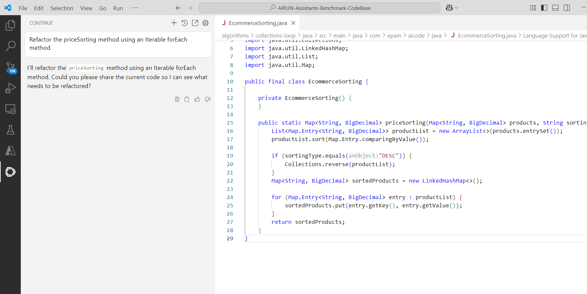

# Continue (Claude 3.7 Sonnet) AI Code Assistant Sandbox Tests - April 2025

## Table of Contents
- [Test execution results](#test-execution-results)
- [Summary](#summary)
    - [Chat based tests (Claude 3.7 Sonnet LLM)](#chat-based-tests-claude-37-sonnet-llm)
    - [Code completion tests](#code-completion-tests)
- [Configuration](#configuration)
- [UX Summary](#ux-summary)

## Test execution results

[SandboxTestsContinueSonnet3.7April2025.xlsx](../../../../../reports/2025/SandboxTestsContinueSonnet3.7April2025.xlsx)

## Summary

Overall Score: **81.63 %** = 27/147

### Chat based tests (Claude 3.7 Sonnet LLM)

**Java:**

| Pass Rate, % | Tests, count | Failed tests |
|--------------|--------------|--------------|
| 97.73        | 44           | 1            |

**C#:**

| Pass Rate, % | Tests, count | Failed tests |
|--------------|--------------|--------------|
| 94.29        | 35           | 2            |

**Type Script:**

| Pass Rate, % | Tests, count | Failed tests |
|--------------|--------------|--------------|
| 100          | 8            | 0            |

Chat based tests score: **96.55 %** = 3/87

### Code completion tests (Codestral model through the [Mistral API](https://console.mistral.ai/))

Java:

| Pass Rate, % | Tests, count | Failed tests |
|--------------|--------------|--------------|
| 38.24        | 34           | 21           |

C#:

| Pass Rate, % | Tests, count | Failed tests |
|--------------|--------------|--------------|
| 94.74        | 19           | 1            |

Type Script:

| Pass Rate, % | Tests, count | Failed tests |
|--------------|--------------|--------------|
| 71.43        | 7            | 2            |

Code completion tests score: **60 %** = 24/60

## Configuration

**Continue version:** 1.0.5  
**IDE:** VS Code

**Config.yaml:**

## UX summary

- Continue did not add the currently opened file to the context. We need to add it manually.

    © 2025 EPAM Systems, Inc. All Rights Reserved.     EPAM, EPAM AI/RUN TM and the EPAM logo are registered trademarks of EPAM Systems, Inc.     This report is licensed under CC BY-SA 4.0 

