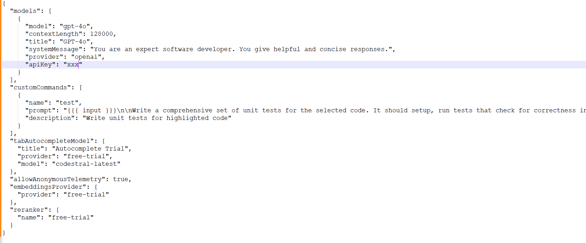
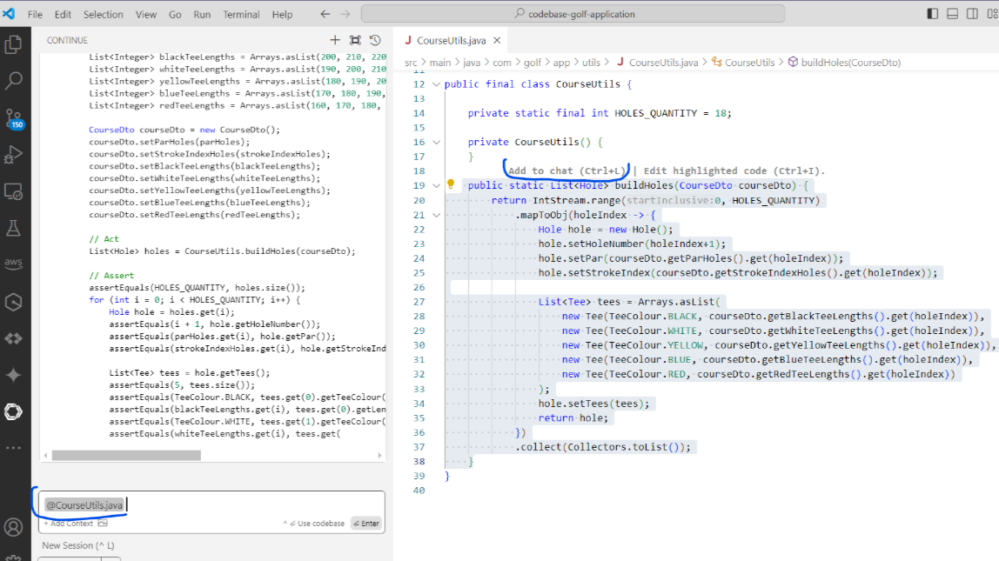
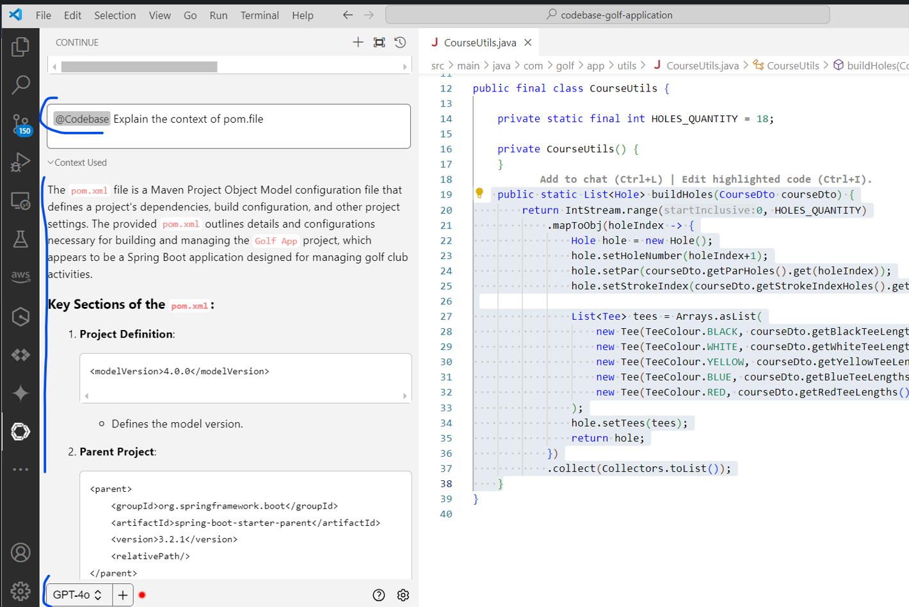
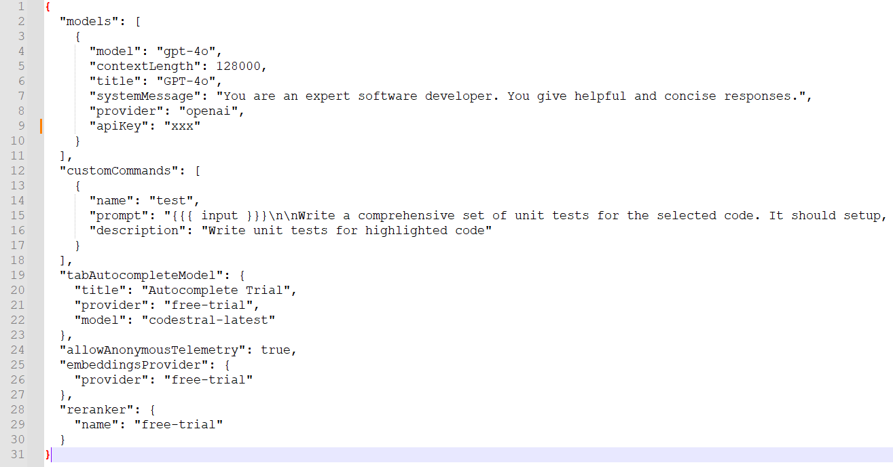
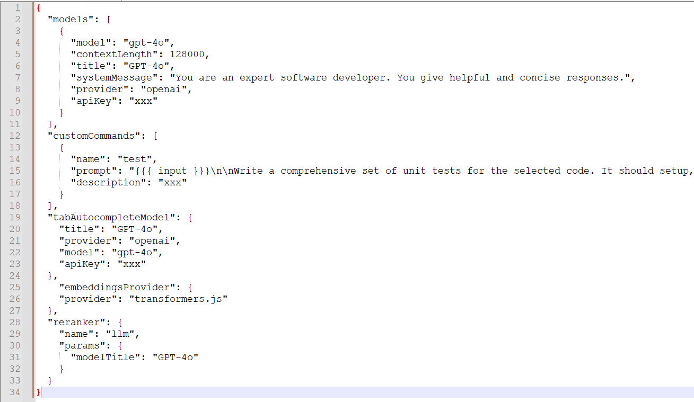

# Continue - July 2024

- [Executive Summary](#executive-summary)
- [Continue Summary](#continue-summary)
  - [Documentation](#documentation)
  - [Reranking](#reranking)
  - [Free Trial](#free-trial)
  - [Telemetry](#telemetry)
  - [Ollama](#ollama)
- [UX Summary](#ux-summary)
- [Test Results](#test-results)
  - [Sandbox Tests](#sandbox-tests)
  - [Golf App Tests](#golf-app-tests)

## Executive Summary
As of Summer 2024, the Continue open-source Code Assistant Tool represents a very promising free alternative to proprietary coding assistants like GitHub Copilot, surpassing its score by 10-15% in simplistic EPAM tests. This could have happened because GitHub at the moment is likely more focused on the next generation of such tools - agentic assistants (that Continue AI does not offer). Continue tool has flexible options to use different LLMs for chat, code completions, and embeddings. Although the tool exists only as a plugin to Visual Studio Code and there's some less stable version for JetBrains set of tools that was not checked. Tool's cost usage must be checked as it may appear that the usage of GPT-4o is more expensive than just buying a Copilot license, especially in a highly intensive code completion scenario.

## Continue Summary

### Documentation
[https://docs.continue.dev/intro](https://docs.continue.dev/intro)

Continue indexes the codebase so that it can later automatically pull in the most relevant context from throughout the workspace. This is done via a combination of embeddings-based retrieval and keyword search. By default, [Transformers.js](https://huggingface.co/docs/transformers.js/index) is applied, which is a JavaScript port of the popular [Transformers](https://huggingface.co/transformers/) library. It allows embeddings to be calculated locally in the browser or inside of the sidebar of your IDE. All embeddings are calculated and stored locally in `~/.continue/index`.

The contents of the input box will be compared with the embeddings from the rest of the codebase to determine relevant files.

[https://docs.continue.dev/walkthroughs/codebase-embeddings](https://docs.continue.dev/walkthroughs/codebase-embeddings)

### Reranking
Continue applies a reranker LLM, which is a type of model used to reorder a list of candidate results based on their relevance to a given query. Unlike embedding models that encode queries and documents separately, rerankers are cross-encoders that jointly process a pair of query and document, enabling more accurate relevancy prediction. Thus, it is a common practice to apply a reranker on the top candidates retrieved with embedding-based search.

The reranker plays a crucial role in refining the results retrieved from the codebase. It processes the initial set of results obtained through embeddings-based retrieval, improving their relevance and accuracy for your queries. Continue offers a free trial of Voyage AI's reranking model ([https://blog.voyageai.com/2024/03/15/boosting-your-search-and-rag-with-voyages-rerankers](https://blog.voyageai.com/2024/03/15/boosting-your-search-and-rag-with-voyages-rerankers/), 50,000,000 tokens are free).

If you only have access to a single LLM, then you can use it as a reranker. This is discouraged unless truly necessary, because it will be much more expensive and still less accurate than any of the above models trained specifically for the task.

### Free trial
The "free-trial" provider lets new users try out Continue with GPT-4, Llama3, Claude 3, and other models using a proxy server that securely makes API calls to these services. Continue asks free trial users to sign in to prevent abuse of API endpoints. If you are not using the free trial, Continue will never ask to sign in. If you don't sign in, you can still use every feature of Continue, you will just need to provide your own LLM either with an API key or by running a local model.

[https://docs.continue.dev/reference/Model%20Providers/freetrial](https://docs.continue.dev/reference/Model%20Providers/freetrial)

[https://docs.continue.dev/reference/Model%20Providers/freetrial#what-happens-if-i-dont-sign-in](https://docs.continue.dev/reference/Model%20Providers/freetrial#what-happens-if-i-dont-sign-in)

### Telemetry
Continue collects and reports anonymous usage information (telemetry). This data is essential to understanding how we should improve the product. Continue uses [Posthog](https://posthog.com/), an open-source platform for product analytics, to collect and store the data.

[https://docs.continue.dev/telemetry](https://docs.continue.dev/telemetry)

### Ollama
[Ollama](https://ollama.ai/) provides an entirely local REST API for working with LLMs, including generating embeddings. Continue recommends using an embeddings model like `nomic-embed-text`.

[https://docs.continue.dev/walkthroughs/codebase-embeddings#ollama](https://docs.continue.dev/walkthroughs/codebase-embeddings#ollama)

Example configurations (config.json):

## UX Summary
- The response in the chat window comes quickly and is detailed.
- Selected code snippets are copied to the chat window using Ctrl + L keys and context files are added using @ annotation.

- Continue not only offers the code, but also explains how to apply it.
- Continue indexes the project. Questions about the project can be asked using the @CodeBase annotation.

## Test Results

### Sandbox Tests
[SandboxTestsContinueJune2024.xlsx](../../../../reports/SandboxTestsContinueJune2024.xlsx)

**Chat based tests (GPT-4o LLM):**

Java:

| AI tool | Pass Rate, % | Tests, count | Failed tests |
|---------|--------------|--------------|--------------|
| Continue| 96.97        | 33           | 1            |

C#:

| AI tool | Pass Rate, % | Tests, count | Failed tests |
|---------|--------------|--------------|--------------|
| Continue| 94.12        | 34           | 2            |

TypeScript:

| AI tool | Pass Rate, % | Tests, count | Failed tests |
|---------|--------------|--------------|--------------|
| Continue| 100          | 7            | 0            |

**Code completion tests (based on open-source random LLM):**

Java:

| AI tool | Pass Rate, % | Tests, count | Failed tests |
|---------|--------------|--------------|--------------|
| Continue| 86.67        | 15           | 2            |

C#:

| AI tool | Pass Rate, % | Tests, count | Failed tests |
|---------|--------------|--------------|--------------|
| Continue| 88.89        | 18           | 2            |

TypeScript:

| AI tool | Pass Rate, % | Tests, count | Failed tests |
|---------|--------------|--------------|--------------|
| Continue| 83.33        | 6            | 1            |

**Overall Score:**
Continue: 92.92 = 8 / 113

**Continue configurations (config.json):**

### Golf App Tests

**Chat based tests (GPT-4o LLM):**

Java:

| AI tool | Pass Rate, % | Tests, count | Failed tests |
|---------|--------------|--------------|--------------|
| Continue| 90           | 20           | 2            |

**Overall Score:**
Continue: 90 = 2 / 20

**Continue configurations (config.json):**

[GolfAppTestsContinueJuly2024.xlsx](../../../../reports/GolfAppTestsContinueJuly2024.xlsx)

**Chat based tests (llama-3-70b-instruct-awq LLM):**

Java:

| AI tool | Pass Rate, % | Tests, count | Failed tests |
|---------|--------------|--------------|--------------|
| Continue| 50           | 20           | 10           |

**Overall Score:**
Continue: 50 = 10 / 20

**Continue configurations (config.json):**

[GolfAppTestsContinueLlamaJuly2024.xlsx](../../../../reports/GolfAppTestsContinueLlamaJuly2024.xlsx)

**Chat based tests (anthropic.claude-v3-5-sonnet LLM):**

Java:

| AI tool | Pass Rate, % | Tests, count | Failed tests |
|---------|--------------|--------------|--------------|
| Continue| 85           | 20           | 3            |

**Overall Score:**
Continue: 85 = 3 / 20

[GolfAppTestsContinueSonnetJuly2024.xlsx](../../../../reports/GolfAppTestsContinueSonnetJuly2024.xlsx)

---

    © 2024 EPAM Systems, Inc. All Rights Reserved.     EPAM, EPAM AI/RUN TM and the EPAM logo are registered trademarks of EPAM Systems, Inc.     This report is licensed under CC BY-SA 4.0 
