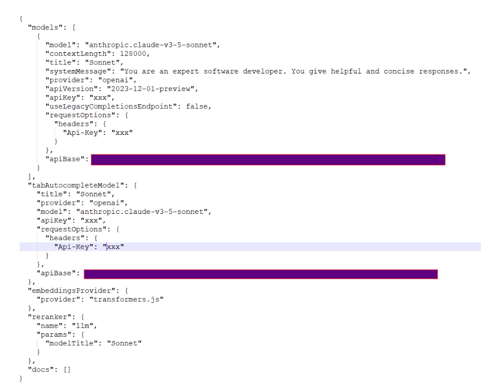

# Continue (Sonnet) Golf App tests - August 2024

- [Test Execution Results](#test-execution-results)
- [Continue Configuration](#continue-configuration)

## Test Execution Results ([anthropic.claude-v3-5-sonnet](https://www.anthropic.com/news/claude-3-5-sonnet) LLM):
[GolfAppTestsContinueSonnetAugust.xlsx](../../../../reports/GolfAppTestsContinueSonnetAugust.xlsx)

| AI tool  | Pass Rate, % | Overall Tests | Failed Tests |
|----------|--------------|---------------|--------------|
| Continue | 86.36        | 22            | 3            |

## Continue Configuration:

---

    © 2024 EPAM Systems, Inc. All Rights Reserved.     EPAM, EPAM AI/RUN TM and the EPAM logo are registered trademarks of EPAM Systems, Inc.     This report is licensed under CC BY-SA 4.0 
