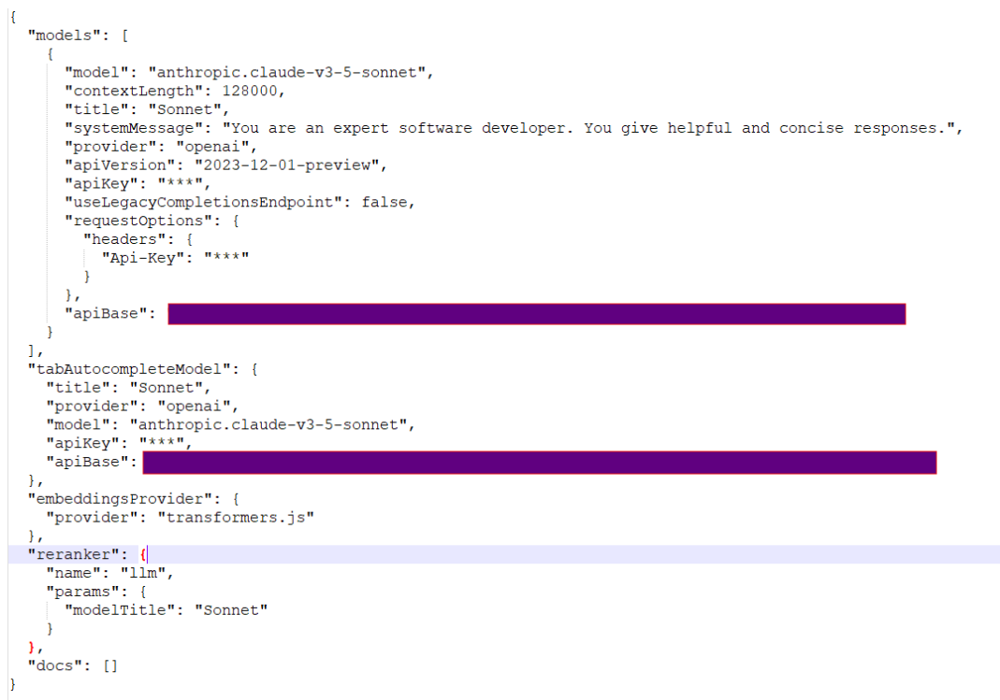
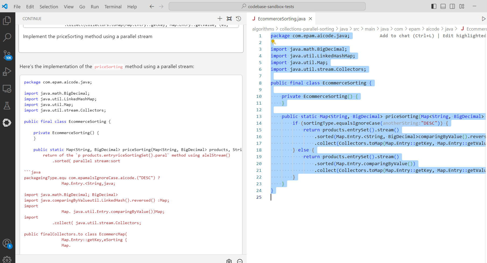
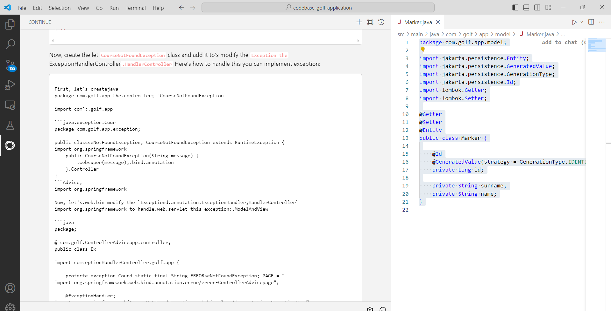

# Continue (Sonnet) Sandbox tests - September 2024

- [Test Execution Results](#test-execution-results)
- [Summary](#summary)
- [Chat Based Tests](#chat-based-tests)
    - [Java](#java)
    - [C#](#csharp)
    - [TypeScript](#typescript)
- [Code Completion Tests](#code-completion-tests)
- [Continue Configuration](#continue-configuration)
- [UX Summary](#ux-summary)

## Test Execution Results:
[SandboxTestsContinueSonnetSeptember2024.xlsx](../../../../reports/SandboxTestsContinueSonnetSeptember2024.xlsx)

## Summary:
**Overall Score: 91.89 = 6 / 74**

## Chat Based Tests ([anthropic.claude-v3-5-sonnet](https://www.anthropic.com/news/claude-3-5-sonnet) LLM):

### Java:
| AI tool   | Pass Rate, % | Overall | Failed tests |
|-----------|--------------|---------|--------------|
| Continue  | 93.94        | 33      | 2            |

### C#:
| AI tool   | Pass Rate, % | Overall | Failed tests |
|-----------|--------------|---------|--------------|
| Continue  | 88.24        | 34      | 4            |

### TypeScript:
| AI tool   | Pass Rate, % | Overall | Failed tests |
|-----------|--------------|---------|--------------|
| Continue  | 100          | 7       | 0            |

## Code Completion Tests:
We were unable to configure autocompletion using the EPAM AI DIAL proxy and access Claude Sonnet 3.5 API for autocompletion.

## Continue Configuration (config.json):

Continue version:
0.8.51

## UX Summary:
We encountered a Continue issue with receiving an unstructured response in the chat window:

We were able to get a structured response after regenerating the response. The issue was relevant for differ

---

    © 2024 EPAM Systems, Inc. All Rights Reserved.     EPAM, EPAM AI/RUN TM and the EPAM logo are registered trademarks of EPAM Systems, Inc.     This report is licensed under CC BY-SA 4.0 
