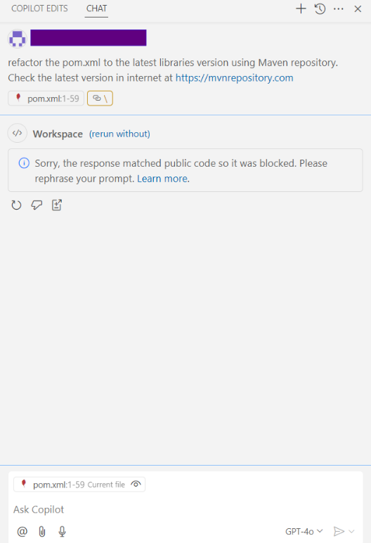

# GitHub Copilot (GPT-4o) AI Code Assistant Golf App Tests - March 2025

## Table of Contents
- [Test Execution Results (GPT-4o LLM)](#test-execution-results-gpt-4o-llm)
- [Summary](#summary)
- [Configuration](#configuration)
- [UX Summary](#ux-summary)

## Test Execution Results (GPT-4o LLM)

[GolfAppTestsCopilotGPT4oMarch2025.xlsx](../../../../../reports/2025/GolfAppTestsCopilotGPT4oMarch2025.xlsx)

## Summary

**Java:**

| Pass Rate, % | Overall | Failed tests |
|--------------|---------|--------------|
| **86.36**    | 22      | 3*           |

- For one test, we received the error message: "Sorry, the response matched public code, so it was blocked. Please rephrase your prompt."

## Configuration

**Copilot version:** 1.293.0  
**IDE:** VS Code

## UX Summary

- For some tests, we received the error message: "Sorry, the response matched public code, so it was blocked. Please rephrase your prompt. Learn more."

    © 2025 EPAM Systems, Inc. All Rights Reserved.     EPAM, EPAM AI/RUN TM and the EPAM logo are registered trademarks of EPAM Systems, Inc.     This report is licensed under CC BY-SA 4.0 

