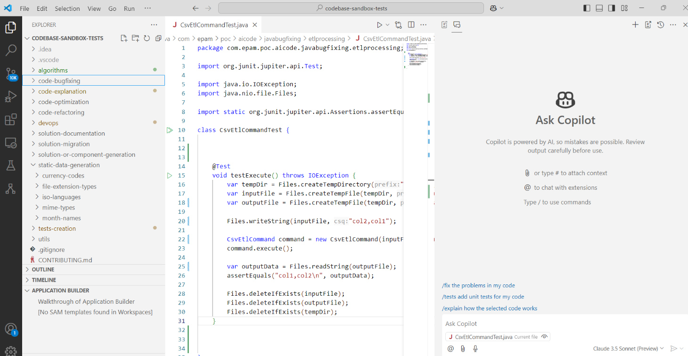

# Copilot (Sonnet) Golf App tests - November 2024

- [Test Execution Results](#test-execution-results)
    - [Overall Results](#overall-results)
- [Configuration](#configuration)

## Test Execution Results ([anthropic.claude-v3-5-sonnet](https://www.anthropic.com/news/claude-3-5-sonnet) LLM)

[GolfAppTestsCopilotNovember2024.xlsx](../../../../reports/GolfAppTestsCopilotClaude3.5SonnetNovember2024.xlsx)

### Overall Results

| AI tool | Pass Rate, % | Tests, count | Failed tests |
|---------|--------------|--------------|--------------|
| Copilot | 84.21        | 19           | 3            |

## Configuration

Copilot version: v0.23.2024102903 (pre-release)  
VSCode version: 1.95.3

---

    © 2024 EPAM Systems, Inc. All Rights Reserved.     EPAM, EPAM AI/RUN TM and the EPAM logo are registered trademarks of EPAM Systems, Inc.     This report is licensed under CC BY-SA 4.0 
