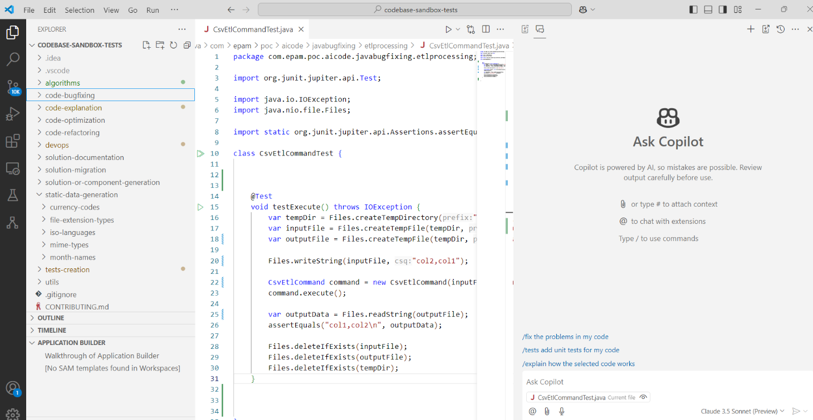
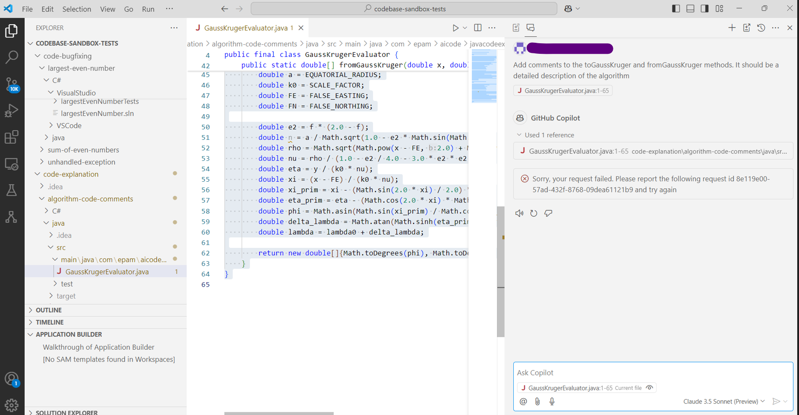

# Copilot (Sonnet) Sandbox tests - November 2024

- [Test Execution Results](#test-execution-results)
    - [Overall Score](#overall-score)
    - [Chat Based Tests](#chat-based-tests)
        - [Java](#java)
        - [C#](#c)
        - [TypeScript](#typescript)
    - [Code Completion Tests](#code-completion-tests)
        - [Java](#java-1)
        - [C#](#c-1)
        - [TypeScript](#typescript-1)
- [Configuration](#configuration)
- [Summary](#summary)

## Test Execution Results
[SandboxTestsCopilotNovember2024.xlsx](../../../../reports/SandboxTestsCopilotClaude3.5SonnetNovember2024.xlsx)

## Overall Score
**Copilot: 88.39 = 112 / 13**

### Chat Based Tests ([anthropic.claude-v3-5-sonnet](https://www.anthropic.com/news/claude-3-5-sonnet) LLM)

#### Java

| AI tool | Pass Rate, % | Tests, count | Failed tests |
|---------|--------------|--------------|--------------|
| Copilot | 96.97        | 33           | 1            |

#### C#

| AI tool | Pass Rate, % | Tests, count | Failed tests |
|---------|--------------|--------------|--------------|
| Copilot | 84.85        | 33           | 5            |

#### TypeScript

| AI tool | Pass Rate, % | Tests, count | Failed tests |
|---------|--------------|--------------|--------------|
| Copilot | 100          | 7            | 0            |

### Code Completion Tests

#### Java

| AI tool | Pass Rate, % | Tests, count | Failed tests |
|---------|--------------|--------------|--------------|
| Copilot | 73.33        | 15           | 4            |

#### C#

| AI tool | Pass Rate, % | Tests, count | Failed tests |
|---------|--------------|--------------|--------------|
| Copilot | 83.33        | 18           | 3            |

#### TypeScript

| AI tool | Pass Rate, % | Tests, count | Failed tests |
|---------|--------------|--------------|--------------|
| Copilot | 100          | 6            | 0            |

## Configuration

Copilot version: v0.23.2024102903 (pre-release)  
VSCode version: 1.95.3

## Summary

- Inline code suggestions were fast; however, the chat was a bit slower than average
- A couple of tests failed with a "cannot provide code that matches public code" error
- Errors appeared in the chat window but disappeared when the request was regenerated

---

    © 2024 EPAM Systems, Inc. All Rights Reserved.     EPAM, EPAM AI/RUN TM and the EPAM logo are registered trademarks of EPAM Systems, Inc.     This report is licensed under CC BY-SA 4.0 
 