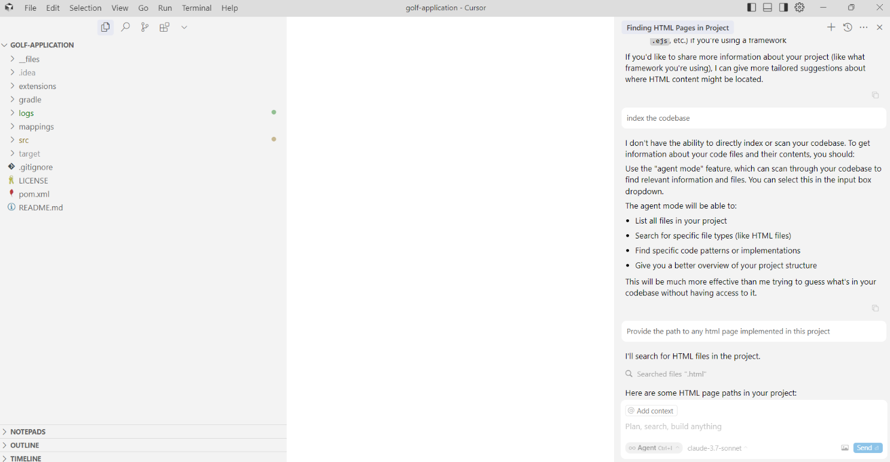

# Cursor (Claude 3.7 Sonnet) AI Code Assistant Golf App Tests - March 2025

## Table of Contents
- [Test Execution Results (Claude 3.7 Sonnet LLM)](#test-execution-results-claude-37-sonnet-llm)
- [Summary](#summary)
- [Configuration](#configuration)
- [UX Summary](#ux-summary)

## Test Execution Results (Claude 3.7 Sonnet LLM)

[GolfAppTestsCursorSonnet3.7March2025.xlsx](../../../../../reports/2025/GolfAppTestsCursorSonnet3.7March2025.xlsx)

## Summary

| Pass Rate, % | Overall | Failed tests |
|--------------|---------|--------------|
| **86.36**    | 22      | 3            |

## Configuration

**Cursor version:** 0.47.8  
**Cursor Subscription:** Business

## UX Summary

- Cursor doesn’t have the ability to directly index or scan the codebase in Chat mode. To obtain information about code files, you need to use the Agent mode.

- It seems that Cursor did not consider the classes applied in the refactored class in Ask mode (chat), but it did in Agent mode.
- Cursor did not check for the latest version of the libraries from the internet as required by the task. In Agent mode, Cursor retrieved them, but not all versions were correct.

    © 2025 EPAM Systems, Inc. All Rights Reserved.     EPAM, EPAM AI/RUN TM and the EPAM logo are registered trademarks of EPAM Systems, Inc.     This report is licensed under CC BY-SA 4.0 

