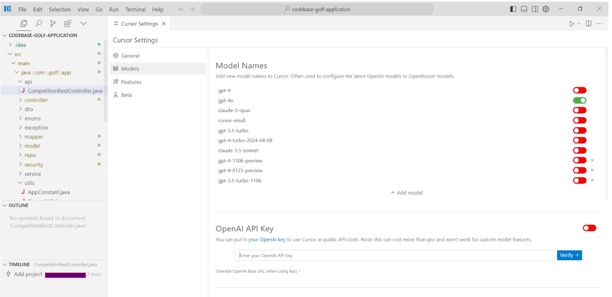
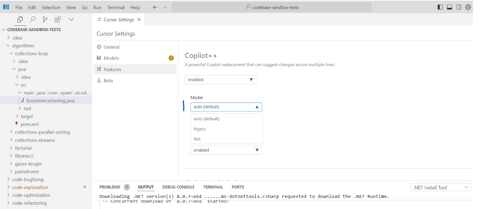
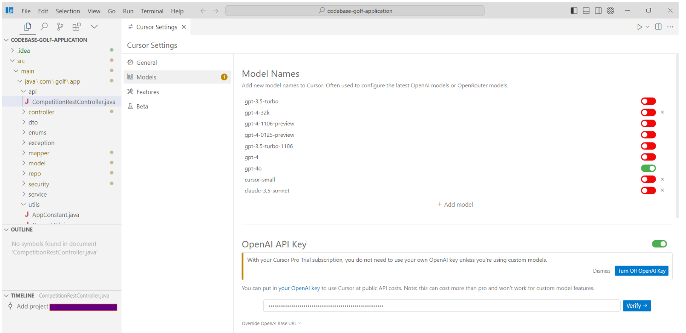

# Cursor - July 2024

- [Executive Summary](#executive-summary)
- [Cursor Summary](#cursor-summary)
  - [Site](#site)
  - [Documentation](#documentation)
  - [Pricing](#pricing)
  - [LLM](#llm)
  - [Features](#features)
    - [Copilot++](#copilot)
    - [Cursor Chat](#cursor-chat)
    - [Cmd K](#cmd-k)
- [UX Summary](#ux-summary)
- [Test Results](#test-results)
  - [Sandbox Tests](#sandbox-tests)
  - [Golf App Tests](#golf-app-tests)

## Executive Summary
Separate IDE (private build of VS Code) that has rich and efficient Gen AI capabilities tightly integrated into the IDE user journeys and scoring very high numbers in EPAM Benchmark. Although raises serious concerns being a niche IDE on its own - rarely a developer will code in VS Code, even more rarely - in some niche IDE.

## Cursor Summary

### Site
[https://www.cursor.com/](https://www.cursor.com/)

### Documentation
[https://docs.cursor.com/get-started/migrate-from-vscode](https://docs.cursor.com/get-started/migrate-from-vscode)

Though Cursor is a standalone code editor, it is a fork of VS Code. This means it has all of the familiar, text editing features from VS Code, in addition to AI features. Some of our features, like Copilot++ and CMD-K, are not possible as VS Code extensions.

### Pricing
[https://www.cursor.com/pricing](https://www.cursor.com/pricing)

### LLM
By default, Cursor has these models ready to use:
- [GPT-4o](https://openai.com/index/hello-gpt-4o/)
- [GPT-4](https://openai.com/index/gpt-4/)
- `cursor-small`
  - `cursor-small` is Cursor’s custom model that isn’t as smart as `GPT-4`, but is faster and users have unlimited access to it.

You can add additional models under `Cursor Settings` > `Models` > `Model Names`.

In long context chat, the model selection is limited to the models that support long context:
- [gpt-4o-128k](https://platform.openai.com/docs/models)
- [gemini-1.5-flash-500k](https://deepmind.google/technologies/gemini/flash/)
- [claude-3-haiku-200k](https://www.anthropic.com/news/claude-3-family)
- [claude-3-sonnet-200k](https://www.anthropic.com/news/claude-3-family)

In chat, Cursor limits to around 20,000 tokens at the moment (or less if the model does not support that much context). For cmd-K, Cursor limits to around 10,000 tokens, to balance TTFT and quality. Long-context chat uses the model’s maximum context window.

Cursor lets you input your own OpenAI API key to send as many AI messages as you want at your own cost. To use your own API key, go to `Cursor Settings` > `Models` > `OpenAI API Key` and enter your API key.

Your API key will not be stored, but it will be sent up to our server with every request. All requests are routed through Cursor backend, because that’s where we do the final prompt building.

### Features

#### Copilot++
Cursor’s Copilot++ is a more powerful Copilot, built especially to make changing code easy.

Copilot++ can:
- Make suggestions based on a history of recent changes
- Suggest edits around the cursor, not just insertions of additional code
- Modify multiple lines at once
- Make suggestions based on linter and compiler error messages

Copilot++ uses a custom model. You can choose to use our `legacy` Copilot++ model, which may work better in foreign languages and generating new code, but it is much slower. For most users, Cursor recommends staying on the default model.

Copilot++ suggestions will appear as ghost texts in the editor when Copilot++ is only adding additional text. If the suggestion modifies existing code, it will appear as a diff popup to the right of your current line.

GitHub Copilot can insert text at your cursor position. It cannot edit the code around your cursor or remove text.

Copilot++ can insert text at the cursor. Copilot++ has a history of recent changes in the context window, so it knows what you are trying to do next.

[https://docs.cursor.com/cpp/introduction](https://docs.cursor.com/cpp/introduction)

The biggest difference is the way Copilot++ and GitHub Copilot complete code.

GitHub Copilot can insert text at your cursor position. It cannot edit the code around your cursor or remove text.

Copilot++ can insert text at your cursor, and much more:
- Multi-character edits
- Instruction-based edits

Further, Copilot++ has a history of your recent changes in the context window, so it knows what you are trying to do next.

#### Cursor Chat
Cursor has several built-in features to provide context in chat, such as automatically including context across your entire codebase, searching the web, indexing documentation, and user-specified references to code blocks.

You can go back to any previous user messages to edit and rerun your queries. This will overwrite any messages after that and regenerate new ones.

AI messages are the responses generated from the AI model you’ve picked. You can toggle between models by pressing `Ctrl/⌘ /`.

All user/AI messages together in the same thread are called a chat thread, and each chat thread is saved in your chat history.

By pressing on the “Previous Chats” button on the top right of the AI pane, or by pressing `Ctrl/⌘ + Alt/Option + L`, you can see the chat history.

By default, Cursor Chat includes the current file as context. You can reference entire files by using `@Files`. In Cursor’s Chat, if the contents of a file is too long, Cursor will chunk the file into smaller chunks and rerank them based on relevance to the query.

By default, Cursor Chat uses OpenAI’s `GPT-4` for its AI model (specifically, the `gpt-4` label points to our instance of GPT4-Turbo).

The AI model you choose for Chat will be saved for future sessions, so you don’t have to change it every time you open Cursor Chat.

You can customize the Cursor Chat under `Cursor Settings` > `Features` > `Chat`.

These settings include:
- Always search the web for answers.
  - This will make the AI model browse the web each query for the most up-to-date information.
- Add chat fading animation.
  - This adds a smooth animation to the AI messages as they are generated.
- Default to no context.
  - This will make the AI model only use the user message as context, and no additional context such as current file will be included.

For better and more accurate codebase answers using `@codebase` or `Ctrl/⌘ Enter`, you can index your codebase. Behind the scenes, Cursor computes embeddings for each file in your codebase, and will use these to improve the accuracy of your codebase answers.

Your codebase index will automatically synchronize with your latest codebase changes.

The status of your codebase indexing is under `Cursor Settings` > `Features` > `Codebase Indexing`.

By default, Cursor will index all files in your codebase if privacy mode is not enabled. If you choose to index your codebase, Cursor will upload your codebase in small chunks to our server to compute embeddings, but all plaintext code ceases to exist after the life of the request.

The embeddings and metadata about your codebase (hashes, file names) are stored in our database, but none of your code is.

You can also expand the `Show Settings` section to access more advanced options. Here, you can decide whether you want to enable automatic indexing for new repositories and configure the files that Cursor will ignore during repository indexing, in addition to your .gitignore settings.

Through `@Codebase`, Cursor Chat goes through these steps until it finds the most important pieces of code to use.
- Gathering: scanning through your codebase for important files / code chunks
- Reranking: reordering the context items based on relevancy to the query
- Reasoning: thinking through a plan of using the context
- Generating: coming up with a response

Cursor’s `Apply` allows you to quickly integrate a codeblock suggestion from the chat into your code.

To apply a code block suggestion, you can press on the play button in the top right corner of each chat code block.

This will edit your file to incorporate the code produced by Chat.

#### Cmd K
Cmd K, also known or “Ctrl K” on Windows/Linux, allows you to generate new code or edit existing code in the editor window:

In Cursor, we call the bar that appears when you press `Ctrl/Cmd K` the “Prompt Bar”. It works similarly to the AI input box for chat, in which you can type normally, or use [@ symbols](https://docs.cursor.com/cmdk/context/@-symbols) to reference other context.

For in-place edits, you can simply select the code you want to edit and type into the prompt bar.

After each generation, you can further refine the prompt by adding more instructions to the prompt bar, and pressing `Enter` so the AI regenerates based on your follow-up instructions.

With `Privacy Mode`, none of your code will ever be stored by us or any third-party (except for OpenAI which persists the prompts we send to them for 30 days for trust and safety, unless you’re on the business plan). Otherwise, we may save prompts / collect telemetry data to improve Cursor.

You can enable `Privacy Mode` under `Cursor Settings` > `General` > `Privacy Mode`.

## UX Summary
- It takes longer to index the [AIRUN Assistants Benchmark CodeBase](https://github.com/epam/AIRUN-Assistants-Benchmark-CodeBase) project compared to [Continue AI code assistant](../continue/continue-july-2024.md). It took 40 minutes while Continue took 5 minutes (Continue can loads the embedded code locally and Cursor into the remote database).
- Code completion works slower and less efficient than Continue and Copilot.

## Test Results
Cursor version:

0.36.2

VSCode version:

1.89.1

Cursor configuration:

Indexing:

The tests were run after the base code was indexed by Cursor

### Sandbox Tests
[SandboxTestsCursorJuly2024.xlsx](../../../../reports/SandboxTestsCursorJuly2024.xlsx)

**Chat based tests (GPT-4o model):**

**Java:**

| AI tool | Pass Rate, % | Tests, count | Failed tests |
|---------|--------------|--------------|--------------|
| Cursor  | 90.91        | 33           | 3            |

**C#:**

| AI tool | Pass Rate, % | Tests, count | Failed tests |
|---------|--------------|--------------|--------------|
| Cursor  | 88.24        | 34           | 4            |

**TypeScript:**

| AI tool | Pass Rate, % | Tests, count | Failed tests |
|---------|--------------|--------------|--------------|
| Cursor  | 85.71        | 7            | 1            |

**Code completion tests (custom Cursor model):**

**Java:**

| AI tool | Pass Rate, % | Tests, count | Failed tests |
|---------|--------------|--------------|--------------|
| Cursor  | 60           | 15           | 6            |

**C#:**

| AI tool | Pass Rate, % | Tests, count | Failed tests |
|---------|--------------|--------------|--------------|
| Cursor  | 61.11        | 18           | 7            |

**TypeScript:**

| AI tool | Pass Rate, % | Tests, count | Failed tests |
|---------|--------------|--------------|--------------|
| Cursor  | 83.33        | 6            | 1            |

**Overall Score**
Cursor: 80.53 = 22 / 113

### Golf App Tests
[GolfAppTestsCursorJuly2024.xlsx](../../../../reports/GolfAppTestsCursorJuly2024.xlsx)

**Chat based tests (GPT-4o model):**

**Java:**

| AI tool | Pass Rate, % | Tests, count | Failed tests |
|---------|--------------|--------------|--------------|
| Continue| 80           | 20           | 4            |

**Overall Score**
Continue: 80 = 4 / 20

---

    © 2024 EPAM Systems, Inc. All Rights Reserved.     EPAM, EPAM AI/RUN TM and the EPAM logo are registered trademarks of EPAM Systems, Inc.     This report is licensed under CC BY-SA 4.0 
