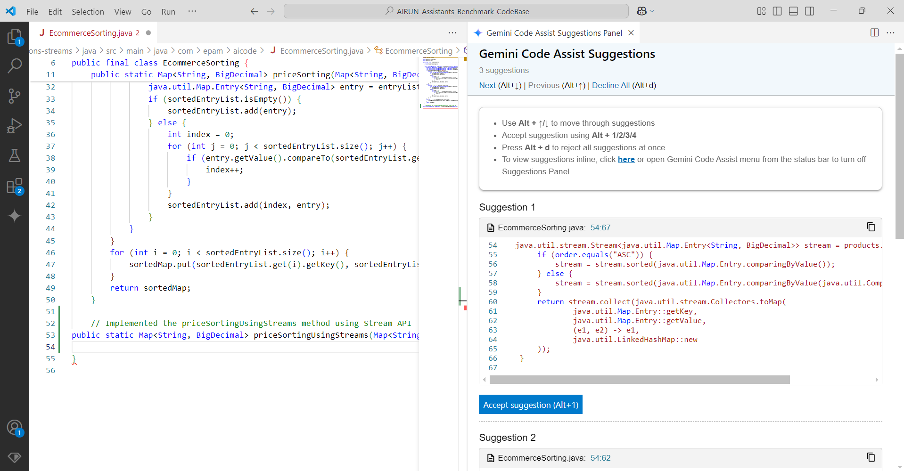

# Gemini AI Code Assistant Sandbox Tests - April 2025

## Table of Contents
- [Test execution results](#test-execution-results)
- [Summary](#summary)
    - [Chat based tests](#chat-based-tests)
    - [Code completion tests](#code-completion-tests)
- [Configuration](#configuration)
- [UX Summary](#ux-summary)

## Test execution results

[SandboxTestsGeminiApril2025.xlsx](../../../../../reports/2025/SandboxTestsGeminiApril2025.xlsx)

## Summary

Overall Score: **82.99 %** = 25/147

### Chat based tests

**Java:**

| Pass Rate, % | Tests, count | Failed tests |
|--------------|--------------|--------------|
| 90.91        | 44           | 4            |

**C#:**

| Pass Rate, % | Tests, count | Failed tests |
|--------------|--------------|--------------|
| 91.43        | 35           | 3            |

**Type Script:**

| Pass Rate, % | Tests, count | Failed tests |
|--------------|--------------|--------------|
| 100          | 8            | 0            |

**91.95 %** = 7/87

### Code completion tests

**Java:**

| Pass Rate, % | Tests, count | Failed tests |
|--------------|--------------|--------------|
| 61.76        | 34           | 13           |

**C#:**

| Pass Rate, % | Tests, count | Failed tests |
|--------------|--------------|--------------|
| 78.95        | 19           | 4            |

**Type Script:**

| Pass Rate, % | Tests, count | Failed tests |
|--------------|--------------|--------------|
| 85.71        | 7            | 1            |

**70 %** = 18/60

## Configuration

**Gemini version:** 2.30.3  
**IDE:** VS Code

## UX Summary

- By clicking Ctrl + Enter (Windows), Gemini shows code suggestions in a separate tab.

- Gemini, in comparison with Amazon Q, Gemini, Windsurf (Claude 3.7 Sonnet), and Continue (Claude 3.7 Sonnet), generated the response for the chat window in a minimum of two times quicker.

    © 2025 EPAM Systems, Inc. All Rights Reserved.     EPAM, EPAM AI/RUN TM and the EPAM logo are registered trademarks of EPAM Systems, Inc.     This report is licensed under CC BY-SA 4.0 

