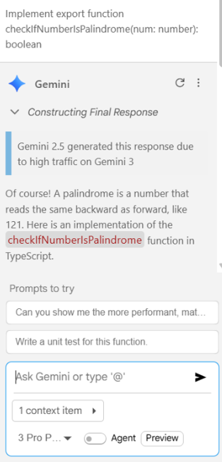

# Gemini Code Assist Test Execution Results - March 2026

- [Summary](#summary)
- [Final Score - Chat-Based Tests (Golf App + Sandbox Tests)](#final-score---chat-based-tests-golf-app--sandbox-tests)
- [Sandbox Test Execution Results](#sandbox-test-execution-results)
    - [Summary Scores](#summary-scores)
    - [Chat-Based Tests Results](#chat-based-tests-results)
    - [Code Completion Tests Results](#code-completion-tests-results)
- [Golf App Test Execution Results](#golf-app-test-execution-results)
    - [Chat-Based Tests Results](#chat-based-tests-results-1)
- [IDE](#ide)

## Summary

- Even though the Gemini 3 Pro model was selected, it sometimes switched to Gemini 2.5 due to high traffic on Gemini 3.

## Final Score - Chat-Based Tests (Golf App + Sandbox Tests)

- **Overall Pass Rate:** 92.66%
- **Failed Tests:** 8 out of 109 tests

---

## Sandbox Test Execution Results

- **Report file:** [SandboxTestsGeminiMarch2026.xlsx](../../../../../reports/2026/SandboxTestsGeminiMarch2026.xlsx)

### Summary Scores

- **Chat-Based Tests Pass Rate:** 93.10% (6 failed out of 87 tests)
- **Code Completion Tests Pass Rate:** 73.53% (18 failed out of 68 tests)

### Chat-Based Tests Results

| Language   | Pass Rate (%) | Total Tests | Failed Tests |
|------------|---------------|-------------|--------------|
| Java       | 90.91         | 44          | 4            |
| C#         | 94.29         | 35          | 2            |
| TypeScript | 100.00        | 8           | 0            |

> **Note:** The tests were conducted using Gemini 3 Pro Preview and Gemini 2.5 models.

### Code Completion Tests Results

| Language   | Pass Rate (%) | Total Tests | Failed Tests |
|------------|---------------|-------------|--------------|
| Java       | 65.00         | 40          | 14           |
| C#         | 85.00         | 20          | 3            |
| TypeScript | 87.50         | 8           | 1            |

> **Note:** The code completion tests were conducted using the default Gemini Code Assist model (LLM undisclosed).

---

## Golf App Test Execution Results

- **Report file:** [GolfAppTestsGeminiMarch2026.xlsx](../../../../../reports/2026/GolfAppTestsGeminiMarch2026.xlsx)

### Chat-Based Tests Results

| Language | Pass Rate (%) | Total Tests | Failed Tests |
|----------|---------------|-------------|--------------|
| Java     | 90.91         | 22          | 2            |

> **Note:** The tests were conducted using Gemini 3 Pro Preview and Gemini 2.5 models.

---

## IDE

- **VS Code version:** 1.111.0

    © 2026 EPAM Systems, Inc. All Rights Reserved.     EPAM, EPAM AI/RUN TM and the EPAM logo are registered trademarks of EPAM Systems, Inc.     This report is licensed under CC BY-SA 4.0 

