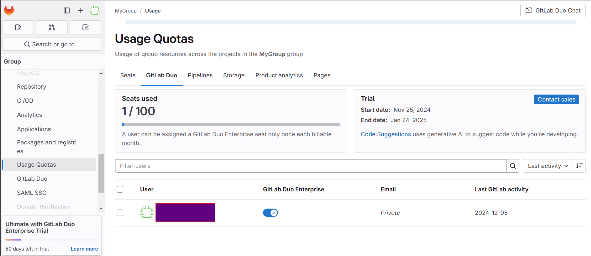
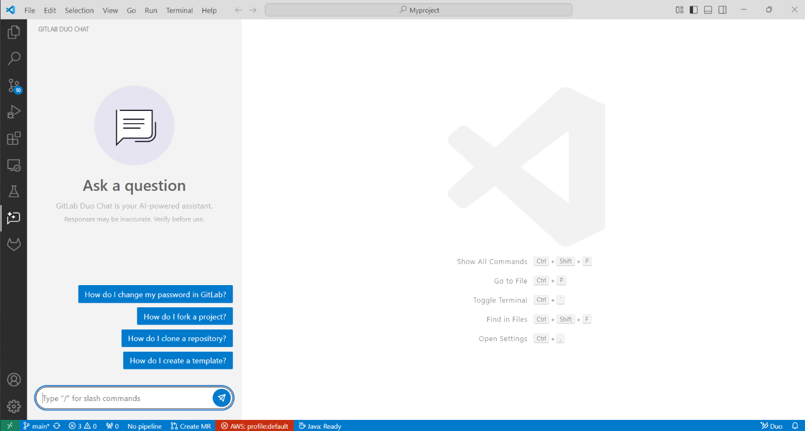
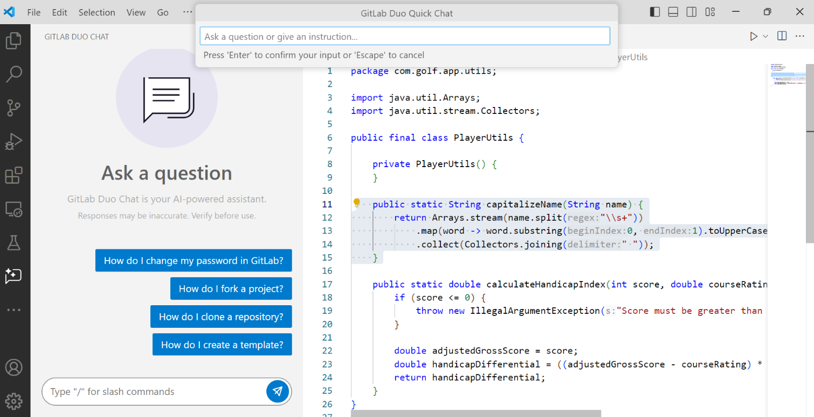
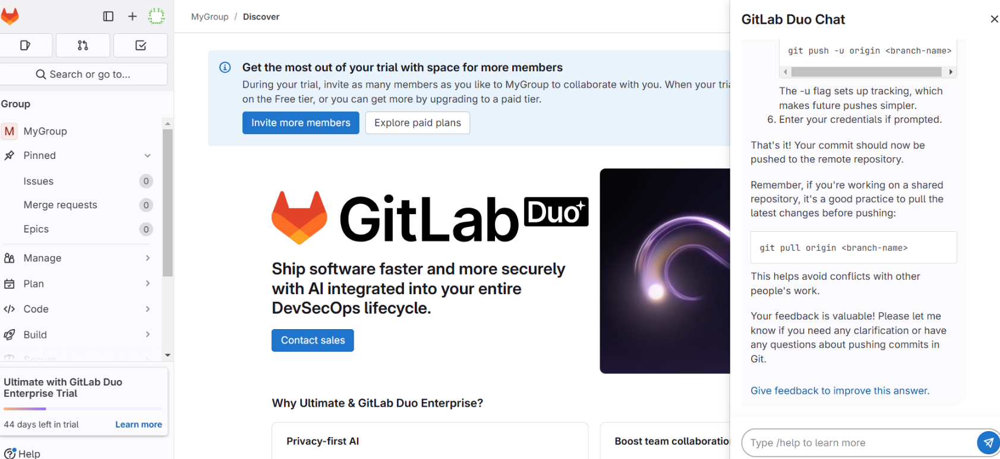
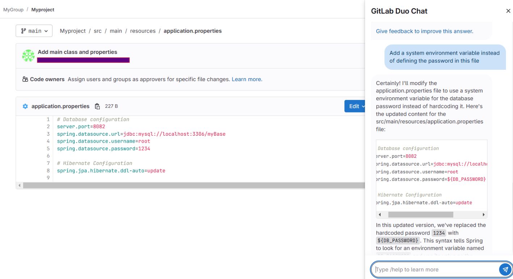
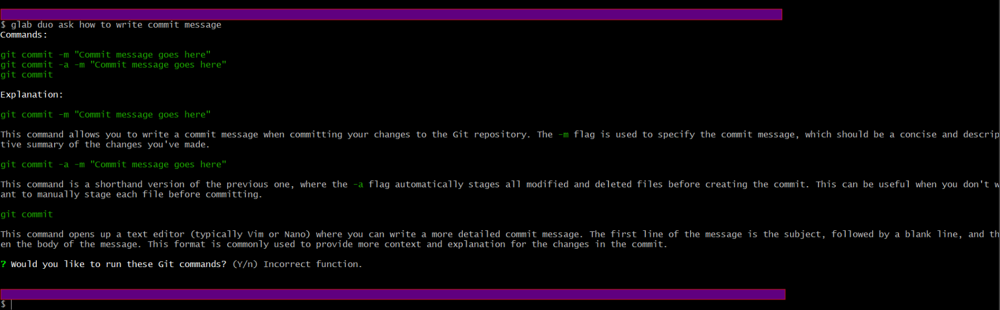
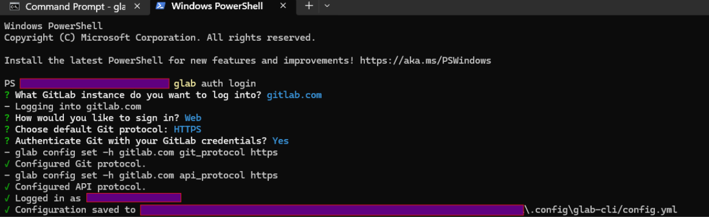
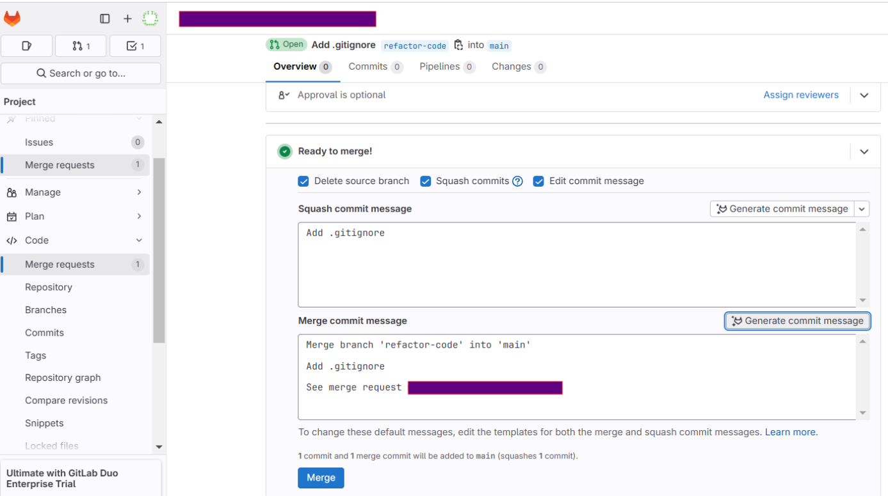
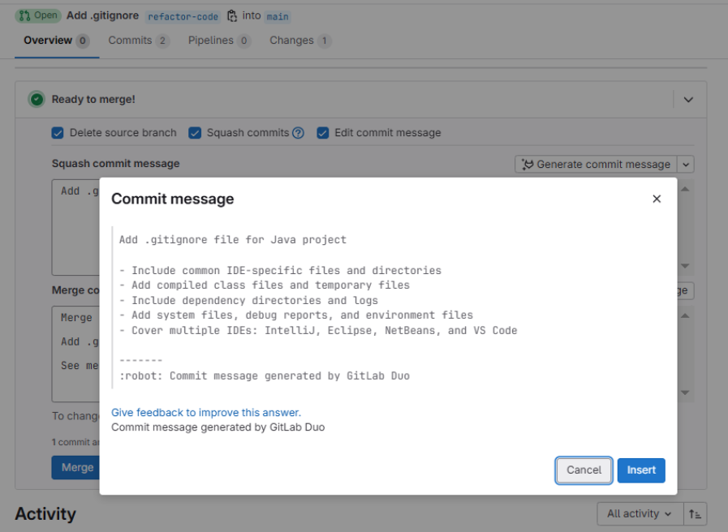
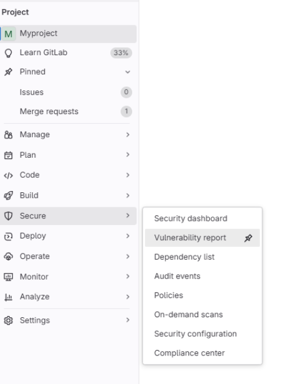

# GitLab Duo - December 2024
1. [Executive Summary](#executive-summary)
2. [Features and Functionality](#features-and-functionality)
3. [Performance Observations](#performance-observations)
4. [Summary](#summary)
   - [Documentation](#documentation)
   - [LLM](#llm)
   - [Features](#features)
      - [GitLab Duo Chat](#gitlab-duo-chat)
      - [GitLab Duo Quick Chat](#gitlab-duo-quick-chat)
      - [Code Suggestions](#code-suggestions)
      - [GitLab Duo Chat in GitLab UI](#gitlab-duo-chat-in-gitlab-ui)
      - [GitLab Duo for CLI](#gitlab-duo-for-cli)
      - [Merge Commit Message Generation](#merge-commit-message-generation)
      - [Vulnerability Explanation](#vulnerability-explanation)
      - [Troubleshoot Failed CI/CD Jobs](#troubleshoot-failed-cicd-jobs)
5. [GitLab Duo Workflow (experimental)](#gitlab-duo-workflow-experimental)
6. [GitLab Duo with Amazon Q (preview/beta)](#gitlab-duo-with-amazon-q-previewbeta)
7. [Test Results](#test-results)
   - [Sandbox Tests](#sandbox-tests)
   - [Golf App Tests](#golf-app-tests)
8. [Configuration](#configuration)
9. [UX Summary](#ux-summary)

## Executive Summary
GitLab Duo serves as an alternative to GitHub Copilot, offering a suite of AI-powered tools designed to integrate seamlessly within the GitLab ecosystem. It includes features such as a dedicated coding assistant plugin, integration with GitLab Server (available through a separate enterprise subscription), a CLI assistant, and a coding agent similar to GitHub Copilot's Workspace.

While GitLab Duo is a strong contender, it currently trails GitHub Copilot by an estimated 5-15% in certain areas , positioning it closer to solutions like Google Gemini according to our benchmark. However reliability may be a concern as we noticed instabilities while running our tests.

## Features and Functionality
- **GitLab Duo Chat:** Provides a chat interface for direct interaction.
- **GitLab Duo Quick Chat:** Facilitates expedited communication for quick resolutions.
- **Code Suggestions:** Offers multiple code suggestions, though the process can be slow and requires several steps.
- **GitLab Duo for CLI:** Extends GitLab Duo's capabilities to the command line interface.
- **GitLab Duo in GitLab UI:** Extends GitLab Duo's capabilities to GitLab UI.
- **Merge Commit Message Generation:** Assists users in crafting concise and relevant commit messages.
- **Vulnerability Explanation:** Helps clarify identified security vulnerabilities.
- **Root Cause Analysis for CI/CD Jobs:** Troubleshoots failed CI/CD jobs with detailed root cause analysis.

## Performance Observations
- **Response Speed:** The tool generates responses in 3-10 seconds, which is average compared to other AI tools.
- **User Interface:** The chat window, positioned on the left, is user-friendly but disappears when the project structure is opened, which may disrupt workflow continuity. Additionally, the inability to add multiple files to the chat window's context is noted.
- **Reliability:** There have been instances of the chat window being non-functional for an entire day, indicating a need for improved reliability.

## Summary

### Documentation
[GitLab Duo Documentation](https://docs.gitlab.com/ee/user/get_started/getting_started_gitlab_duo.html)

Open the [link](https://about.gitlab.com/solutions/gitlab-duo-pro/sales/) to sign up for a free 60 day GitLab Duo trial.

To enable GitLab Duo chat and code suggestions in VSCode, enable the user in Usage Quotas:

GitLab Duo is available in the following IDEs:
- [VSCode](https://docs.gitlab.com/ee/editor_extensions/visual_studio_code/index.html)
- [JetBrains IDEs](https://docs.gitlab.com/ee/editor_extensions/jetbrains_ide/index.html)
- [Visual Studio](https://docs.gitlab.com/ee/editor_extensions/visual_studio/index.html)
- [Neovim](https://docs.gitlab.com/ee/editor_extensions/neovim/index.html)

### LLM
- [Claude 3.5 Sonnet](https://console.cloud.google.com/vertex-ai/publishers/anthropic/model-garden/claude-3-5-sonnet)
- [Claude 3 Haiku](https://console.cloud.google.com/vertex-ai/publishers/anthropic/model-garden/claude-3-haiku)
- [Vertex AI Search](https://cloud.google.com/enterprise-search)
- The LLM depends on the question asked.

### Features
- [GitLab Duo Features Documentation](https://docs.gitlab.com/ee/user/gitlab_duo/index.html)

#### GitLab Duo Chat

Chat is not aware of the file; you must select the lines you want to ask about. You can't add multiple files to the context of the chat window.

#### GitLab Duo Quick Chat
To open GitLab Duo Quick Chat in the editor window press:

- MacOS: Option + c
- Windows and Linux: ALT + c

#### Code Suggestions
[Code Suggestions Documentation](https://docs.gitlab.com/ee/user/project/repository/code_suggestions/)

Code generation requests take longer than code completion requests because:
- A larger LLM is used.
- Additional context is sent in the request, for example, the libraries used by the project.
- Your instructions are passed to the LLM.

By default, Code Suggestions uses the open files in your IDE for context when making suggestions.

#### GitLab Duo Chat in GitLab UI

You can ask questions related to project and merge request files:

#### GitLab Duo for CLI
The `glab duo ask` command can help you remember a git command you forgot, or provide suggestions on how to run git commands to perform other tasks:

Installation instructions are available in the `glab` [README](https://gitlab.com/gitlab-org/cli/#installation).

#### Merge Commit Message Generation
When preparing to merge your merge request, you can add a merge commit message by using GitLab Duo Merge Commit Message Generation.
1. On the left sidebar, select **Search or go to** and find your project.
2. Select **Code > Merge requests** and find your merge request.
3. Select the **Edit commit message** checkbox on the merge widget.
4. Select **Generate commit message**.

#### Vulnerability Explanation
GitLab can help to:
- Summarize the vulnerability
- Help developers and security analysts to understand the vulnerability, how it could be exploited, and how to fix it
- Provide a suggested mitigation

[More on Vulnerability Explanation](https://docs.gitlab.com/ee/user/application_security/vulnerabilities/index.html#explaining-a-vulnerability)

#### Troubleshoot Failed CI/CD Jobs
You can ask GitLab Duo Chat to determine the root cause of a CI/CD job failure by analyzing the logs and suggesting a fix.
[More on Troubleshooting CI/CD Jobs](https://docs.gitlab.com/ee/user/gitlab_duo_chat/examples.html#troubleshoot-failed-cicd-jobs-with-root-cause-analysis)

## GitLab Duo Workflow (experimental)
Duo Workflow is an AI-powered coding agent in the VS Code IDE. It works in the project you have open in your IDE, and helps you with coding tasks like:
- Drafting code to implement your issue or improve your merge request.
- Refactoring or simplifying your code.
- Writing or extending your tests.

After you describe your goal, Duo Workflow generates and executes on a plan to address it. While it executes, you can pause or ask it to adjust the plan.

GitLab Duo Workflow needs an execution platform like Docker where it can execute arbitrary code, read and write files, and make API calls to GitLab.
[More on GitLab Duo Workflow](https://docs.gitlab.com/ee/user/duo_workflow/)

This feature is considered experimental and is not intended for customer usage outside of initial design partners.

## GitLab Duo with Amazon Q (preview/beta)
This feature is Preview/Beta and is available for testing, but not ready for production use.
[More on GitLab Duo with Amazon Q](https://docs.gitlab.com/ee/user/duo_amazon_q/)

Amazon Q can analyze your merge request and suggest improvements to your code:
[More on using GitLab Duo with Amazon Q](https://docs.gitlab.com/ee/user/duo_amazon_q/#use-gitlab-duo-with-amazon-q-in-a-merge-request)

## Test Results

### Sandbox Tests
[SandboxTestsGitLabDuoDecember2024.xlsx](../../../../reports/SandboxTestsGitLabDuoDecember2024.xlsx)

Overall Score: **84.48** = 116 / 18

#### Chat Based Tests

##### Java

| AI tool    | Pass Rate, %  | Tests, count | Failed tests |
|------------|---------------|--------------|--------------|
| GitLab Duo | 91.67         | 36           | 3            |

##### C#

| AI tool    | Pass Rate, % | Tests, count | Failed tests |
|------------|--------------|--------------|--------------|
| GitLab Duo | 94.12        | 34           | 2            |

##### TypeScript

| AI tool    | Pass Rate, % | Tests, count | Failed tests |
|------------|--------------|--------------|--------------|
| GitLab Duo | 100          | 7            | 0            |

### Code Completion Tests

##### Java:

| AI tool    | Pass Rate, % | Tests, count | Failed tests |
|------------|--------------|--------------|--------------|
| GitLab Duo | 73.33        | 15           | 4            |

##### C#:

| AI tool    | Pass Rate, % | Tests, count | Failed tests |
|------------|-------------|--------------|--------------|
| GitLab Duo | 72.22       | 18           | 5            |

##### TypeScript:

| AI tool    | Pass Rate, % | Tests, count | Failed tests |
|------------|--------------|--------------|--------------|
| GitLab Duo | 33.33        | 6            | 4            |

### Golf App Tests
[GolfAppTestsGitLabDuoDecember2024.xlsx](../../../../reports/GolfAppTestsGitLabDuoDecember2024.xlsx)

| AI tool    | Pass Rate, % | Tests, count | Failed tests |
|------------|--------------|--------------|--------------|
| GitLab Duo | 77.27        | 22           | 5            |

## Configuration
GitLab Workflow version: 5.21.0  
VSCode version: 1.96.0

## UX Summary
- The chat window's response generation speed was average compared to other AI tools (3-10 seconds).
- The chat window generated comprehensive documentation responses.
- Code suggestions offered multiple suggestions.
- The chat window is on the left and disappears when the project structure is opened.
- You can't add multiple files to the context of the chat window.
- Code suggestions were slow, generating the code in several steps.
- Faced an issue when the chat window didn’t work for one day.