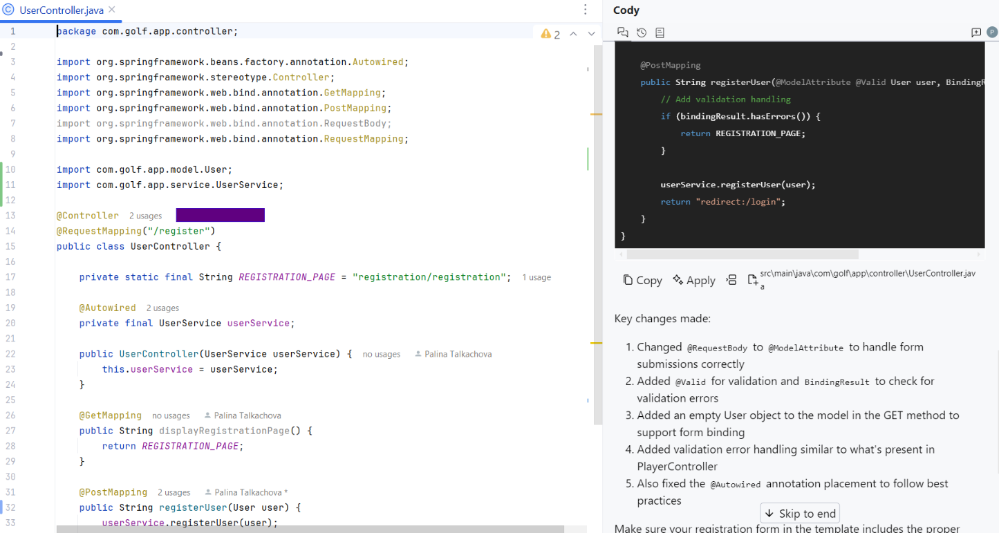

# Cody (Claude 3.7 Sonnet) AI Code Assistant Sandbox Tests - March 2025

## Table of Contents
- [Test Execution Results](#test-execution-results)
- [Summary](#summary)
    - [Chat Based Tests (Claude Sonnet 3.7 LLM)](#chat-based-tests-claude-sonnet-37-llm)
    - [Code Completion Tests](#code-completion-tests)
- [Configuration](#configuration)
- [UX Summary](#ux-summary)

## Test Execution Results (Claude 3.7 Sonnet LLM)

[SandboxTestsCodyMarch2025.xlsx](../../../../../reports/2025/SandboxTestsCodyMarch2025.xlsx)

## Summary
Overall Score: **79.59** =30/147

### Chat Based Tests (Claude Sonnet 3.7 LLM)

**Java:**

| Pass Rate, % | Tests, count | Failed tests |
|--------------|--------------|--------------|
| 86.36        | 44           | 6            |

**C#:**

| Pass Rate, % | Tests, count | Failed tests |
|--------------|--------------|--------------|
| 94.29        | 35           | 2            |

**TypeScript:**

| Pass Rate, % | Tests, count | Failed tests |
|--------------|--------------|--------------|
| 100          | 8            | 0            |

### Code Completion Tests

**Java:**

| Pass Rate, % | Tests, count | Failed tests |
|--------------|--------------|--------------|
| 50           | 33           | 17           |

**C#:**

| Pass Rate, % | Tests, count | Failed tests |
|--------------|--------------|--------------|
| 78.95        | 19           | 4            |

**TypeScript:**

| Pass Rate, % | Tests, count | Failed tests |
|--------------|--------------|--------------|
| 85.71        | 7            | 1            |

## Configuration
**Cody version:** 7.78.2  
**IDE:** IntelliJ IDEA 2024.2.31 (Community Edition)  
**Cody subscription:** Enterprise

## UX Summary

- The Apply button in Cody is responsible for merging the suggested implementation with the existing code. It works much more slowly compared to Cursor, taking more than 10 seconds, whereas Cursor takes just a few seconds.

- Cody and Cursor generate more comprehensive documentation for the code compared to Copilot (GPT-4 LLM)

    © 2025 EPAM Systems, Inc. All Rights Reserved.     EPAM, EPAM AI/RUN TM and the EPAM logo are registered trademarks of EPAM Systems, Inc.     This report is licensed under CC BY-SA 4.0 

