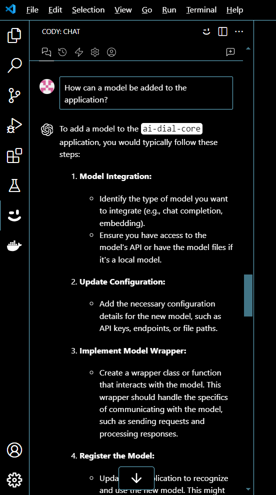

# Sourcegraph Cody - July 2024

1. [Executive Summary](#executive-summary)
2. [Overview](#overview)
3. [Main Capabilities](#main-capabilities)
4. [Main Features](#main-features)
5. [Supported LLMs](#supported-llms)
    - [Chat and Commands](#chat-and-commands)
    - [Autocomplete](#autocomplete)
6. [Supported IDEs, Editors, and UIs](#supported-ides-editors-and-uis)
7. [Cody Pricing](#cody-pricing)
8. [Links](#links)
9. [Test Summary](#test-summary)
    - [Basic Tests](#basic-tests)
    - [Chat-based Tests (GPT-4o LLM)](#chat-based-tests-gpt-4o-llm)
    - [Code-Completion Tests](#code-completion-tests)
    - [Overall Score](#overall-score)
10. [Complex Tests](#complex-tests)
    - [Chat-based Tests (GPT-4o LLM)](#chat-based-tests-gpt-4o-llm-1)
11. [Unique Features](#unique-features)
    - [Debugging](#debugging)
    - [Code Search](#code-search)
    - [Context-based Chat](#context-based-chat)

## Executive Summary
Niche product - a plugin for VS Code and a standalone website plus an enterprise offering. Scored good marks in EPAM Benchmark although worse than Copilot especially in code completion. Especially good at indexing a project locally and automatically providing necessary embeddings. A separate website has got a Code Search feature that answers questions on open-source repositories. Is worth investigating deeper for cases when a client needs to index a whole private repository locally - likely an expensive Enterprise version is needed for such case.

## Overview
Sourcegraph Cody is an AI coding assistant accompanied with advanced search pulling context from local and remote codebase sources, so it operates within the all source code context including APIs, symbols, and usage patterns.

Cody can connect and index web-based source code repositories GitHub, GitLab and can be plugged into the most popular IDEs.

## Main Capabilities
Cody declares the following main capabilities:
- The ability to search entire developer codebase for context
- Vast knowledge of open source code
- Extensive training data for code understanding and problem-solving

## Main Features
Cody's main features include:
- **Context-based Autocomplete**: Cody autocompletes single lines, or whole functions, in any programming language, configuration file, or documentation. It’s powered by the latest instant LLM models, for accuracy and performance.
- **Context-based Chat**: Cody answers questions about programming topics generally or codebase specifically. It is possible to include Enhanced Context of project or tag specific files and symbols to refine chat prompt.
- Special-purpose ready-to-use **commands** for code documentation, unit tests generation, and detecting code smells.
    - `edit`: editing and fixing code
    - `explain`: explaining code explain
    - `test`: generating unit tests
    - `doc`: writing documentation
    - `smell`: improving code quality
- **Debugging**
- **Context filtering**
- **OpenCtx Context** Providers support
- Wide choice of the latest **large language models** including GPT-4o, GPT-4 Turbo, and Claude 3 (Opus, Sonnet, Haiku), Claude 3.5 Sonnet, Gemini Flash and Pro, Mixtral
    - **Offline** mode with Ollama

## Supported LLMs

### Chat and Commands
| Provider         | Model            |
|------------------|------------------|
| OpenAI           | gpt-3.5 turbo    |
| OpenAI           | gpt-4            |
| OpenAI           | gpt-4 turbo      |
| OpenAI           | gpt-4o           |
| Anthropic        | claude-3 Haiku   |
| Anthropic        | claude-3 Sonnet  |
| Anthropic        | claude-3.5 Sonnet|
| Anthropic        | claude-3 Opus    |
| Mistral          | mixtral 8x7b     |
| Mistral          | mixtral 8x22b    |
| Ollama           | variety          |
| Google Gemini    | 1.5 Pro          |
| Google Gemini    | 1.5 Flash        |

### Autocomplete
| Provider         | Model            |
|------------------|------------------|
| Fireworks.ai     | StarCoder        |
| Anthropic        | claude Instant   |
| Ollama           | variety          |

## Supported IDEs, Editors, and UIs
- **VS Code**
- JetBrains IDEs:
    - **IntelliJ**
    - **PyCharm**
    - **GoLand**
    - **Android Studio**
    - **WebStorm**
    - **Rider**
    - **RubyMine**
- **Neovim**: `Experimental`
- **Cody CLI**: `Experimental`
- **Visual Studio**: `Coming soon`
- **Eclipse**: `Coming soon`
- **Emacs**: `Coming soon`
- **Web** (Online Chat)

## Cody Pricing
| Free | Pro | Enterprise |
|------|-----|------------|
| $0   | $9 per user/month | $19 per user/month |
| **Unlimited** Autocomplete | **Unlimited** Autocomplete | **Unlimited** Autocomplete |
| **200** Messages and commands per month | **Unlimited** Messages and commands | **Unlimited** Messages and commands |
| Code context and personalization: Personalization for **small local codebases** (200MB of code) | Code context and personalization: Personalization for **larger local codebases** (1GB of code) | Code context and personalization: Advanced personalization for **enterprise codebases** |
| LLM Support: Claude 3 (Sonnet, Haiku), Claude 3.5 Sonnet, Gemini Flash and Pro, Mixtral | LLM Support: Everything in free, plus GPT-4o, GPT-4 Turbo, and Claude 3 Opus | LLM Support: Flexible LLM choices: GPT-4o, GPT-4 Turbo, Gemini Flash and Pro, Claude 3 (Opus, Sonnet, Haiku) |
| Compatibility: VS Code, JetBrains IDEs, and Neovim | Compatibility: VS Code, JetBrains IDEs, and Neovim | Enterprise features: Everything in Pro, Flexible deployment options, Enterprise admin and security features (SSO, SAML, SCIM, audit logs, etc.), Guardrails: scan output for OSS code, reducing the risk of copyrighted code in suggestions, Context Filters |
| Support: Community support only | Support: Support with limited SLAs | Support: Enterprise support |
| Developer limit: 1 user | Developer limit: 1 user | Developer minimum: 50+ users |

## Links
- Home page: [https://sourcegraph.com/](https://sourcegraph.com/)
- Online Cody Chat: [https://sourcegraph.com/cody/chat](https://sourcegraph.com/cody/chat)
- Visual Studio Code extension: [https://marketplace.visualstudio.com/items?itemName=sourcegraph.cody-ai](https://marketplace.visualstudio.com/items?itemName=sourcegraph.cody-ai)
- JetBrains IDEs plugin: [https://plugins.jetbrains.com/plugin/9682-cody-ai-coding-assistant-with-autocomplete–chat](https://plugins.jetbrains.com/plugin/9682-cody-ai-coding-assistant-with-autocomplete–chat)
- Source code: [https://github.com/sourcegraph](https://github.com/sourcegraph)
- Documentation: [https://sourcegraph.com/docs/cody](https://sourcegraph.com/docs/cody)
- Telemetry: [https://sourcegraph.com/docs/admin/telemetry](https://sourcegraph.com/docs/admin/telemetry)
- Cody Usage and Privacy policy: [https://sourcegraph.com/terms/cody-notice](https://sourcegraph.com/terms/cody-notice)
- Pricing: [https://sourcegraph.com/pricing](https://sourcegraph.com/pricing)

## Test Summary

### Basic Tests
[SandboxTestsCodyJuly2024.xlsx](../../../../reports/SandboxTestsCodyJuly2024.xlsx)

### Chat-based Tests (GPT-4o LLM)
| AI tool          | Language   | Success Rate, % | Overall | Failed tests |
|------------------|------------|-----------------|---------|--------------|
| Sourcegraph Cody | Java       | 96.97           | 33      | 1            |
| Sourcegraph Cody | C#         | 79.41           | 34      | 6            |
| Sourcegraph Cody | TypeScript | 85.71           | 7       | 1            |
| Sourcegraph Cody | In All     | 87.84           | 74      | 9            |

### Code-Completion Tests
| AI tool          | Language   | Success Rate, % | Overall | Failed tests |
|------------------|------------|-----------------|---------|--------------|
| Sourcegraph Cody | Java       | 40.00           | 15      | 9            |
| Sourcegraph Cody | C#         | 38.89           | 18      | 11           |
| Sourcegraph Cody | TypeScript | 33.33           | 6       | 4            |
| Sourcegraph Cody | In All     | 38.46           | 39      | 24           |

[generated code as patch](../../../../files/sandbox-test/sourcegraph-cody/0001-run-cody_20240709_codecompletion.patch)

### Overall Score
| AI tool          | Language | Success Rate, % | Overall | Failed tests |
|------------------|----------|-----------------|---------|--------------|
| Sourcegraph Cody | In All   | 70.80           | 113     | 33           |

## Complex Tests
[GolfAppTestsCodyJuly2024.xlsx](../../../../reports/GolfAppTestsCodyJuly2024.xlsx)

### Chat-based Tests (GPT-4o LLM)
| AI tool          | Language | Success Rate, % | Overall | Failed tests |
|------------------|----------|-----------------|---------|--------------|
| Sourcegraph Cody | Java     | 75.00           | 20      | 5            |

[generated code as patch](../../../../files/sandbox-test/sourcegraph-cody/0001-run-cody_20240719.patch)

## Unique Features

### Debugging
It is stated that Cody can debug code in the editor and also helps with identification of code smells.

Actually Debugging feature is more a review tool than a debugging tool. It allows to analyze source code and provide advises how to improve it. It can be considered as just another static code analysis tool.

The tool can be invoked either by sending "fix code" prompt to chat or by running IDE embedded command.

[Response to "Find Code Smells" command](../../../../images/sandbox-test/sourcegraph-cody/sourcegraph-cody-response1.png)

### Code Search
[Code Search](https://sourcegraph.com/docs/code-search) allows to find, fix, and navigate code with any code host or language across multiple repositories with real-time updates.

Main features:
- Use regular expressions and keyword queries to perform full-text searches
- Search any branch and commit, with no indexing required
- Search commit diffs and commit messages to see how code has changed
- Narrow your search by repository and file pattern
- Use search contexts to search across a set of repositories at specific revisions
- Curate saved searches for yourself or your org
- Use code monitoring to set up notifications for code changes that match a query
- View language statistics for search results

Search is performed on the site [https://sourcegraph.com/search](https://sourcegraph.com/search):

Click here to expand...

By default, search is available for **public** repositories only. **Enterprise** license is needed to add **private** repositories.

Search SECURITY.md files in EPAM AI DIAL repositories on Github...

https://sourcegraph.com/search?q=context:global+repo:%5Egithub%5C.com/epam/ai-dial-*++type:path+SECURITY.md&patternType=keyword&sm=0
Search query: *context:global repo:^github\.com/epam/ai-dial-*  type:path SECURITY.md*

[Search query](../../../../images/sandbox-test/sourcegraph-cody/sourcegraph-cody-search-query.png)

### Context-based Chat
Cody chat allows to ask coding-related questions about any part of codebase or specific code snippets and to get contextually-aware answers. Cody is able to retrieve context from user codebases, it uses various methods to gather context relevant to user input, including Keyword Search, Embeddings, Sourcegraph Search, Code Graph.

Cody indexes **local code embeddings** and allows a developer give a generic task description in chat. To test the capability we run a test [0003](https://github.com/epam/AIRUN-Assistants-Benchmark-TestInstructions/tree/main/agentic-workflow-tests/0003) from **agentic workflow**. Cody coped with the task well, without asking additional technical details.

Click here to expand...

It is possible to add source-code repositories to context and ask **cross-repository questions**.

Cross repository request via Web Online Chat...

An user provided repositories and Cody gathered related context itself.

However, answers can be too high-level and generic, disconnected from requested context:

Click here to expand...

Too generic response:

Suggested example steps in Python, although the application is written on Java:

> **Note:** The feature is examined with Pro license, more advanced context-related capabilities are suggested with Sourcegraph Enterprise license.

---

    © 2024 EPAM Systems, Inc. All Rights Reserved.     EPAM, EPAM AI/RUN TM and the EPAM logo are registered trademarks of EPAM Systems, Inc.     This report is licensed under CC BY-SA 4.0 
