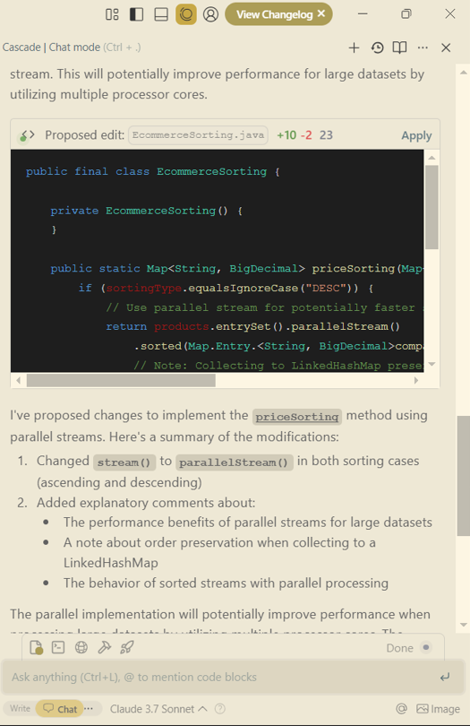

# Windsurf (Claude 3.7 Sonnet) AI Code Assistant Sandbox Tests - April 2025

## Table of Contents
- [Test execution results](#test-execution-results)
- [Summary](#summary)
   - [Chat based tests (Claude Sonnet 3.7 LLM)](#chat-based-tests-claude-sonnet-37-llm)
   - [Code completion tests](#code-completion-tests)
- [Configuration](#configuration)
- [UX Summary](#ux-summary)

## Test execution results

[SandboxTestsWindsurfSonnet3.7April2025.xlsx](../../../../../reports/2025/SandboxTestsWindsurfSonnet3.7April2025.xlsx)

## Summary

Overall Score: **74.15 %** = 38/147

### Chat based tests (Claude Sonnet 3.7 LLM)

**Java:**

| Pass Rate, % | Tests, count | Failed tests |
|--------------|--------------|--------------|
| 86.36        | 44           | 6            |

**C#:**

| Pass Rate, % | Tests, count | Failed tests |
|--------------|--------------|--------------|
| 97.14        | 35           | 1            |

**Type Script:**

| Pass Rate, % | Tests, count | Failed tests |
|--------------|--------------|--------------|
| 87.50        | 8            | 1            |

**90.80 %** = 8/87

### Code completion tests

**Java:**

| Pass Rate, % | Tests, count | Failed tests |
|--------------|--------------|--------------|
| 44.12        | 34           | 19           |

**C#:**

| Pass Rate, % | Tests, count | Failed tests |
|--------------|--------------|--------------|
| 57.89        | 19           | 8            |

**Type Script:**

| Pass Rate, % | Tests, count | Failed tests |
|--------------|--------------|--------------|
| 57.14        | 7            | 3            |

**50 %** = 30/60

## Configuration

**Windsurf version:** 1.6.3  
**IDE:** Windsurf  
**Windsurf subscription:** Pro  

## UX Summary

- We didn't see the copy button for the text, only the Apply button, so it takes time to manually paste and copy the text.

    © 2025 EPAM Systems, Inc. All Rights Reserved.     EPAM, EPAM AI/RUN TM and the EPAM logo are registered trademarks of EPAM Systems, Inc.     This report is licensed under CC BY-SA 4.0 

