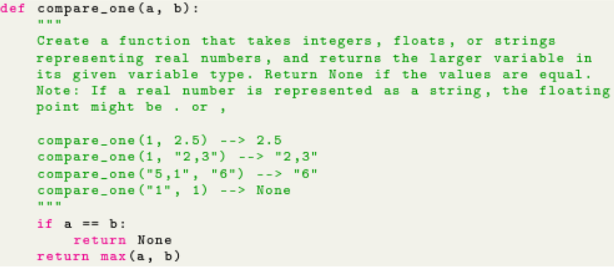
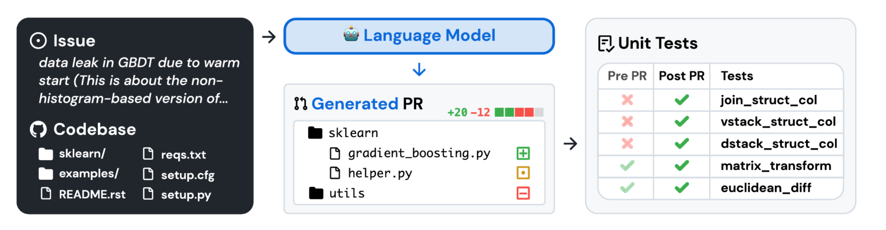

# Why AI RUN TM Engineering Benchmark

- [The Tasks We Focus On](#the-tasks-we-focus-on)
- [What We Solve - A need for a holistic benchmark](#what-we-solve---a-need-for-a-holistic-benchmark)
- [Enterprise Development Specific](#enterprise-development-specific)
- [Other Good Benchmarks](#other-good-benchmarks)
- [AI/RUN TM Engineering Benchmark Tests](#airun-engineering-benchmark-tests)

## The Tasks We Focus On 

Generative AI is changing a multitude of industries, from creative content generation and data analysis to customer service and beyond. Among its most significant contributions is the support it provides to software developers, streamlining their daily workflows and enhancing productivity through intelligent code assistance. And while GenAI brings enormous value in other areas, our team is focusing on the productivity GenAI tools provide in **Software Development Life Cycle (SDLC)**, in **day to day development tasks in particular**.     

## What We Solve - A need for a holistic benchmark

Developer assistant tools have been around for decades, but a completely new generation of them gained significant traction with the wide adoption of GitHub Copilot, boosted by hype around Chat GPT use cases in early 2023. In mid-2024, we call these tools Generative AI enabled Developer Assistants (in short, Gen AI Dev Assistants), meaning that the core technology of such is Large Language Models (LLMs) with different intelligent services and infrastructures that enable more efficient and intelligent ways of operating.

Starting from just being code completion tools that merely augmented or replaced usual IDE code completion, such software has, in just one year, passed a remarkable evolutionary path into what we now call ‘agents’. Such agents act as companions for developers that are able to understand high-level tasks, break them down into steps, and then generate code for each step.

Relative evaluation of such software development assistants has never been an easy task. Even with basic code completion, it was very challenging to set up a comprehensive benchmark that covered all major activities. When other modalities like chat interfaces emerged, the task started to be even more sophisticated. **So the value that we bring is a study and a benchmark that we have tested throughout almost two years that accurately measures the efficiency of Generative AI Code Assistants in the field of software engineering, especially in enterprises.** We called this benchmark EPAM AI/RUN TM Engineering Benchmark - an integral part of [EPAM AI/RUN TM Platform](https://www.epam.com/services/artificial-intelligence).

The benchmark is characterized by the following:
- Tasks were thoroughly crafted to represent real-world software development 
- Areas of tasks are diverse and not focused on just one area
- Holistic evaluation of tools by they overall score and their features

## Enterprise Development Specifics

By Enterprise Development, we mean a kind of development of software solutions that has the following characteristics:
1. It mostly uses non-exotic popular industry-adopted programming languages.
2. Solutions exhibit a large portion of usage of integration using common or proprietary protocols, 3rd party libraries, and frameworks that are also popular and industry-adopted.
3. Quite often, there's a high degree of legacy code in solutions.
4. The code is far more frequently maintained than developed from scratch.
5. Very frequently, the code is lacking documentation and/or comprehensive comments as it was written by many people at different times.
6. Code that exhibits traces of technical debt frequently occurs.

## Other Good Benchmarks

We understand that we are not new in this space. For quite some time, there had been [HumanEval](https://github.com/openai/human-eval?tab=readme-ov-file) and [studies that relied upon it to assess Gen AI assistants tools relative efficiency](https://arxiv.org/abs/2304.10778). HumanEval used to be a landmark in 2023 for evaluating how good LLMs were able to solve coding tasks - it is still used in mid-2024, but there are other ancestors of it that have emerged like [MBPP](https://github.com/google-research/google-research/tree/master/mbpp) and [MultiPL-E](https://github.com/nuprl/MultiPL-E), where the former extended the range of Python problems to be solved, and the latter extended the previous two into other programming languages by transpiling.

Soon [it was revealed](https://arxiv.org/abs/2310.06770) that many popular benchmarks like Human Eval and its extensions MBPP and MultiPL-E focus on a relatively narrow scope of tasks that mainly revolve around algorithmic topics like data structures traversal and manipulation, string literal data processing, sorting, filtering, and similar. Whereas according to our internal surveys that covered hundreds of developers, the main areas where Gen AI tooling increases developers' productivity were unit tests generation, standard components/solutions creation, refactoring, and similar – everything that was not included in the scope of Human Eval and its ancestors.

A typical example of a formatted HumanEval test with a suggestion from GitHub Copilot [taken from the study](https://arxiv.org/pdf/2304.10778) is depicted below - which explains most of the statements written above:

Addressing this challenge, a new generation of benchmarks appeared with the most prominent representative being [SWE-Bench](https://arxiv.org/abs/2310.06770). It took an approach of analyzing the most popular open-source Python repositories and trying to make LLMs recreate code patches for the common issues posted into those repositories - usually bugs but sometimes feature requests. This benchmark is very popular in terms of citations and is also used for [facilitating open research in the field of developing Generative AI agentic assistants](https://www.swebench.com/index.html).

A visual representation of how SWE-Bench works [taken from the study](https://arxiv.org/pdf/2310.06770) is depicted below:

Although SWE Bench resembles real world tasks that developers do - fixing issues submitted into repositories - we were more focused on more frequent and diverse developers activities like bugfixing, refactoring, code documentation, code optimization and more, which goes much beyond of just addressing issues that describe bugs.

Another challenge was closely resembling real developer interactions with code assistants. Like it was already shown, Human Eval and similar benchmarks rely on a huge text comment that explains the requirements of a task and goes before the actual code – which is the way that real developers almost never use in real coding. Instead, in the most frequent case, they start typing the code and await a suggestion at some point or ask a contextual question in the chat window highlighting a code snippet that needs correction or augmentation.

## AI/RUN TM Engineering Benchmark Tests

Seeing the above limitations in the benchmarks we explored we decided to create our own that would address the challenges depicted above. The type of tests, methodology and evaluation approch introduced in AI/RUN TM Engineering Benchmark allow us to score the tool and be cofident that the same impression and efficiency will be seen by real developers on production tasks. 

See more details [here](../../pages/sandbox-test/code-assistants-benchmark-approach.md)
